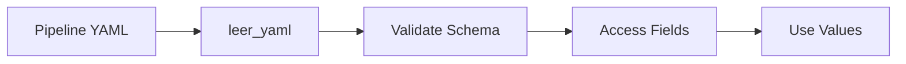
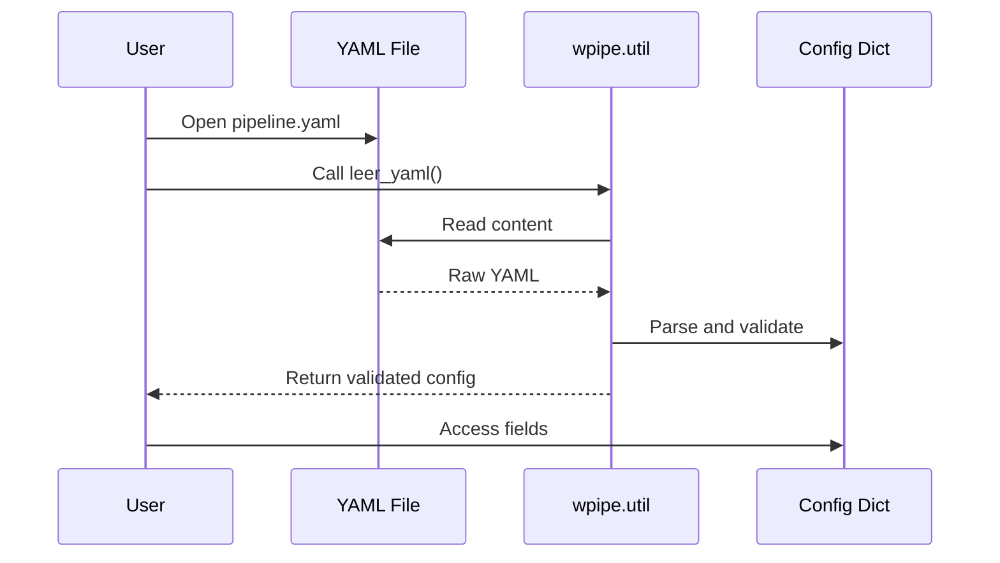
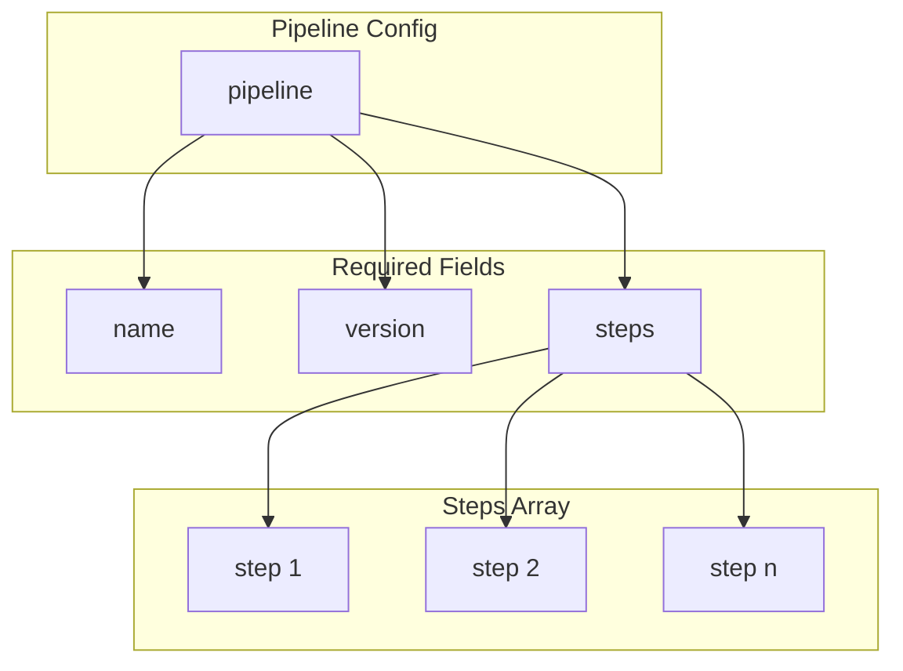
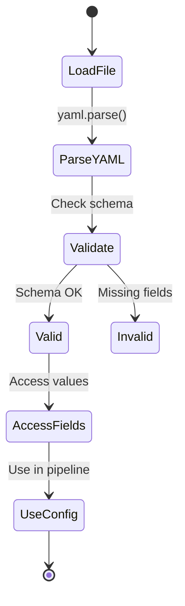
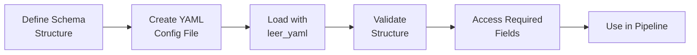

# YAML Schema Validation

Shows validating YAML configuration against a schema structure.

## What It Does

This example demonstrates:
- Creating well-structured YAML configurations
- Loading and accessing validated configuration values
- Working with pipeline configurations with schema

## Example

```python
from wpipe.util import leer_yaml

config = leer_yaml("pipeline.yaml")
name = config["pipeline"]["name"]
version = config["pipeline"]["version"]
```

## Config Flow



## Validation Sequence



## Config Structure



## Validation States



## Process Flow


