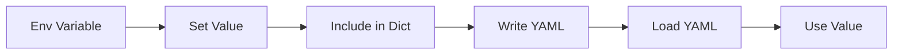
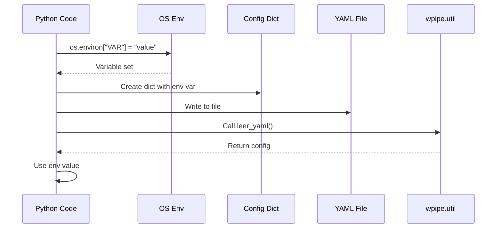
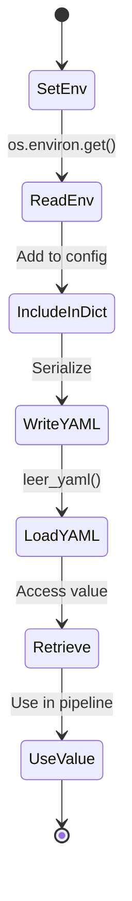
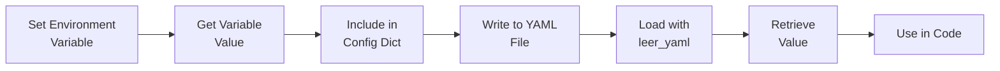

# Environment Variables in YAML Config

Shows how to use environment variables within YAML configuration files.

## What It Does

This example demonstrates:
- Setting environment variables in Python
- Including environment variable values in YAML configs
- Loading and using env-based configurations

## Example

```python
import os
from wpipe.util import leer_yaml

os.environ["TEST_VAR"] = "test_value"
config = {"env_var": os.environ.get("TEST_VAR")}
escribir_yaml("config.yaml", config)
loaded = leer_yaml("config.yaml")
```

## Config Flow



## Env Loading Sequence



## Config Structure

```mermaid
graph TB
    subgraph Environment
        A[Environment Variables]
    end
    subgraph Config Dict
        B[env_var]
    end
    subgraph Value
        C[os.environ.get<br/>["VAR_NAME"]]
    end
    A --> C
    C --> B
```

## Env States



## Process Flow


