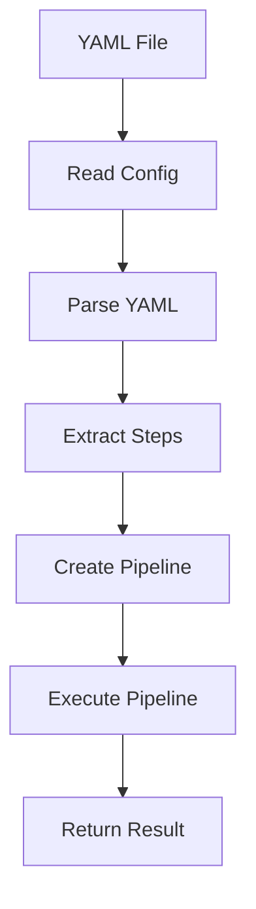
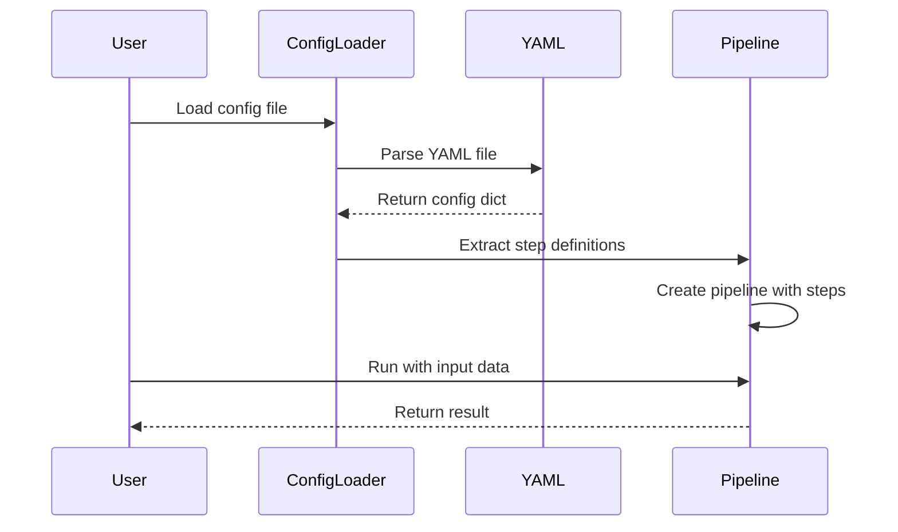
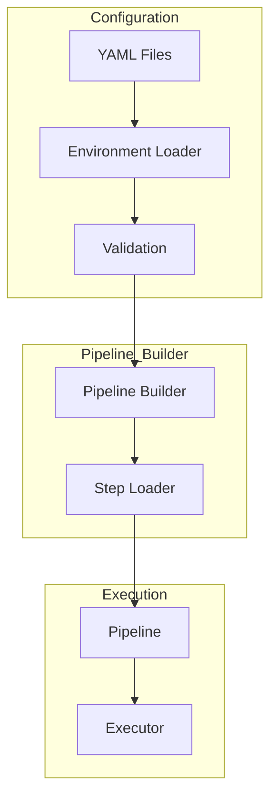
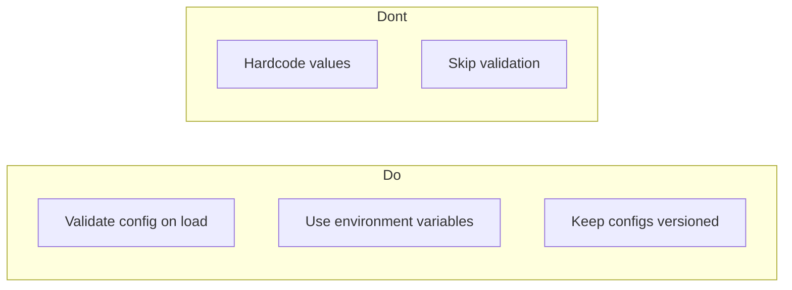

# YAML Configuration

This directory contains examples demonstrating YAML configuration loading and usage with pipelines.

## Project Overview

The `yaml_config` module provides utilities for loading pipeline configurations from external YAML files. This enables separation of configuration from code, making applications more flexible and maintainable.

**Key Capabilities:**
- Read YAML configuration files
- Write configuration to YAML files
- Dynamic step loading from config
- Environment variable substitution
- Nested configuration support
- Multi-file configuration loading
- Configuration validation

---

## 1. 🚶 Diagram Walkthrough



---

## 2. 🗺️ System Workflow (Sequence)



---

## 3. 🏗️ Architecture Components



---

## 4. 📂 File-by-File Guide

| File | Description |
|------|-------------|
| `01_read_yaml_example/` | Basic YAML file reading |
| `02_write_yaml_example/` | Writing configuration to YAML |
| `03_pipeline_with_config_example/` | Pipeline using YAML config |
| `04_complex_config_example/` | Complex nested configurations |
| `05_nested_config_example/` | Nested configuration structure |
| `06_load_steps_example/` | Dynamic step loading from config |
| `07_dynamic_loading_example/` | Dynamic configuration loading |
| `08_validation_example/` | Configuration validation |
| `09_environment_vars_example/` | Environment variable substitution |
| `10_multi_file.py` | Multi-file configuration |
| `10_nested_env_config.py` | Nested env config |
| `config_loader.py` | Configuration loader utilities |

---

## Quick Start

### Reading YAML

```python
from wpipe.util import leer_yaml

config = leer_yaml("config.yaml")
print(config)
```

### Writing YAML

```python
from wpipe.util import escribir_yaml

config = {"name": "my_pipeline", "version": "v1.0"}
escribir_yaml("config.yaml", config)
```

### Using with Pipeline

```python
from wpipe import Pipeline
from wpipe.util import leer_yaml

config = leer_yaml("config.yaml")
pipeline = Pipeline(
    verbose=config.get("verbose", False)
)
```

---

## YAML Structure

### Basic Configuration

```yaml
name: my_pipeline
version: v1.0.0
verbose: true
```

### Pipeline Configuration

```yaml
pipeline:
  name: "my_pipeline"
  version: "v1.0.0"
  
steps:
  - name: "Step 1"
    function: "process_data"
    enabled: true
    
  - name: "Step 2"
    function: "validate_results"
    enabled: true
```

### Nested Configuration

```yaml
application:
  name: service
  environments:
    dev:
      url: http://dev.example.com
      retries: 3
    prod:
      url: http://prod.example.com
      retries: 5
```

---

## Environment Variables

```yaml
database:
  host: ${DB_HOST}
  port: ${DB_PORT:-5432}
  name: ${DB_NAME}
```

---

## Dynamic Step Loading

```python
config = leer_yaml("steps.yaml")

steps = []
for step_config in config.get("steps", []):
    if step_config.get("enabled", True):
        func = globals()[step_config["function"]]
        steps.append((func, step_config["name"], "v1.0"))

pipeline.set_steps(steps)
```

---

## Configuration Validation

```python
from wpipe.util import validate_config

config = leer_yaml("config.yaml")
validate_config(config, required_fields=["pipeline", "steps"])
```

---

## Best Practices



1. **Validate configuration on load** - Prevent runtime errors
2. **Use environment variables** - Keep secrets out of config files
3. **Keep configs versioned** - Track configuration changes
4. **Use descriptive names** - Make configuration clear

---

## See Also

- [Basic Pipeline](../01_basic_pipeline/) - Core pipeline concepts
- [SQLite Integration](../06_sqlite_integration/) - Data persistence
