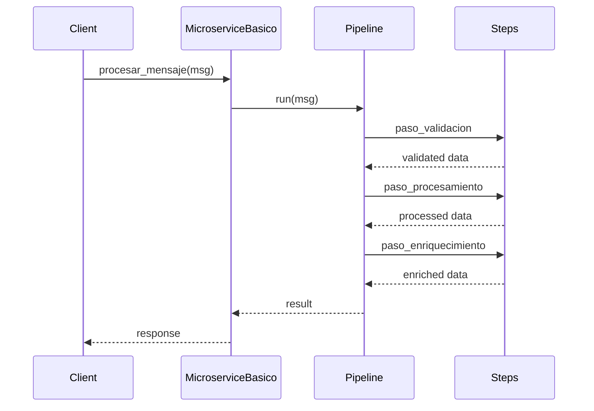
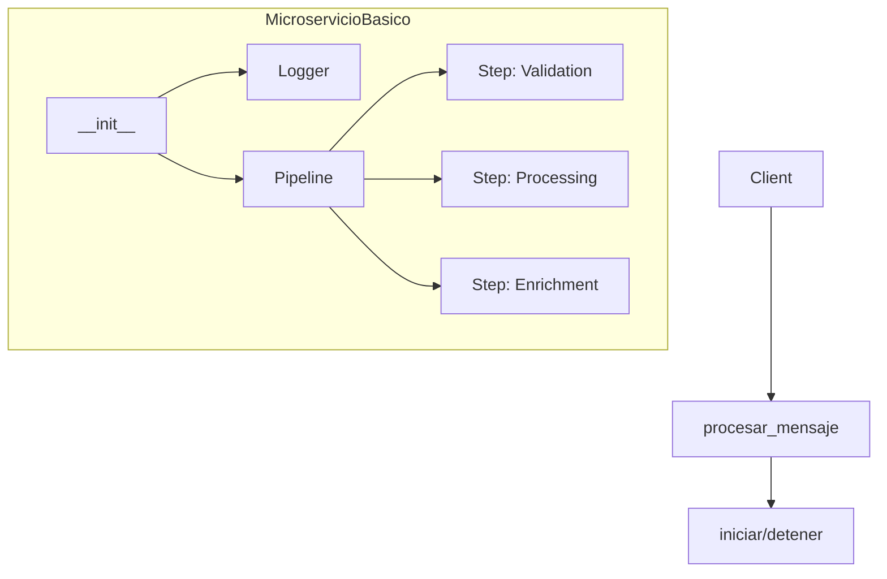
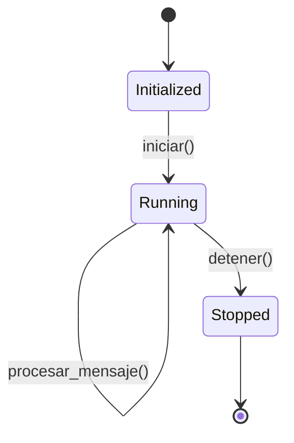
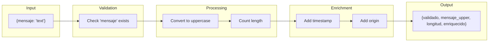

# Basic Microservice Example

Demonstrates the basic structure of a microservice using wpipe without requiring Kafka for local testing.

## What It Does

This example shows how to create a simple microservice with:
- A processing pipeline with multiple steps
- Message validation and enrichment
- Logging functionality
- Start/stop lifecycle management

## Service Flow


## Service Communication



## Service Structure



## Service States



## Processing Pipeline



## Usage

```bash
python example.py
```

## Expected Output

```
======================================
MICROSERVICIO BASICO
======================================

--- Creando Microservicio ---
[MICROSERVICIO] servicio_prueba iniciado
  Mensajes procesados: 0

--- Simulando Mensajes ---
[MENSAJE 1] Enviando: {'mensaje': 'hola mundo'}
[MSG-1] Procesando mensaje...
[MSG-1] Completado
[RESULTADO 1] {'validado': True, ...}

--- Deteniendo Microservicio ---
[MICROSERVICIO] servicio_prueba detenido
  Total mensajes procesados: 4
```
