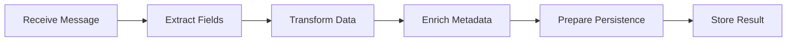
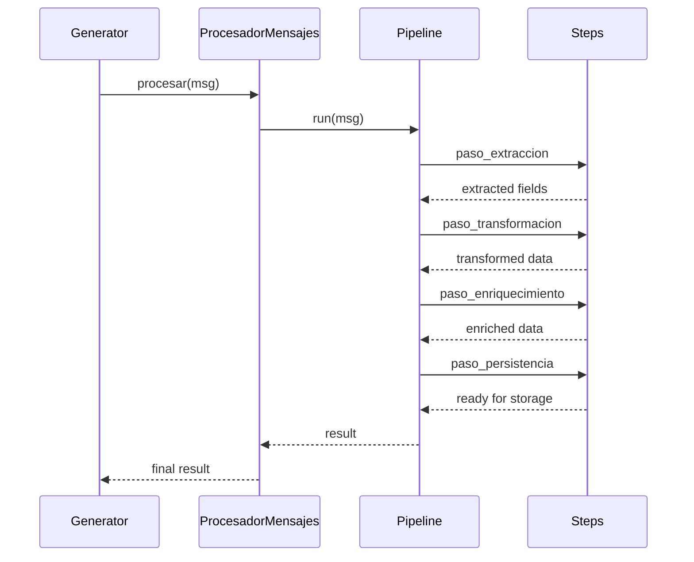
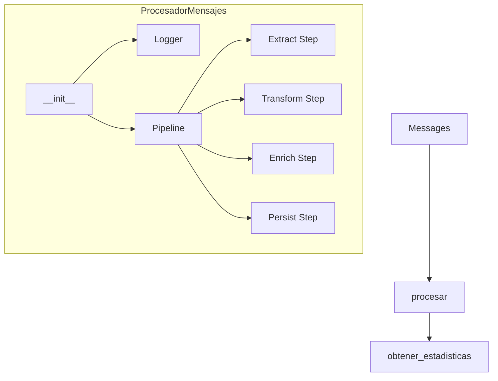
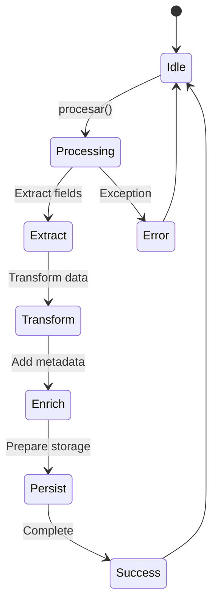
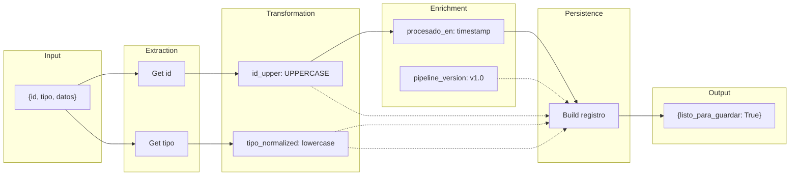

# Message Processor Example

Demonstrates a message processor that simulates receiving messages and processes them through pipelines.

## What It Does

This example shows how to create a message processor with:
- Extraction of data from messages
- Data transformation and normalization
- Metadata enrichment
- Statistics tracking
- Persistence preparation

## Service Flow

## Service Communication

## Service Structure

## Processing States

## Pipeline Workflow

