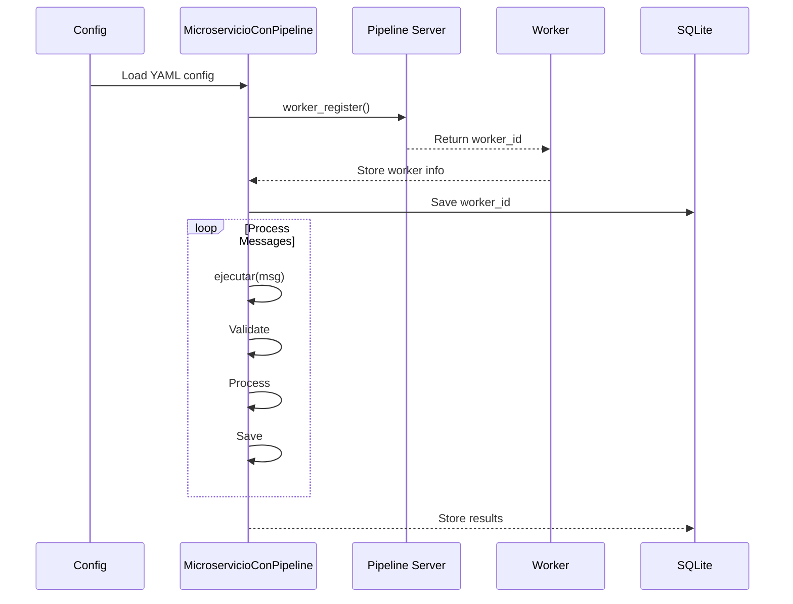
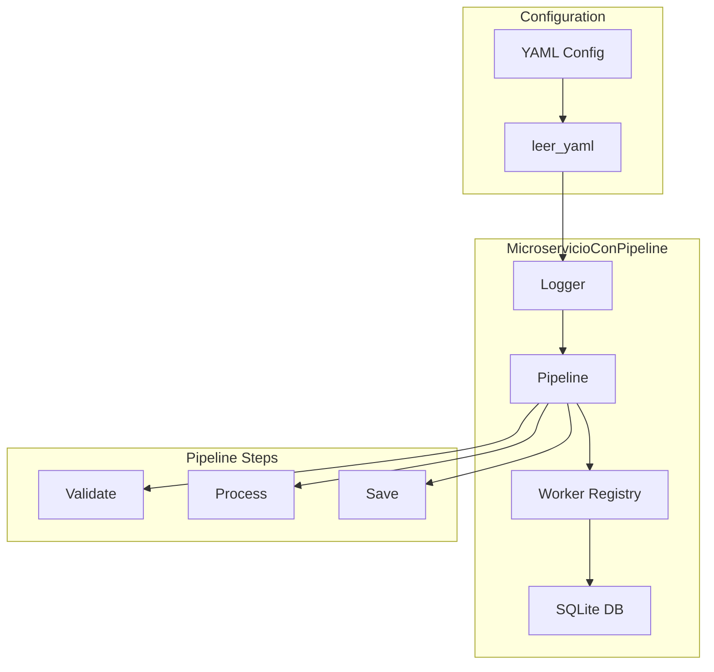
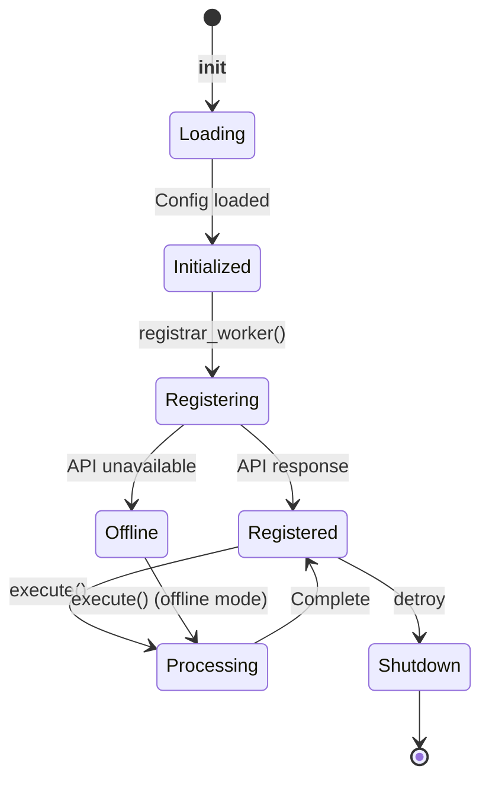

# Microservice with Pipeline Example

Demonstrates a complete microservice with integrated pipeline, YAML configuration, and worker registration.

## What It Does

This example shows how to create a full-featured microservice with:
- YAML-based configuration management
- Worker registration with API server
- Multi-step pipeline processing
- State management
- SQLite persistence support

## Service Flow


## Service Communication



## Service Structure



## Service States



## Component Architecture

```mermaid
flowchart TB
    subgraph Core Components
        A[Config (YAML)] 
        B[Pipeline (wpipe)]
        C[Worker (API)]
        D[SQLite (Persistence)]
        E[Logger]
    end
    
    subgraph Pipeline Steps
        F[paso_validar]
        G[paso_procesar]
        H[paso_guardar]
    end
    
    subgraph Methods
        I[registrar_worker]
        J[ejecutar]
        K[obtener_estado]
    end
    
    A --> B
    C --> D
    B --> F
    B --> G
    B --> H
    
    J --> B
    I --> C
    K --> A
```

## Usage

```bash
python example.py
```

## Expected Output

```
======================================
MICROSERVICIO CON PIPELINE INTEGRADO
======================================

--- Creando Microservicio ---
Configuracion:
  Nombre: microservicio_ejemplo
  Version: 1.0.0

--- Registrando Worker ---
  Worker registrado: worker-xxx

--- Procesando Mensajes ---
[MENSAJE 1] Tipo: usuario
  Validado: True
  Procesado: True
  Guardado: True
```
