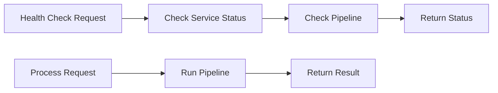
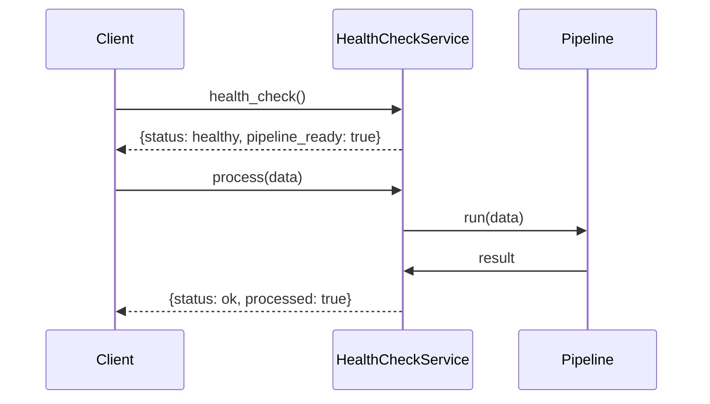
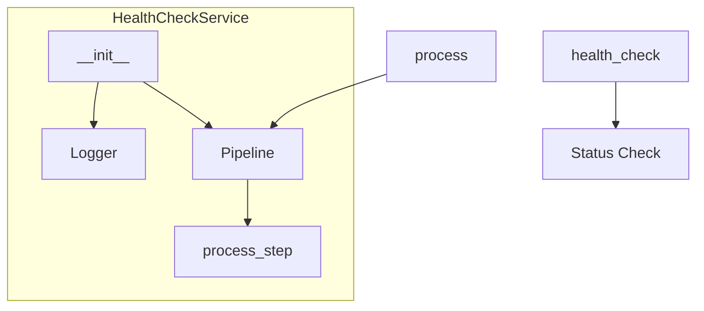
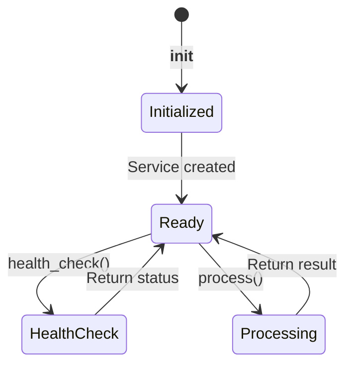
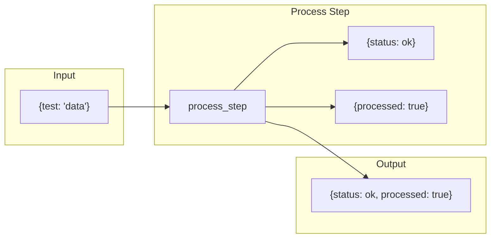

# Health Check Example

Demonstrates implementing a health check endpoint for microservice monitoring.

## What It Does

This example shows how to create a service with:
- Health check endpoint for monitoring
- Service status reporting
- Basic pipeline processing
- Simple architecture

## Service Flow



## Service Communication



## Service Structure



## Service States



## Processing Flow



## Usage

```bash
python example.py
```

## Expected Output

```
Health check: {'service': 'test_service', 'status': 'healthy', 'pipeline_ready': True}
Process result: {'status': 'ok', 'processed': True}
```
