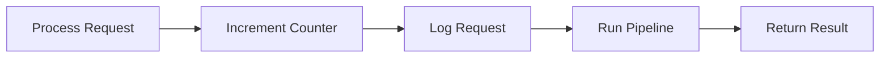
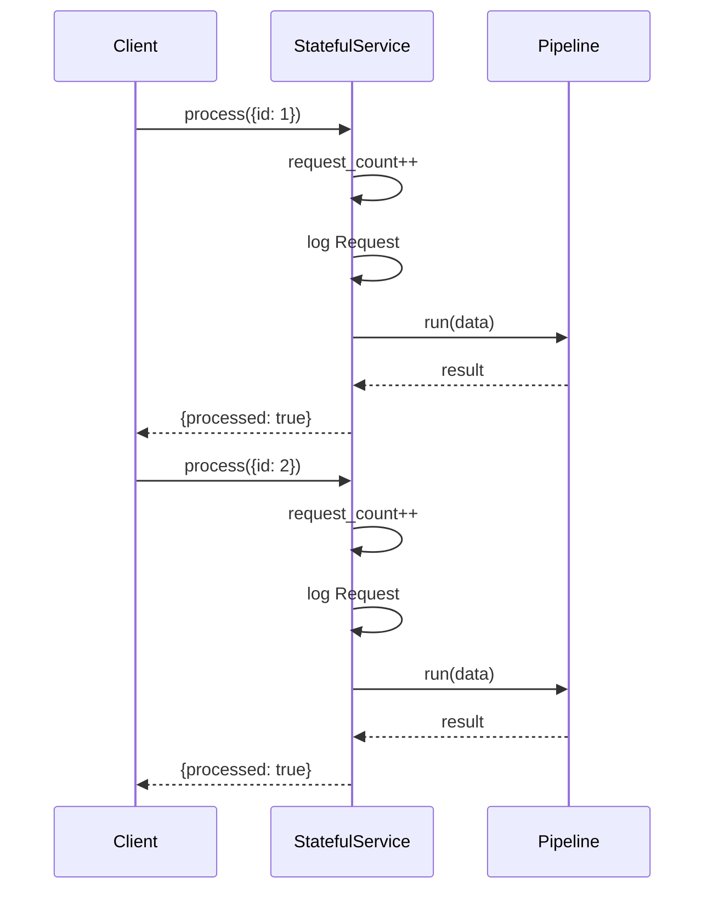
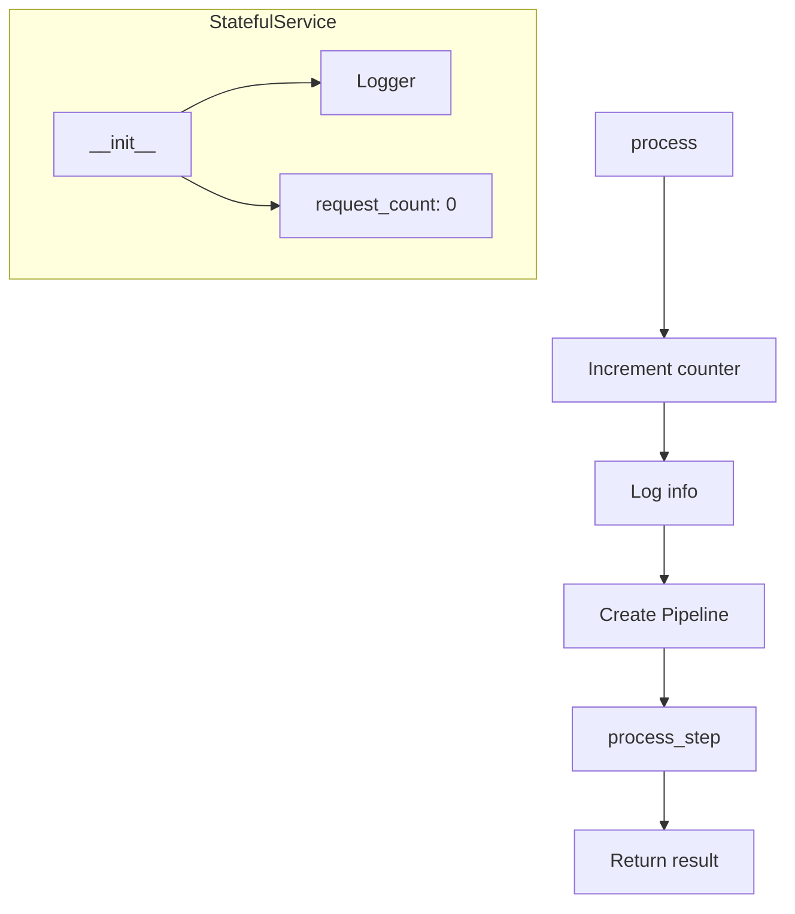
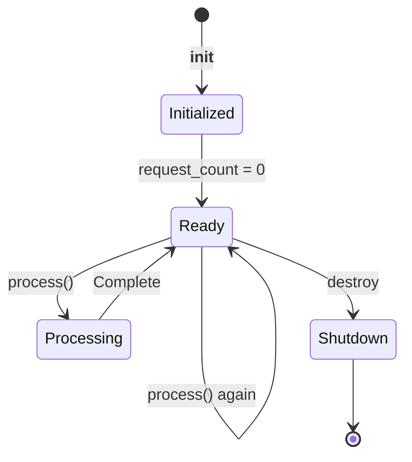
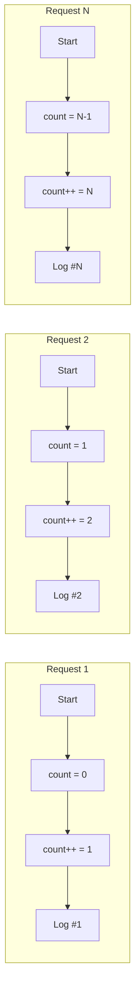

# Service State Management Example

Demonstrates managing service state across multiple requests.

## What It Does

This example shows how to create a stateful service with:
- Request counting across calls
- State persistence during service lifetime
- Pipeline processing per request
- Logging of request numbers

## Service Flow



## Service Communication



## Service Structure



## Service States



## Request Counter Flow



## Usage

```bash
python example.py
```

## Expected Output

```
Total requests: 2
```
