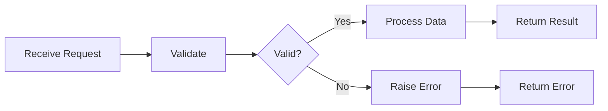
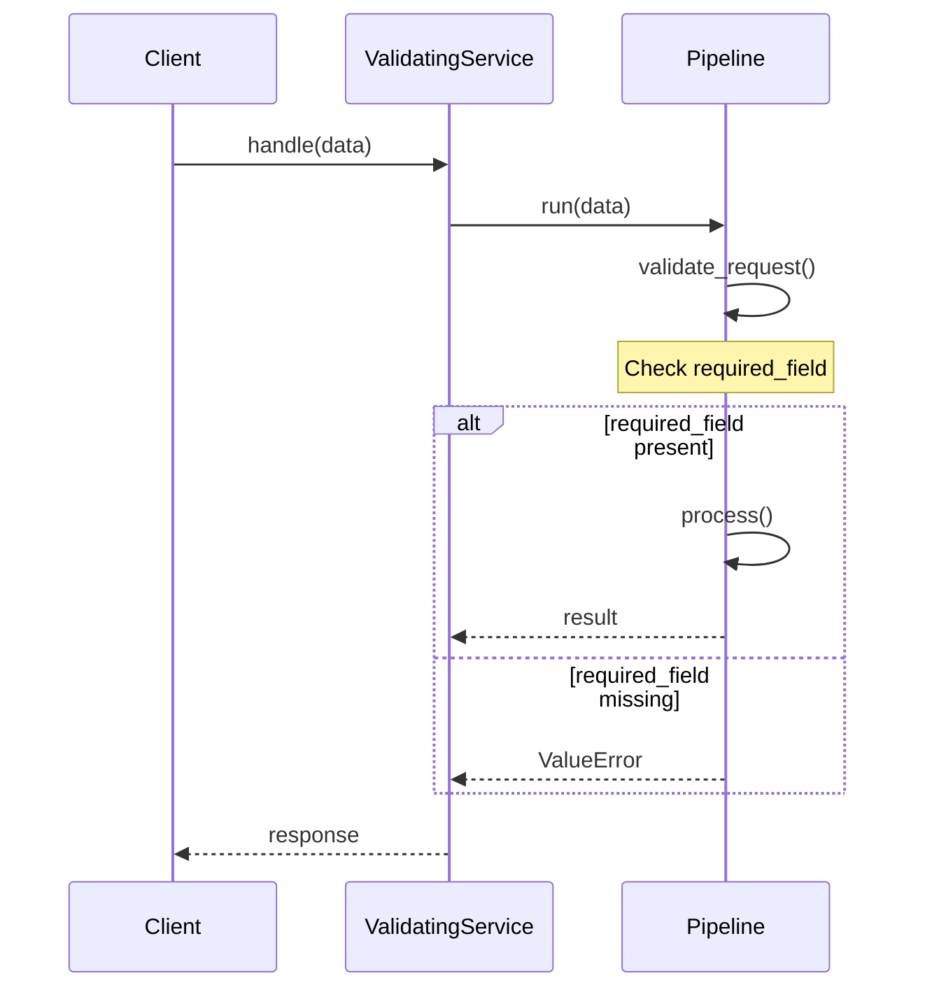
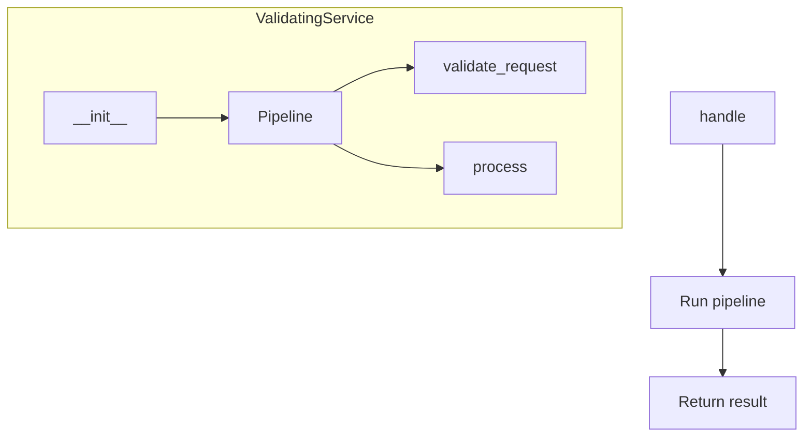
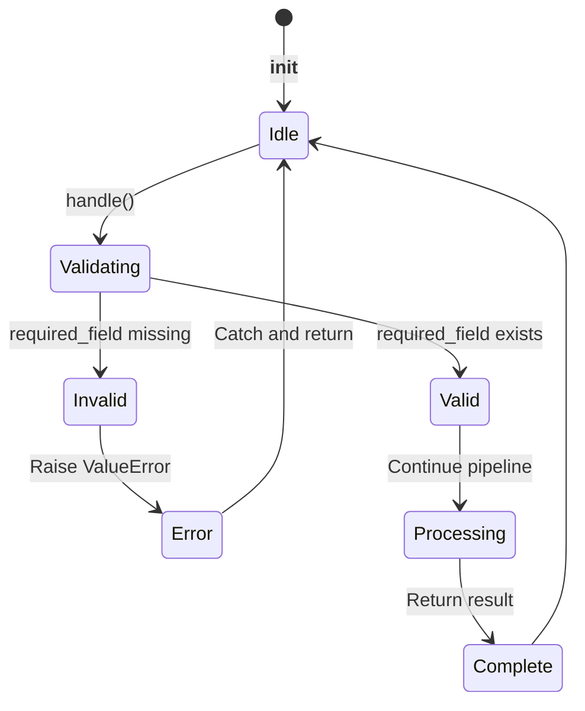
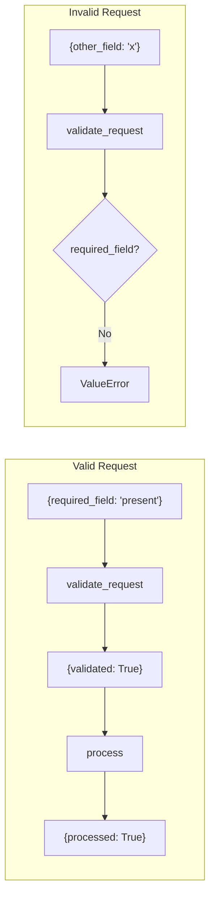

# Request Validation Example

Demonstrates validating incoming requests before processing.

## What It Does

This example shows how to create a validating service with:
- Request validation step
- Pipeline-based validation
- Error handling for invalid requests
- Processing after validation

## Service Flow



## Service Communication



## Service Structure



## Validation States



## Validation Flow



## Usage

```bash
python example.py
```

## Expected Output

```
Valid request result: {'validated': True, 'processed': True}
```
