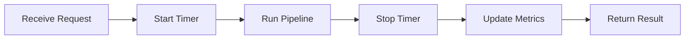
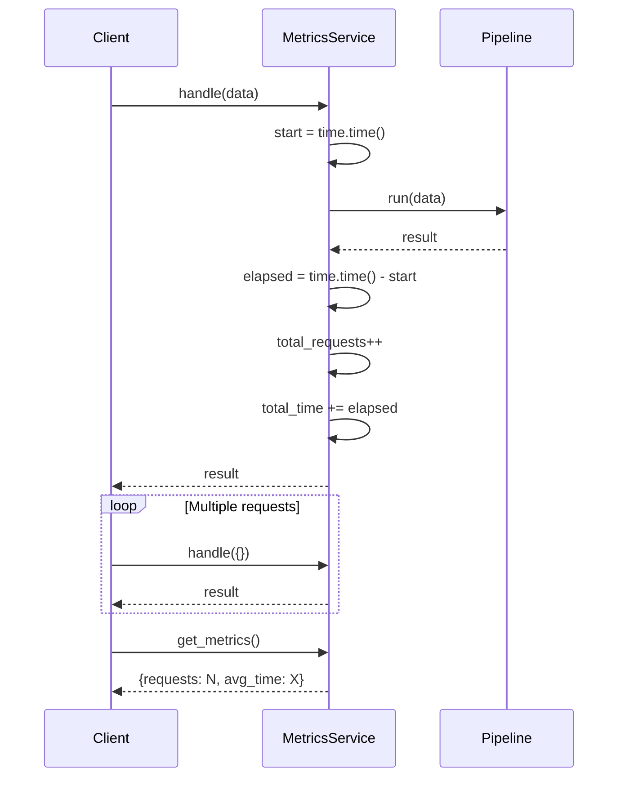
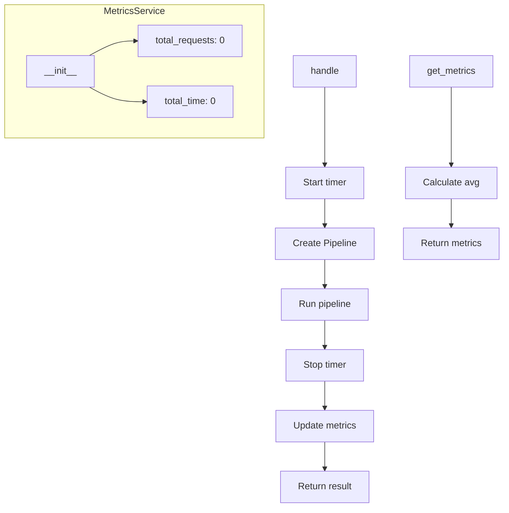
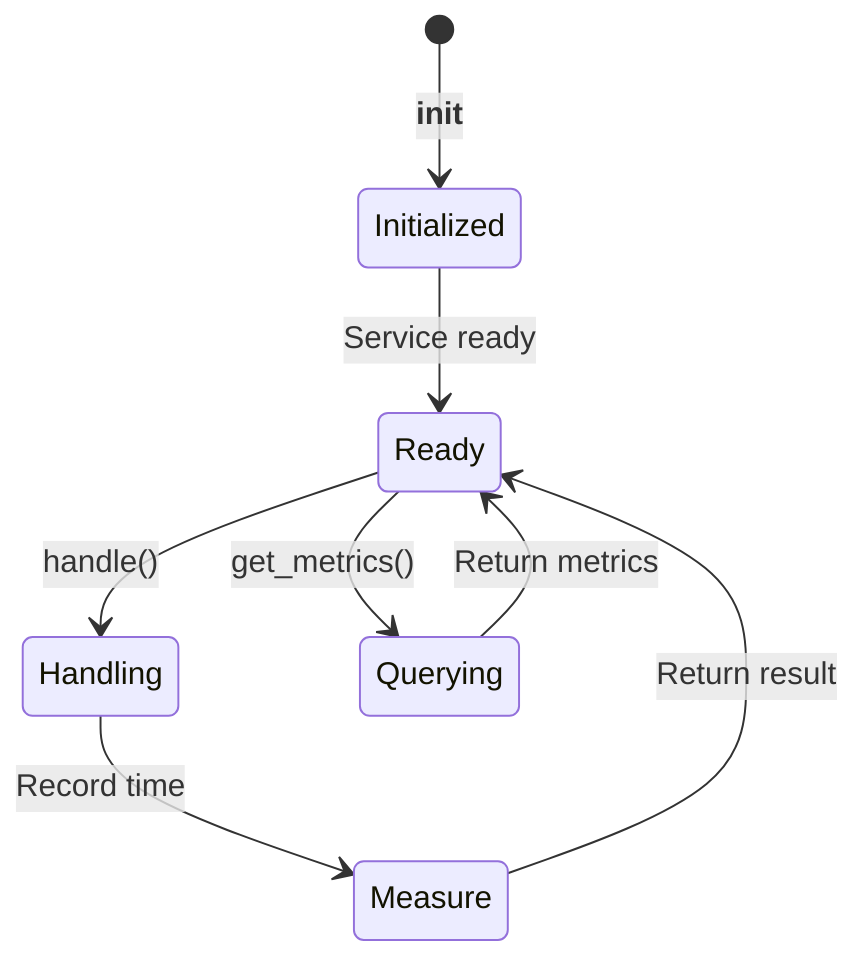
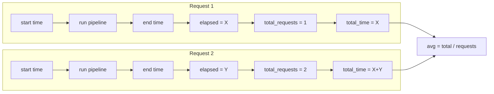

# Metrics Collection Example

Demonstrates collecting service performance metrics.

## What It Does

This example shows how to create a metrics service with:
- Request counting
- Processing time tracking
- Average time calculation
- Metrics retrieval

## Service Flow



## Service Communication



## Service Structure



## Metrics States



## Metrics Collection Flow



## Usage

```bash
python example.py
```

## Expected Output

```
Metrics: {'requests': 3, 'avg_time': 0.001234}
```
