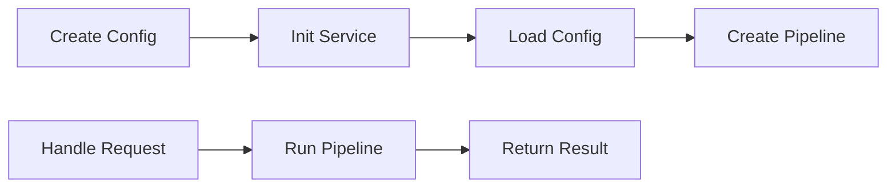
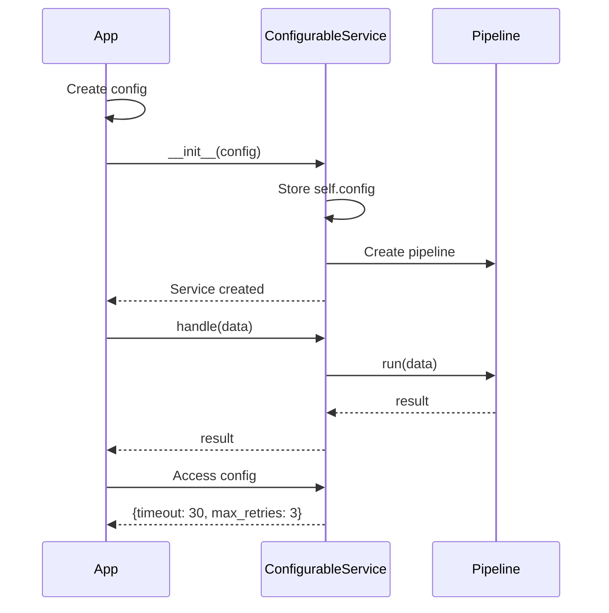
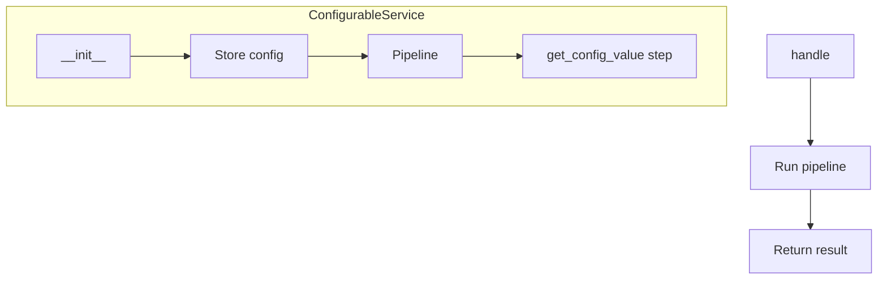
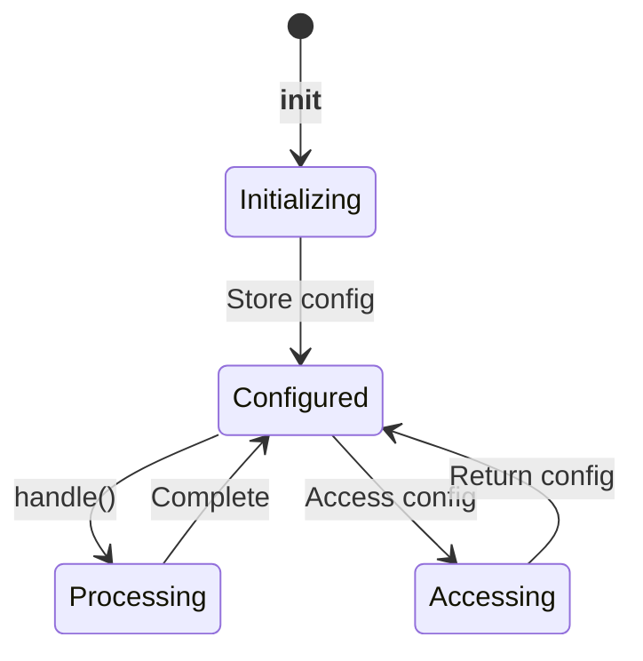

# Dynamic Configuration Example

Demonstrates loading configuration dynamically into a service.

## What It Does

This example shows how to create a configurable service with:
- Dynamic configuration loading
- Configuration storage
- Pipeline processing
- Configuration access

## Service Flow



## Service Communication



## Service Structure



## Configuration States



## Configuration Flow

```mermaid
flowchart LR
    subgraph App Setup
        A["config = {timeout: 30, max_retries: 3}"]
    end
    
    subgraph Service Init
        B["ConfigurableService(config)"]
        B --> C[Store self.config]
        C --> D[Create pipeline]
        D --> E[Set steps]
    end
    
    subgraph Handle Request
        F[handle(data)]
        F --> G[Run pipeline]
        G --> H[get_config_value]
        H --> I["{config_loaded: True}"]
    end
    
    A --> B
    E --> F
```

## Usage

```bash
python example.py
```

## Expected Output

```
Service configured with: {'timeout': 30, 'max_retries': 3}
```
