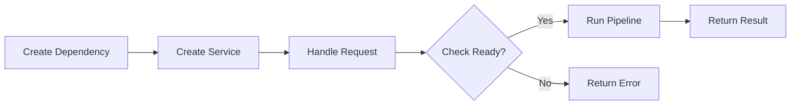
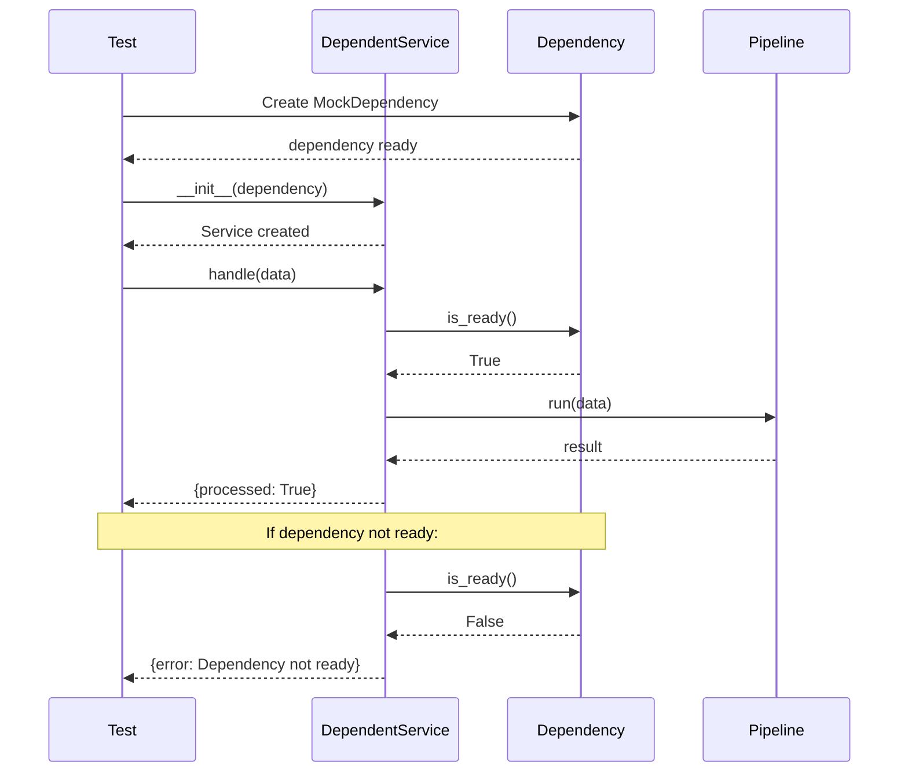
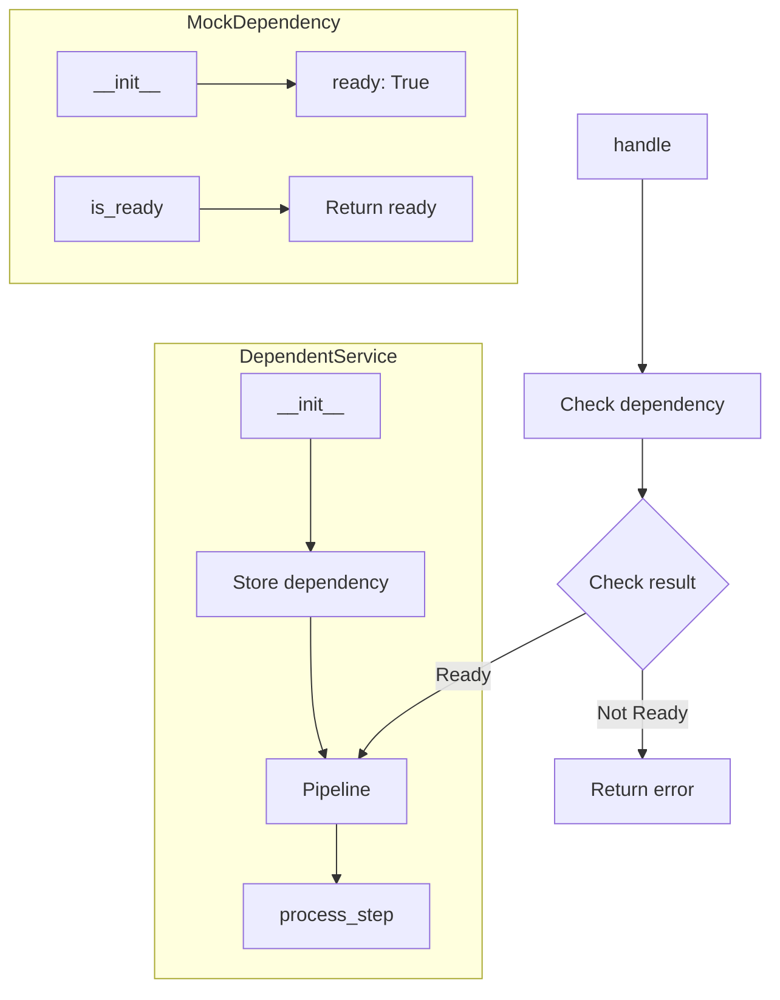
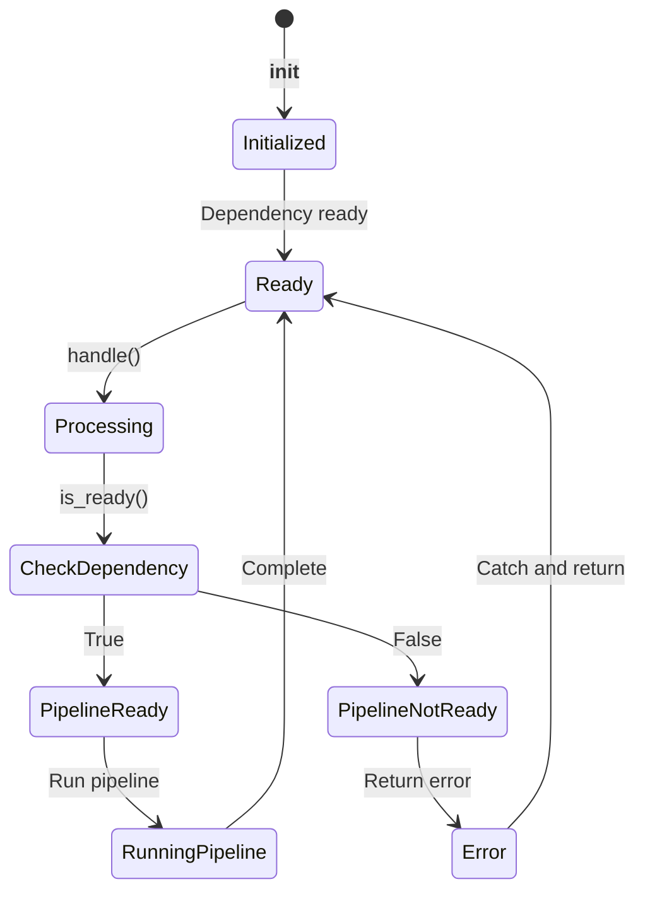

# Service Dependencies Example

Demonstrates managing service dependencies.

## What It Does

This example shows how to create a dependent service with:
- Dependency injection
- Readiness checking
- Conditional processing
- Mock dependency for testing

## Service Flow



## Service Communication



## Service Structure



## Dependency States



## Dependency Check Flow

```mermaid
flowchart LR
    subgraph Dependency Check
        A[handle(data)]
        A --> B[is_ready()?]
        B --> C{Ready?}
    end
    
    subgraph Case: Ready
        C -->|Yes| D[Run pipeline]
        D --> E["{processed: True}"]
    end
    
    subgraph Case: Not Ready
        C -->|No| F["{error: Dependency not ready}"]
    end
```

## Usage

```bash
python example.py
```

## Expected Output

```
Result: {'processed': True}
```
