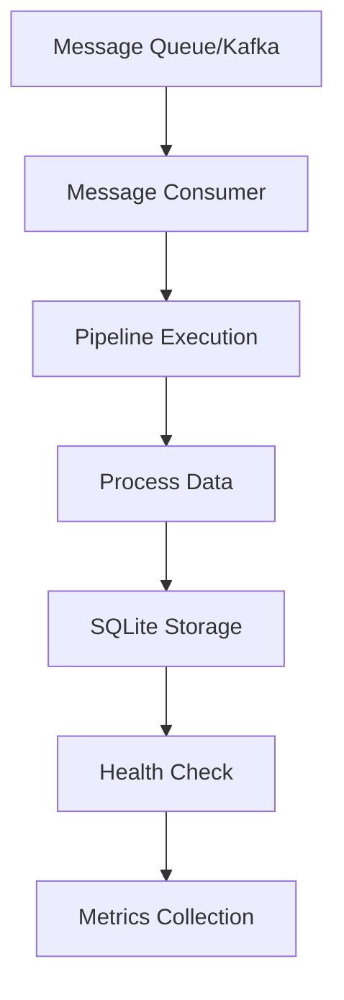
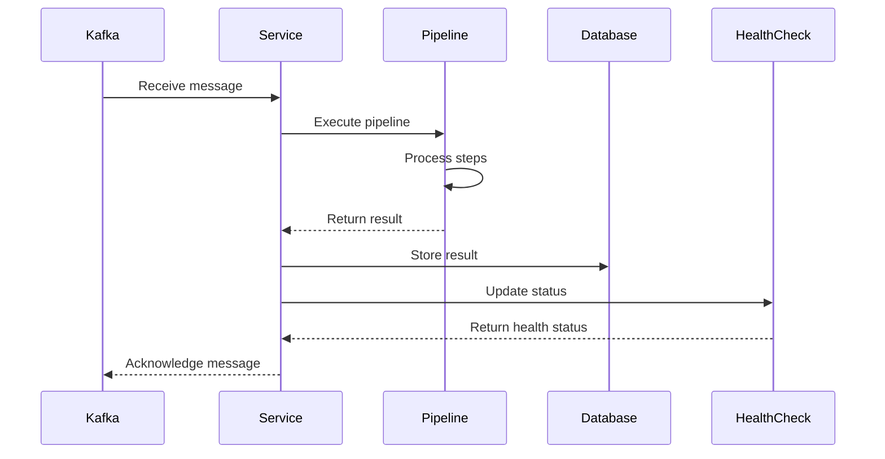
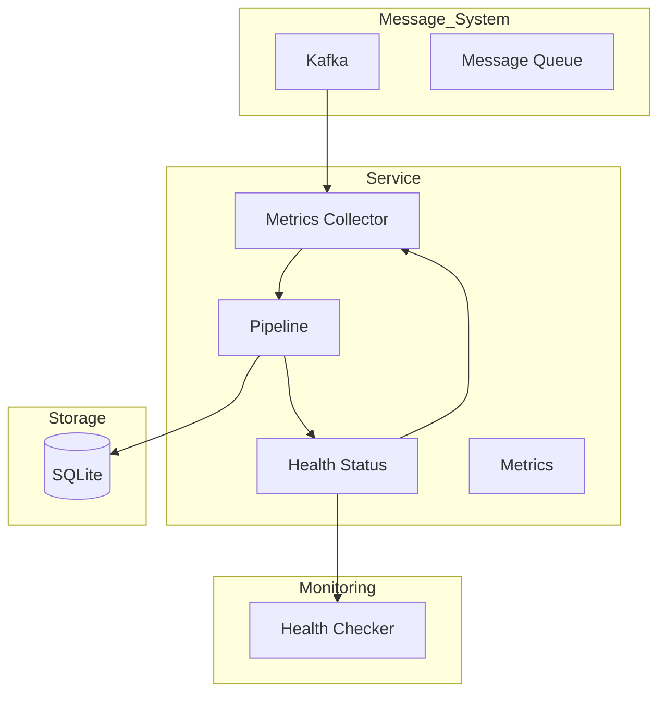

# Microservice Architecture

This directory contains examples demonstrating microservice patterns using wpipe.

## Project Overview

The `microservice` module provides patterns for building microservices that can process messages from messaging systems (like Kafka), run pipelines for processing, store results in SQLite, and report status to APIs.

**Key Capabilities:**
- Message processing from Kafka or other systems
- Pipeline integration for data processing
- SQLite for result persistence
- Health check endpoints
- Worker state management
- Metrics collection
- Graceful shutdown handling

---

## 1. 🚶 Diagram Walkthrough



---

## 2. 🗺️ System Workflow (Sequence)



---

## 3. 🏗️ Architecture Components



---

## 4. 📂 File-by-File Guide

| File | Description |
|------|-------------|
| `01_basic_service_example/` | Basic microservice structure |
| `02_message_processor_example/` | Message processor pattern |
| `03_service_with_pipeline_example/` | Complete service with pipeline |
| `05_health_check_example/` | Health check implementation |
| `06_service_state_example/` | Service state management |
| `07_service_validation_example/` | Request validation |
| `08_service_metrics_example/` | Metrics collection |
| `09_service_config_example/` | Configuration-based service |
| `09_service_dependencies_example/` | Service dependencies |
| `10_service_graceful_shutdown.py` | Graceful shutdown handling |

---

## Quick Start

### Basic Service Structure

```python
from examples.microservice.microservice import Microservice

def process_message(data):
    return {"processed": True, "data": data}

service = Microservice(verbose=True)
service.set_steps([(process_message, "Process", "v1.0")])

# Process a message
result = service.run({"message": "hello"})
```

### With Kafka

```python
from examples.microservice.microservice import Microservice
from wkafka.controller import Wkafka

kafka = Wkafka(
    bootstrap_servers="localhost:9092",
    topic="my_topic",
    group_id="my_group"
)

microservice = Microservice(kafka, config_file="config.yaml")
microservice.set_steps([(process_step, "Process", "v1.0")])
microservice.start_healthchecker()
```

---

## Configuration

### YAML Configuration

```yaml
name: Microservicio_1
version: v1.0
kafka_server: localhost:9092
pipeline_use: true
pipeline_server: http://localhost:8418
pipeline_token_server: mysecrettoken
sqlite_db_name: register.db
```

---

## Health Checks

```python
from examples.microservice.microservice import Microservice

service = Microservice(verbose=True)
service.set_steps([(process, "Process", "v1.0")])
service.start_healthchecker()

# Check health
health = service.health_check()
print(health)
```

---

## Metrics

```python
service = Microservice(verbose=True)
service.set_steps([(process, "Process", "v1.0")])

# Run multiple times
for i in range(10):
    service.run({"index": i})

# Get metrics
metrics = service.get_metrics()
print(metrics)
```

---

## State Management

```python
class MyService(Microservice):
    def __init__(self):
        super().__init__()
        self.request_count = 0
    
    def process(self, data):
        self.request_count += 1
        data["request_number"] = self.request_count
        return data
```

---

## Graceful Shutdown

```python
import signal
import sys

service = Microservice(verbose=True)

def signal_handler(sig, frame):
    print("Shutting down...")
    service.stop()
    sys.exit(0)

signal.signal(signal.SIGINT, signal_handler)
```

---

## Dependencies

For Kafka integration:
```bash
pip install wkafka
```

---

## Best Practices


1. **Use health checks** - Monitor service status
2. **Implement graceful shutdown** - Clean up resources
3. **Track metrics** - Monitor performance
4. **Store results** - Persist processing data

---

## See Also

- [Basic Pipeline](../01_basic_pipeline/) - Core pipeline concepts
- [SQLite Integration](../06_sqlite_integration/) - Data persistence
- [YAML Config](../08_yaml_config/) - Configuration management
