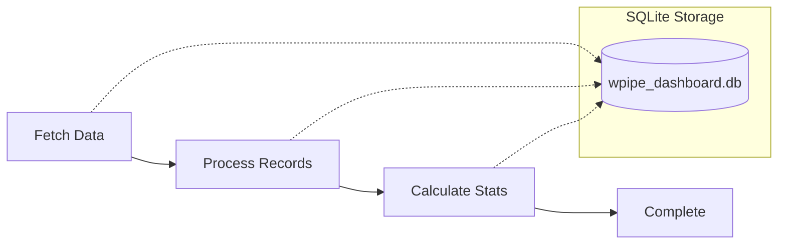
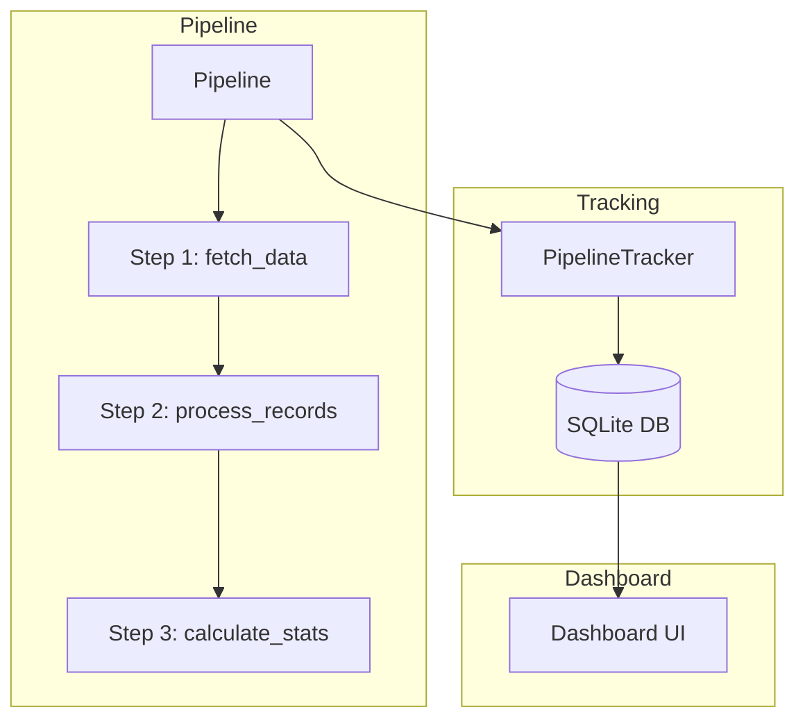

# Example 01: Pipeline with SQLite

This example demonstrates how to create a pipeline that automatically stores execution data in SQLite, which can then be viewed in the dashboard.

## What it does

The pipeline performs data processing tasks and automatically tracks:
- Pipeline execution status
- Input and output data
- Step-by-step execution details
- Timestamps and duration

## Pipeline Flow



## Execution Timeline

```mermaid
gantt
    title Pipeline Execution Timeline
    dateFormat X
    axisFormat %s
    
    Fetch Data       :0, 5
    Process Records  :5, 15
    Calculate Stats  :15, 20
```



## Architecture



## Run the Example

```bash
cd examples/10_dashboard/01_pipeline_with_sqlite
python example.py
```

## View Dashboard

```bash
cd ..
python -m wpipe.dashboard --db wpipe_dashboard.db --config-dir configs --open
```

## Key Features Demonstrated

- ✅ Automatic SQLite tracking
- ✅ Input/output data capture
- ✅ Step-level metrics
- ✅ Dashboard visualization
