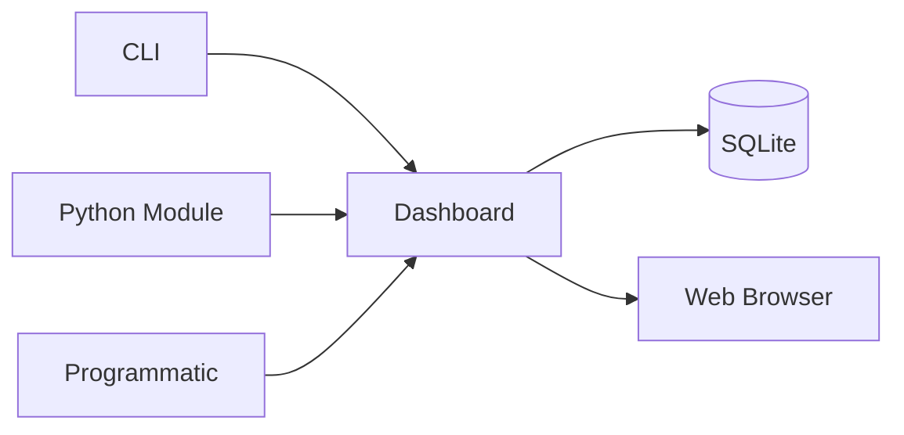
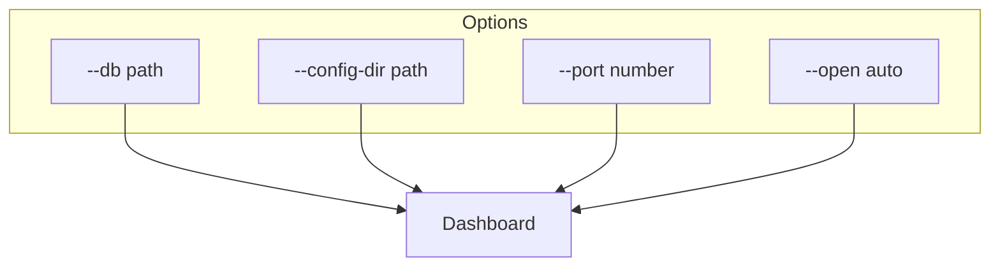
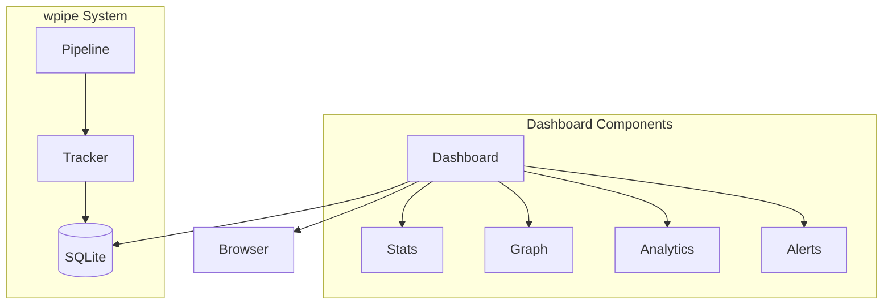

# Example 02: Start Dashboard

Learn how to launch and configure the wpipe dashboard.

## Dashboard Access Methods



## Startup Options



## Architecture Overview



## Run Methods

```bash
# Method 1: CLI
python -m wpipe.dashboard --db wpipe_dashboard.db --config-dir configs --open

# Method 2: Python
python -c "from wpipe import start_dashboard; start_dashboard('wpipe_dashboard.db')"

# Method 3: Shell script
./run_dashboard.sh
```

## Key Features

- ✅ Multiple startup methods
- ✅ Configurable port and database
- ✅ Auto browser opening
- ✅ Real-time data refresh
