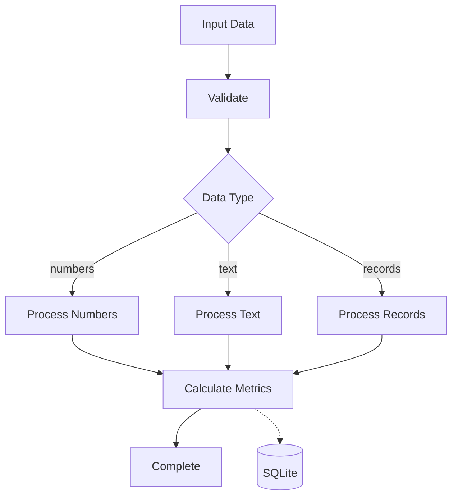
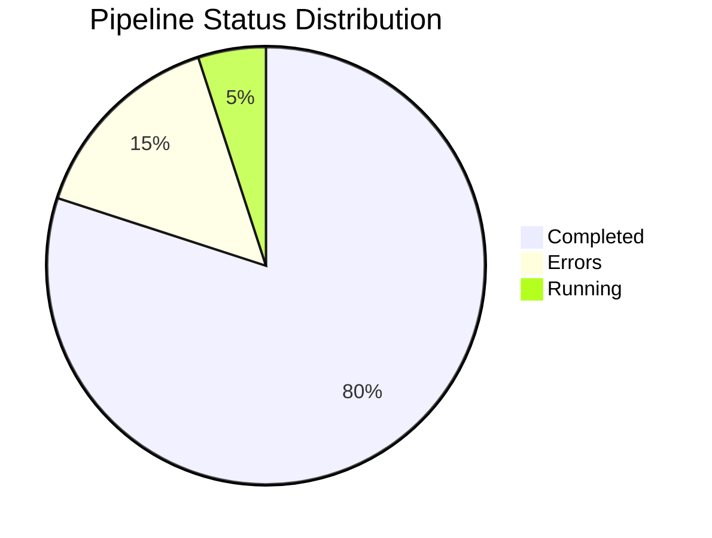

# Example 03: Full Example with Multiple Executions

Generate historical pipeline data with multiple runs to demonstrate the dashboard's analytics capabilities.

## What it does

Runs the same pipeline multiple times with different inputs to create historical data for:
- Success/failure rate analytics
- Execution time trends
- Step performance comparisons

## Pipeline Flow



## Multi-Run Execution

```mermaid
gantt
    title Multiple Pipeline Runs
    dateFormat X
    axisFormat %s
    
    Run 1 - Numbers :0, 10
    Run 2 - Text   :10, 20
    Run 3 - Records :20, 30
    Run 4 - Numbers :30, 40
    Run 5 - Text    :40, 50
```



## Analytics Dashboard



## Run the Example

```bash
cd examples/10_dashboard/03_full_example
python example.py
```

## What You'll See in Dashboard

- 📊 **Stats Cards**: Total pipelines, success rate, avg duration
- 📈 **Analytics Tab**: Pie chart of statuses, slowest steps
- ⏱️ **Timeline Tab**: Execution history over time
- 🔔 **Alerts Tab**: Fired alerts from executions
