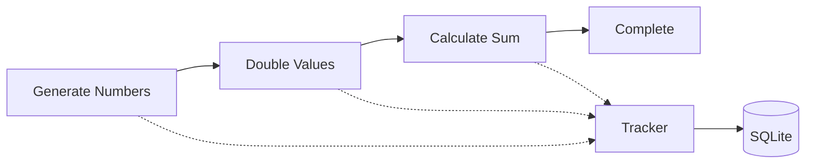
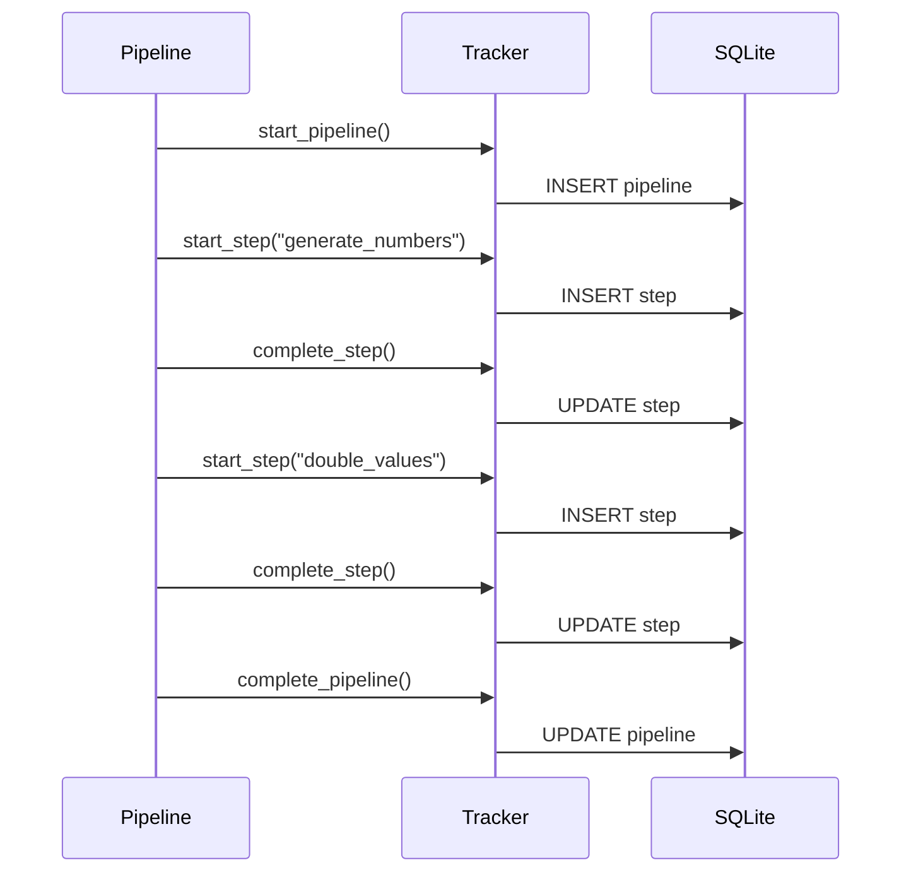

# Example 04: Basic Tracking

Simple example demonstrating core pipeline tracking functionality.

## Pipeline Flow



## Execution Steps



## Key Tracking Data

| Data Type | Stored |
|-----------|--------|
| Pipeline ID | ✅ Unique matrícula |
| Status | ✅ completed/error/running |
| Duration | ✅ milliseconds |
| Input Data | ✅ JSON |
| Output Data | ✅ JSON |
| Timestamps | ✅ started/completed |

## Run

```bash
cd examples/10_dashboard/04_basic_tracking
python example.py
```
