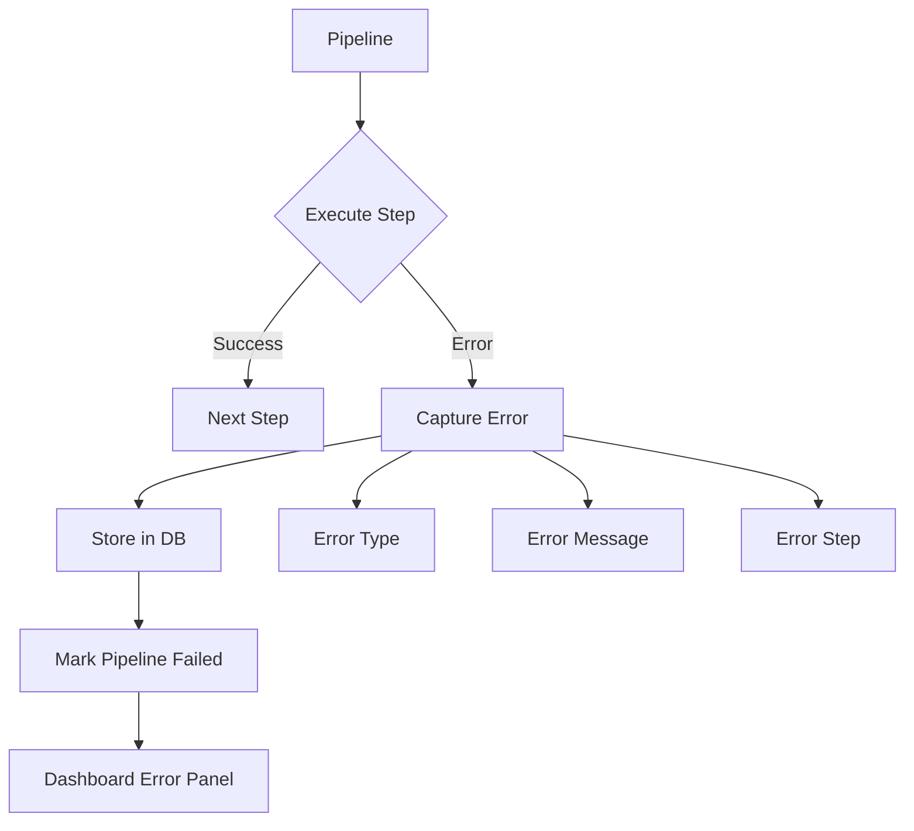
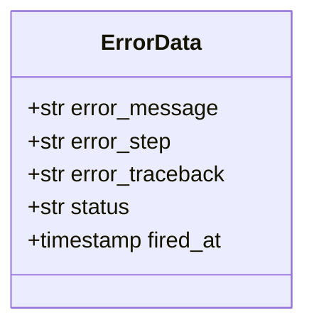

# Example 05: Error Handling

Demonstrates how errors are tracked, stored, and displayed in the dashboard.

## Error Tracking Flow



## Error Data Captured



## Dashboard Error Display

```mermaid
graph LR
    DB[(SQLite)] --> API[/api/pipelines/{id}\]
    API --> D[Dashboard]
    D --> EP[Error Panel]
    D --> EL[Error List]
    D --> EA[Alert Badge]
```

## What Gets Tracked

- ✅ Error message
- ✅ Error step name
- ✅ Full traceback
- ✅ Pipeline status
- ✅ Timestamp

## Run

```bash
cd examples/10_dashboard/05_error_handling
python example.py
```
