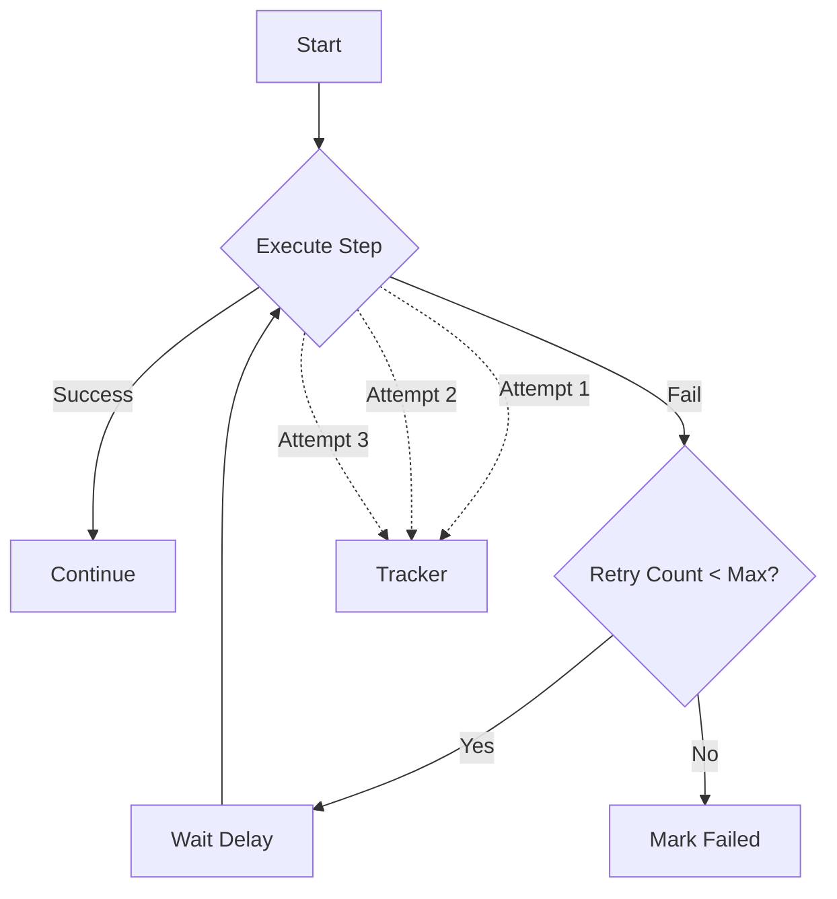
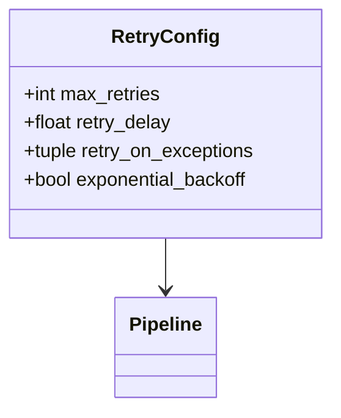
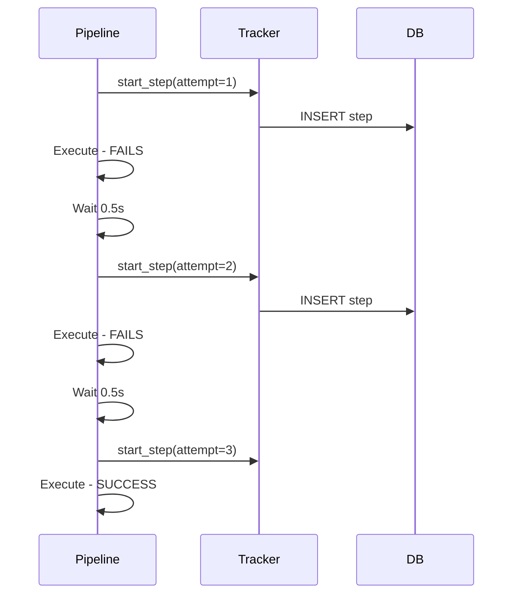

# Example 06: Retry Logic

Shows automatic retry functionality with tracking of retry attempts.

## Retry Flow



## Retry Configuration



## Tracking Retries



## Run

```bash
cd examples/10_dashboard/06_retry_logic
python example.py
```
