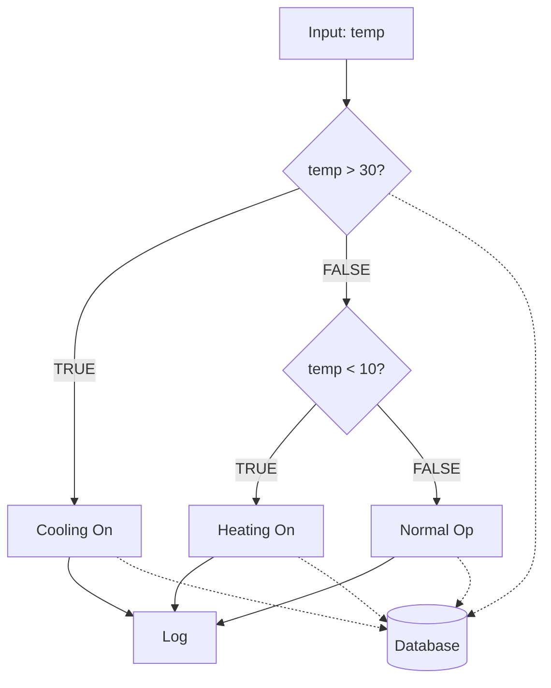
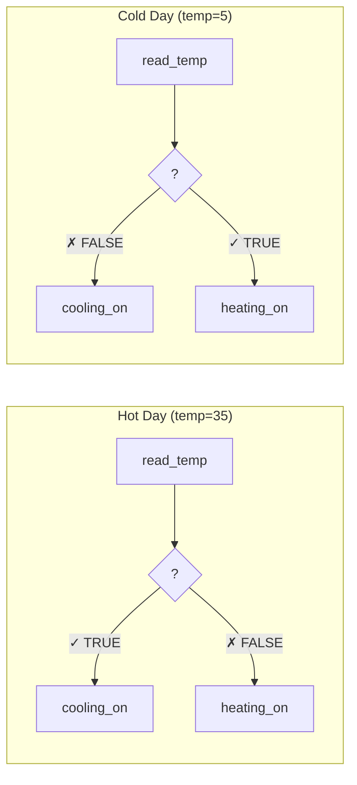

# Example 07: Conditional Branching

Demonstrates conditional logic with branches tracked in the dashboard.

## Conditional Flow



## Branch Visualization



## What Dashboard Shows

- ✅ Diamond nodes for conditions
- ✅ TRUE/FALSE branch indicators
- ✅ Skipped steps in gray
- ✅ Both branches listed in tooltip

## Run

```bash
cd examples/10_dashboard/07_conditions
python example.py
```
