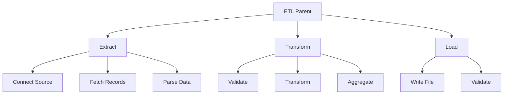
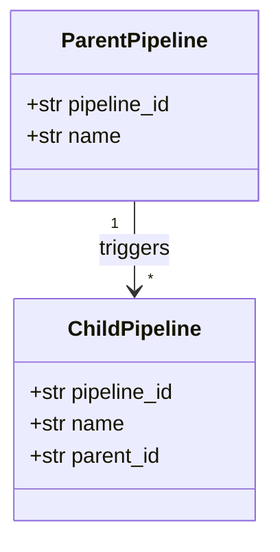
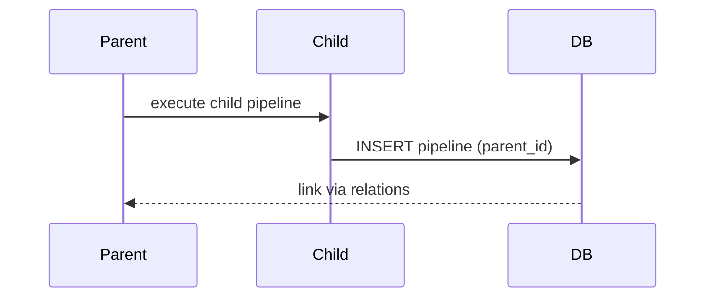

# Example 08: Nested Pipelines

Shows how to compose pipelines from other pipelines with parent-child relationships.

## Hierarchical Structure



## Parent-Child Relationships



## Pipeline Relations



## What Gets Tracked

- ✅ Parent pipeline ID
- ✅ Child pipeline ID
- ✅ Relation type (triggered, contains, etc.)
- ✅ Execution order

## Run

```bash
cd examples/10_dashboard/08_nested_pipelines
python example.py
```
