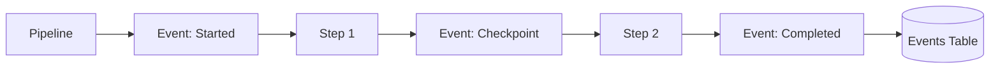
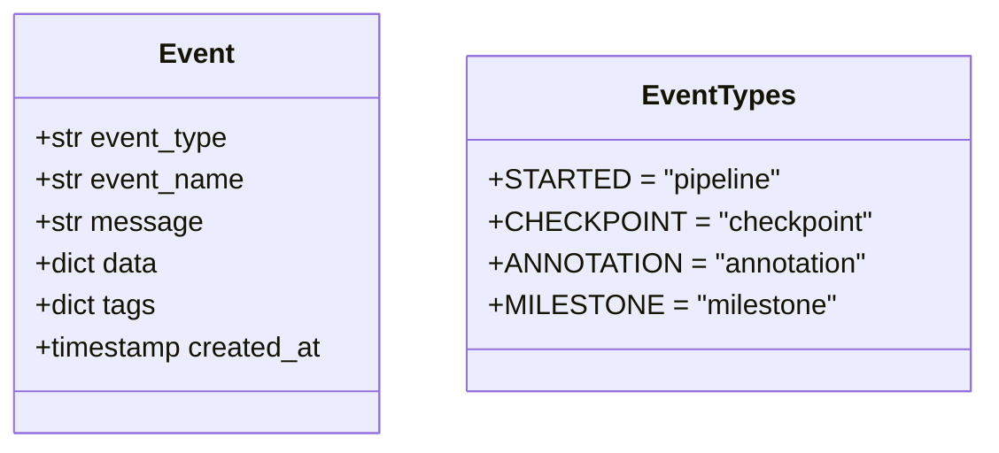

# Example 09: Events & Annotations

Add custom events and annotations to pipelines for better tracking and documentation.

## Events System



## Event Types



## Timeline View

```mermaid
gantt
    title Pipeline with Events
    dateFormat X
    axisFormat %s
    
    Section Execution
    Initialize      :0, 5
    Process Batch 1 :5, 15
    Checkpoint      :15, 15
    Process Batch 2 :15, 25
    Complete        :25, 30
    
    Section Events
    Started         :milestone, 0, 0
    Checkpoint      :milestone, 15, 15
    Completed       :milestone, 30, 30
```



## Run

```bash
cd examples/10_dashboard/09_events_annotations
python example.py
```
