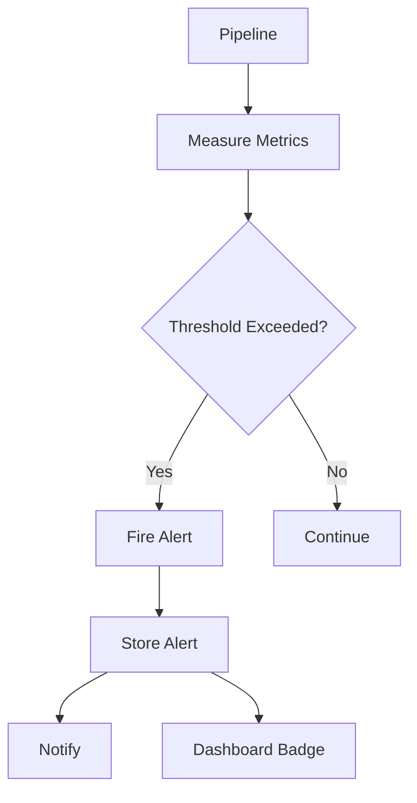
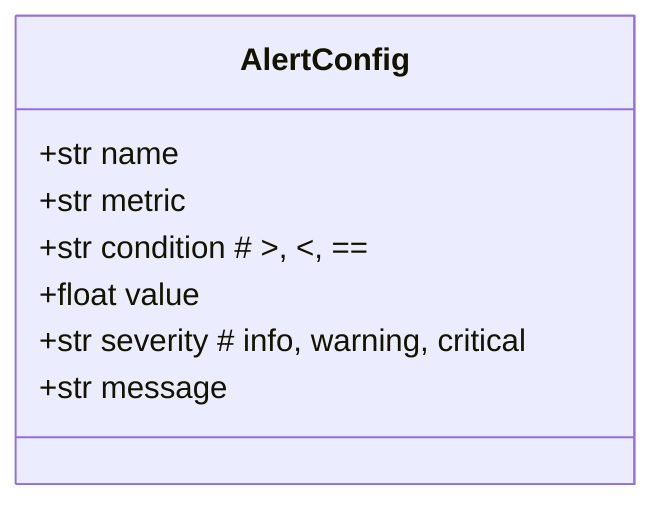
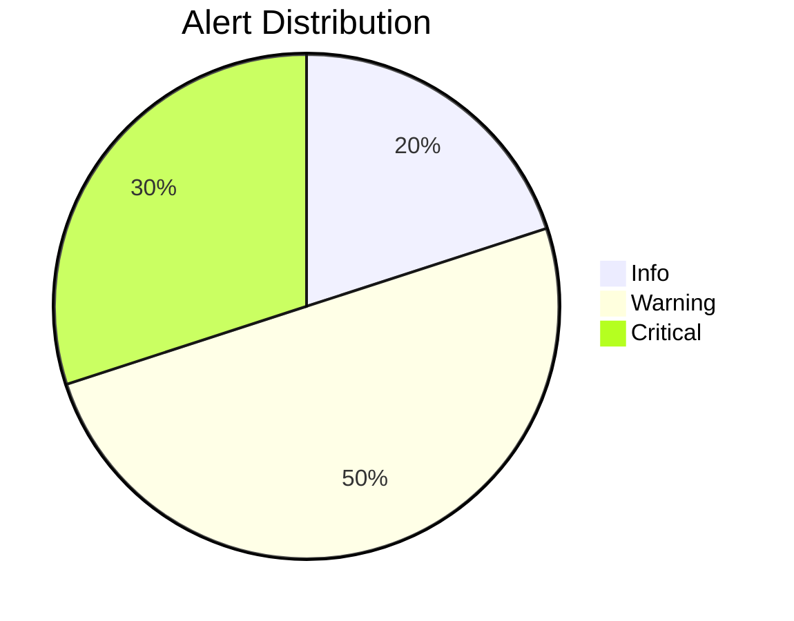

# Example 10: Alert System

Configure alert thresholds and get notified when metrics exceed limits.

## Alert Flow



## Alert Configuration



## Available Metrics

| Metric | Description |
|--------|-------------|
| pipeline_duration_ms | Total execution time |
| step_duration_ms | Individual step time |
| retry_count | Number of retries |
| error_count | Errors encountered |

## Severity Levels



## Run

```bash
cd examples/10_dashboard/10_alerts
python example.py
```
