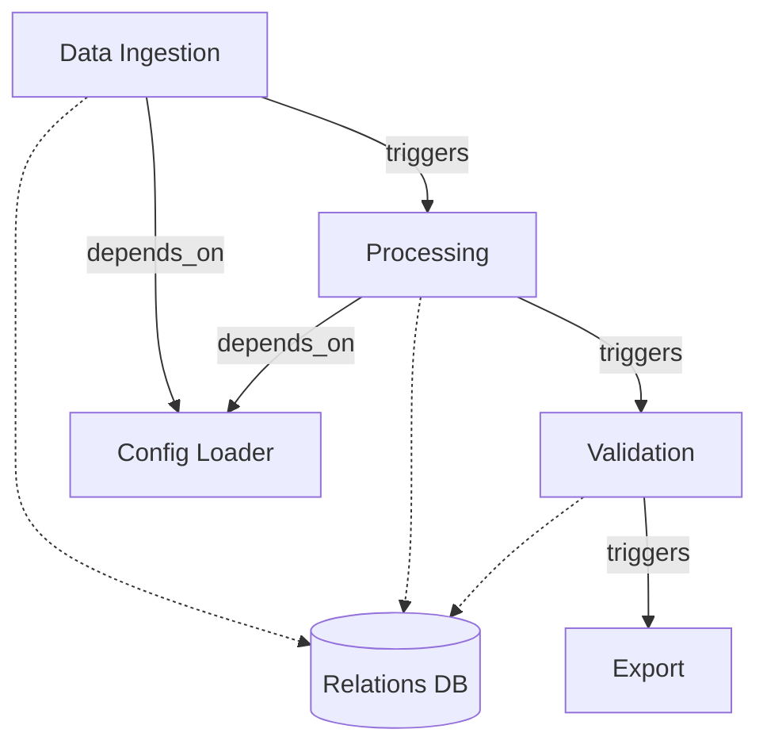
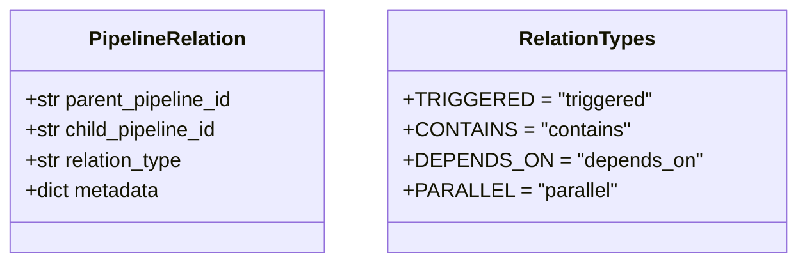
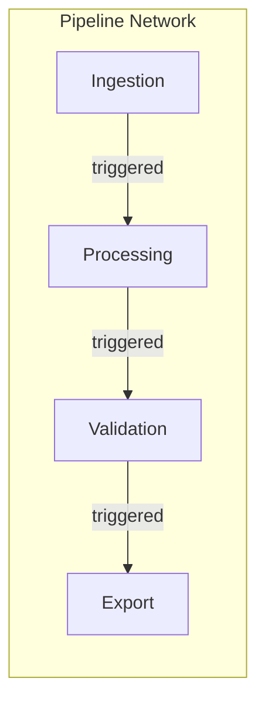

# Example 11: Pipeline Relations

Create and visualize relationships between different pipelines.

## Relation Types



## Relation Types



## Visualization



## Run

```bash
cd examples/10_dashboard/11_pipeline_relations
python example.py
```
