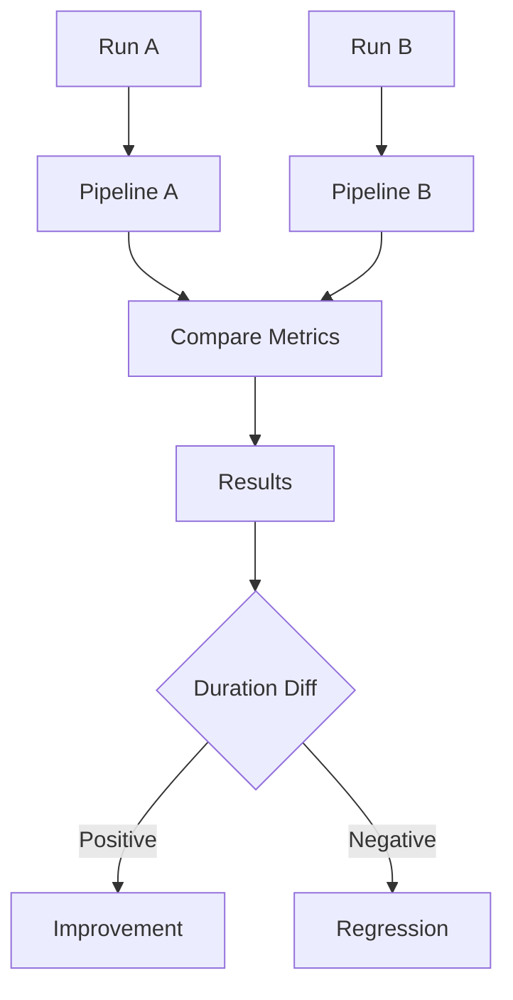
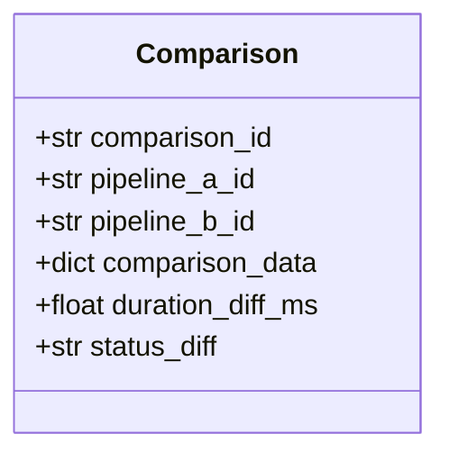
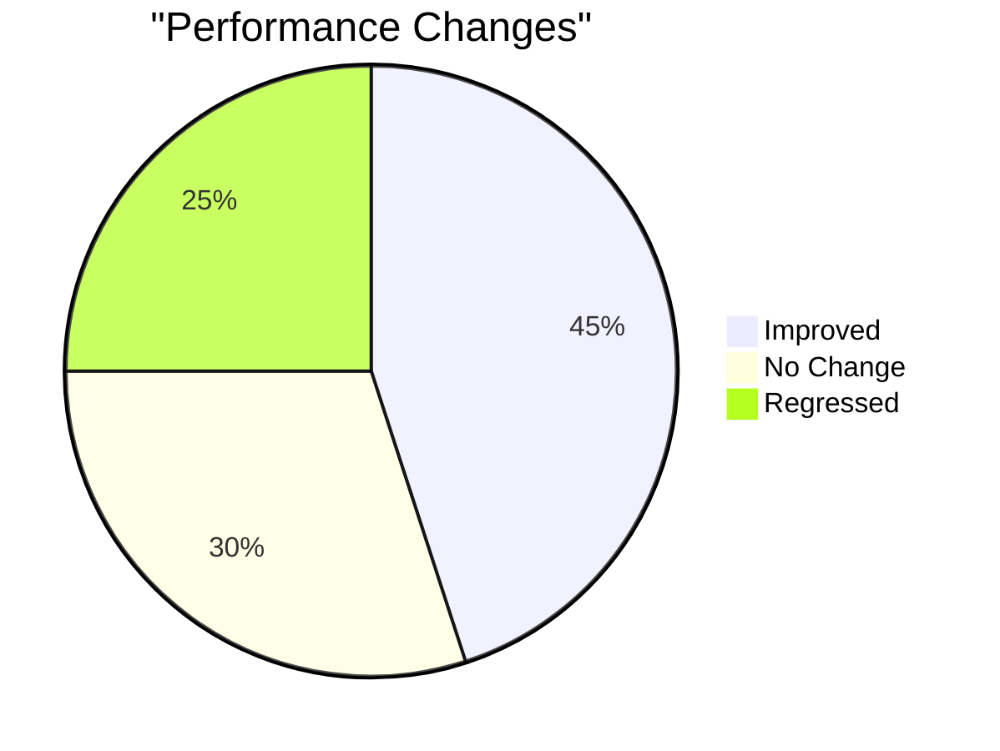

# Example 12: Performance Comparison

Compare two pipeline executions to identify performance regressions or improvements.

## Comparison Flow



## Comparison Metrics



## Results Display



## Run

```bash
cd examples/10_dashboard/12_performance_comparison
python example.py
```
