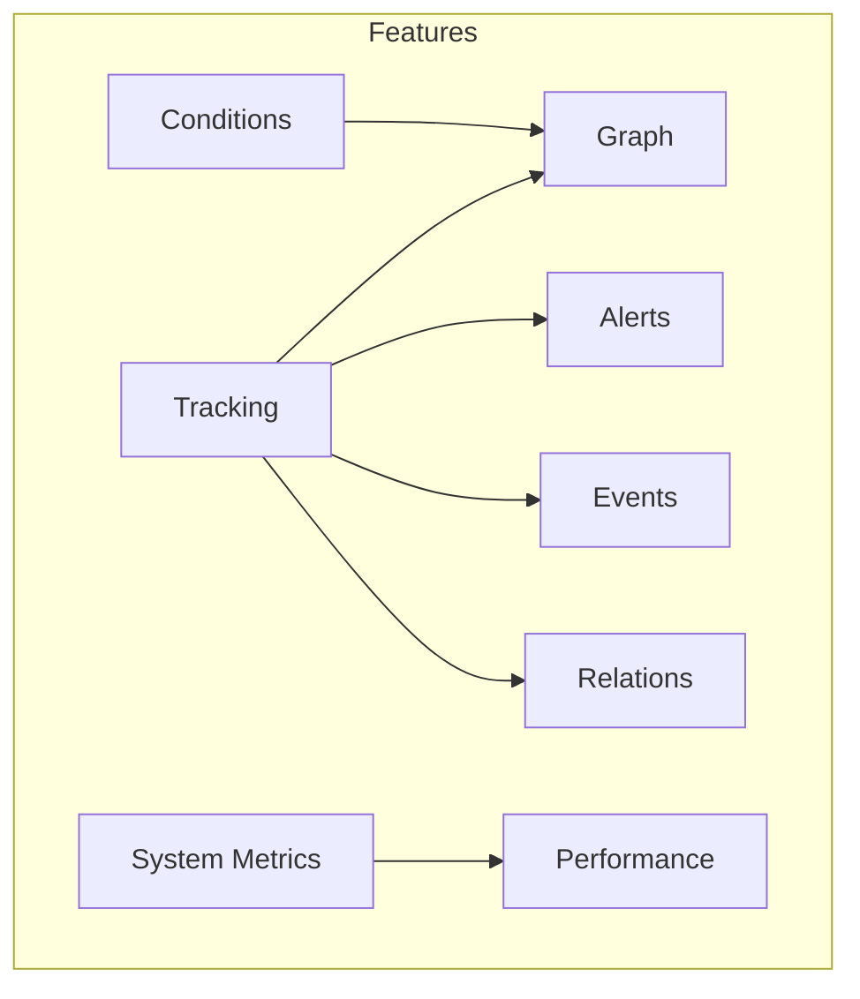
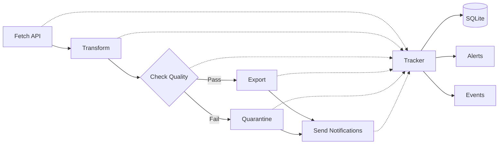

# Example 13: Complete Dashboard

The MASTER example demonstrating ALL wpipe dashboard features combined.

## All Features



## Feature Summary

| Feature | Description |
|---------|-------------|
| ✅ Tracking | Unique pipeline IDs (matrícula) |
| ✅ Graph | SVG visualization of steps |
| ✅ Conditions | Branch tracking with TRUE/FALSE |
| ✅ Events | Custom annotations |
| ✅ Alerts | Configurable thresholds |
| ✅ Relations | Parent-child pipelines |
| ✅ System Metrics | CPU/Memory during execution |
| ✅ Performance | Compare executions |
| ✅ YAML Config | Generated configurations |

## Complete Pipeline Flow



## Run

```bash
cd examples/10_dashboard/13_complete_dashboard
python example.py
```

## What You'll See

1. **Stats Cards**: All key metrics
2. **Graph Tab**: Pipeline flow with conditions
3. **Timeline Tab**: Historical execution chart
4. **Analytics Tab**: Status pie chart, slow steps
5. **Alerts Tab**: Fired alerts with severity
6. **Events Tab**: Timeline of annotations
