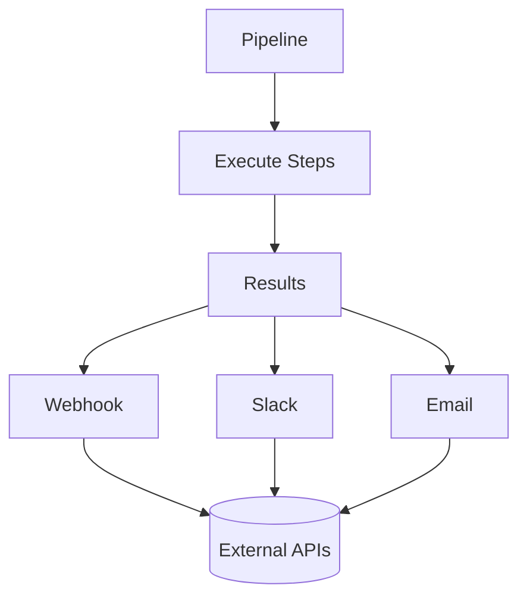
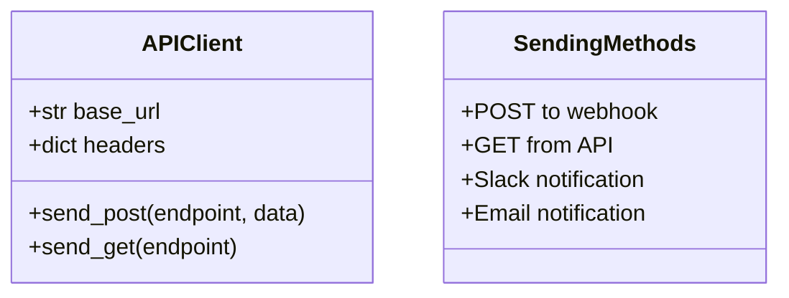
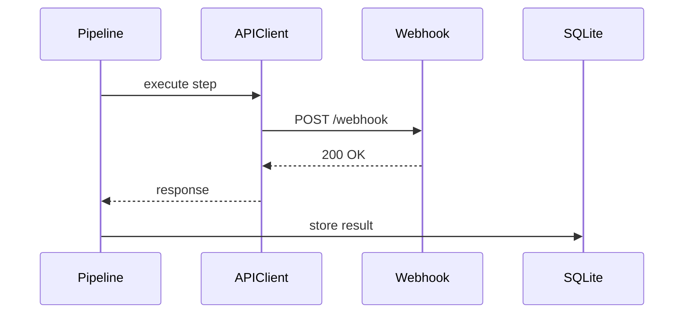

# Example 14: API Sending

Send pipeline results to external APIs, webhooks, and notification systems.

## API Integration Flow



## Sending Methods



## Data Flow



## Run

```bash
cd examples/10_dashboard/14_api_sending
python example.py
```
