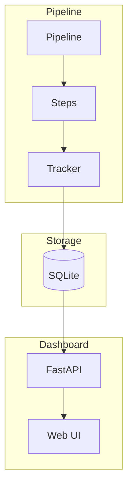

# wpipe Dashboard Examples

Enterprise-grade pipeline tracking and visualization system. This dashboard is so professional and feature-rich that users of Airflow, Dagster, or Prefect would want to switch to wpipe.

## Quick Start

### Run the Dashboard

```bash
# Option 1: Using the shell script
./run_dashboard.sh

# Option 2: Using Python
cd ..
python -m wpipe.dashboard --db wpipe_dashboard.db --config-dir configs --open
```

### Run All Examples

```bash
./run_all_examples.sh
```

## Examples Overview

| # | Name | Description | Key Features |
|---|------|-------------|--------------|
| 01 | Pipeline with SQLite | Basic pipeline with tracking | ✅ SQLite, ✅ Dashboard |
| 02 | Start Dashboard | How to launch the dashboard | ✅ CLI, ✅ Python, ✅ Config |
| 03 | Full Example | Multiple executions for analytics | ✅ History, ✅ Trends |
| 04 | Basic Tracking | Simple tracking demo | ✅ Steps, ✅ Duration |
| 05 | Error Handling | Error tracking | ✅ Errors, ✅ Traceback |
| 06 | Retry Logic | Automatic retries | ✅ Retry, ✅ Attempts |
| 07 | Conditions | Conditional branching | ✅ Branches, ✅ TRUE/FALSE |
| 08 | Nested Pipelines | Parent-child relationships | ✅ Hierarchy |
| 09 | Events & Annotations | Custom events | ✅ Timeline |
| 10 | Alert System | Configurable thresholds | ✅ Alerts, ✅ Severity |
| 11 | Pipeline Relations | Link pipelines | ✅ Dependencies |
| 12 | Performance Comparison | Compare executions | ✅ Diff, ✅ Trends |
| 13 | Complete Dashboard | ALL FEATURES | ✅ Everything |
| 14 | API Sending | External API integration | ✅ Webhooks |

## Dashboard Features

- 🔀 **Pipeline Graph**: Visual SVG flow diagram with animations
- ⏱️ **Timeline**: Gantt-style execution timeline  
- 📊 **Analytics**: Chart.js pie charts and bar graphs
- 🔔 **Alerts**: Configurable thresholds with severity levels
- 📝 **Events**: Timeline of pipeline events and annotations
- 📈 **Performance**: Compare executions side-by-side
- 💾 **System Metrics**: CPU/Memory during execution
- 📄 **YAML Viewer**: Pipeline configuration display
- 🌐 **Multi-language**: English and Spanish
- 🎨 **Dark Mode**: Professional glassmorphism design

## Architecture



## Database Schema

The dashboard uses 9 tables for comprehensive tracking:

| Table | Purpose |
|-------|---------|
| pipelines | Main pipeline executions |
| steps | Individual step executions |
| performance_stats | Aggregated metrics |
| step_history | Step duration history |
| alerts_config | Alert configurations |
| alerts_fired | Fired alerts |
| events | Pipeline events |
| pipeline_relations | Parent-child links |
| system_metrics | CPU/Memory during run |

## Multi-language Support

Switch between English and Spanish using the dropdown in the header.

## Keyboard Shortcuts

- `Ctrl+K` - Search pipelines
- `R` - Refresh data
- `Esc` - Close modals

## Examples by Category

### Basic
- 01_pipeline_with_sqlite
- 04_basic_tracking

### Error Handling
- 05_error_handling
- 06_retry_logic

### Flow Control
- 07_conditions

### Integration
- 08_nested_pipelines
- 14_api_sending

### Monitoring
- 09_events_annotations
- 10_alerts
- 11_pipeline_relations
- 12_performance_comparison

### Complete
- 13_complete_dashboard
