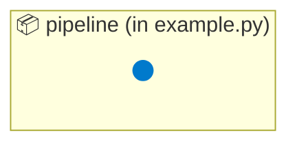

# Pipeline DAG: example.py

Generated by WPipe Tools

```mermaid
flowchart TD
  classDef step fill:#1e1e1e,stroke:#007acc,stroke-width:2px,color:#fff,rx:5,ry:5
  classDef logic fill:#1e1e1e,stroke:#ce9178,stroke-width:2px,color:#fff,rx:2,ry:2
  classDef startN fill:#007acc,stroke:#007acc,color:#fff
  subgraph sg_mglr5 ["📦 pipeline (in example.py)"]
    direction TD
    start_mglr5(( )):::startN

  end

```