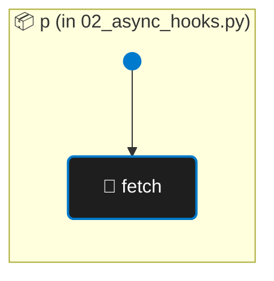

# Pipeline DAG: 02_async_hooks.py

Generated by WPipe Tools

```mermaid
flowchart TD
  classDef step fill:#1e1e1e,stroke:#007acc,stroke-width:2px,color:#fff,rx:5,ry:5
  classDef logic fill:#1e1e1e,stroke:#ce9178,stroke-width:2px,color:#fff,rx:2,ry:2
  classDef startN fill:#007acc,stroke:#007acc,color:#fff
  subgraph sg_iwbsi ["📦 p (in 02_async_hooks.py)"]
    direction TD
    start_iwbsi(( )):::startN
      start_iwbsi --> nLiwbsi0[" 🚀 fetch "]:::step

  end

```