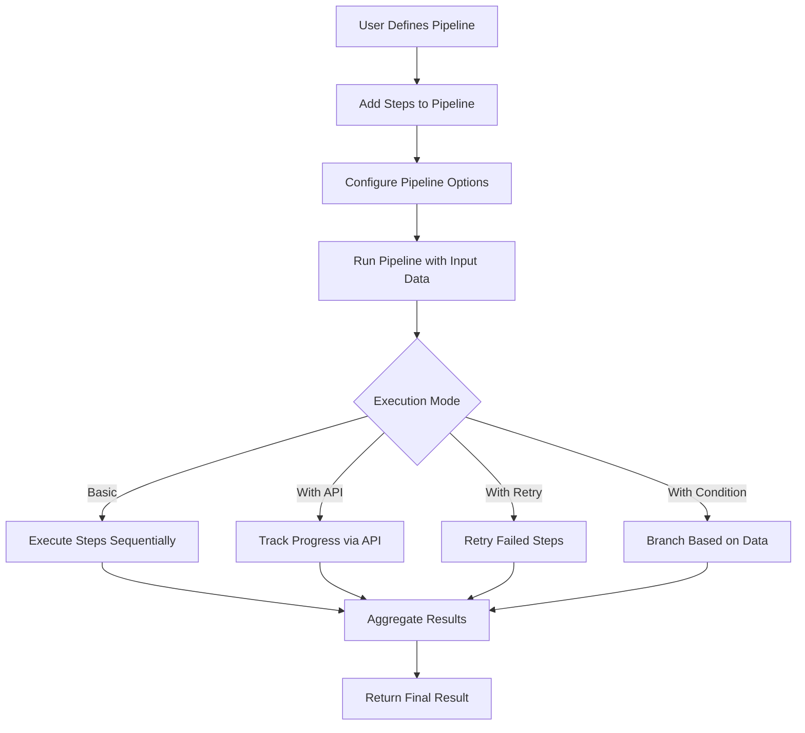
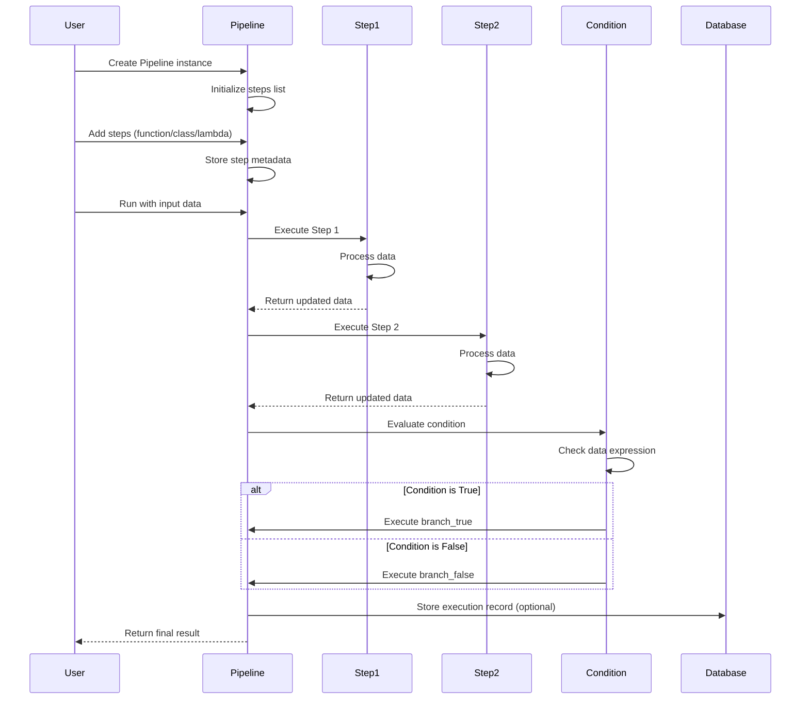
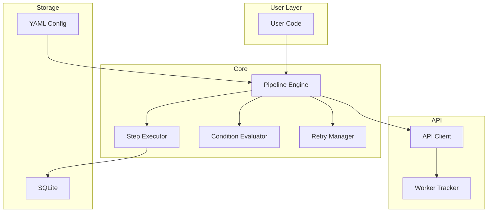
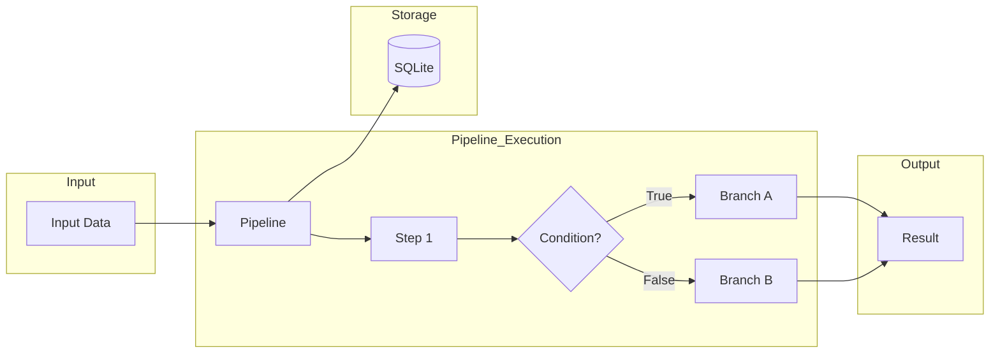
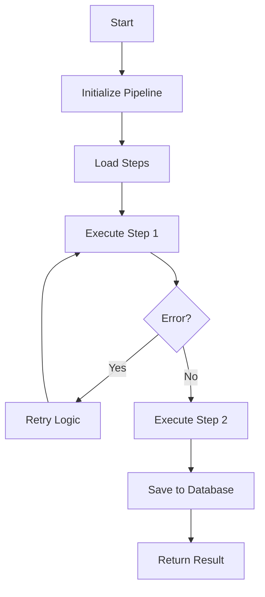

# wpipe Examples

<p align="center">
  
</p>

## Project Overview

This directory contains a comprehensive collection of **working examples** demonstrating the wpipe library's functionality. Each subdirectory represents a specific feature or use case, organized by complexity level from basic concepts to advanced patterns.

**wpipe** is a powerful Python pipeline framework that enables creating executable workflows with support for:
- Chained processing steps
- Conditional branching
- Automatic retry mechanisms
- SQLite database integration
- Nested pipelines
- YAML configuration management
- Microservice architecture patterns

## Features

| Feature | Description | Complexity Level |
|---------|-------------|------------------|
| Basic Pipeline | Core pipeline creation and execution | 1 |
| API Pipeline | Pipeline with API tracking and worker management | 2 |
| Error Handling | Strategies for managing failures and recovery | 3 |
| Conditional Execution | Dynamic branching based on data conditions | 4 |
| Retry Mechanisms | Automatic retry with configurable backoff | 5 |
| SQLite Integration | Persistent storage of pipeline execution data | 6 |
| Nested Pipelines | Hierarchical pipeline composition | 7 |
| YAML Configuration | External configuration loading and validation | 8 |
| Microservice Patterns | Service architecture with health checks and metrics | 9 |

---

## 1. 🚶 Diagram Walkthrough



---

## 2. 🗺️ System Workflow (Detailed Sequence)



---

## 3. 🏗️ Architecture Components



---

## 4. ⚙️ Container Lifecycle

### Build Process
The wpipe library doesn't require compilation, but the development environment setup includes:

1. **Environment Setup**
   ```bash
   # Create virtual environment
   uv venv --python 3.10
   
   # Activate environment
   source .venv/bin/activate
   ```

2. **Dependency Installation**
   ```bash
   # Install wpipe in development mode
   pip install -e .
   ```

### Runtime Process

1. **Pipeline Initialization**
   - Create Pipeline instance
   - Configure verbose/logging options
   - Set up steps with metadata

2. **Execution Flow**
   - Load input data
   - Execute steps sequentially
   - Handle conditions and branches
   - Apply retry logic on failures
   - Store results in SQLite (if configured)

3. **Completion**
   - Aggregate all step results
   - Return final dictionary
   - Optional: export to CSV

---

## 5. 📂 File-by-File Guide

| Directory | Description |
|-----------|-------------|
| `01_basic_pipeline/` | Core pipeline functionality - 15 examples |
| `02_api_pipeline/` | API integration with worker tracking - 21 examples |
| `03_error_handling/` | Error handling and recovery strategies - 11 examples |
| `04_condition/` | Conditional execution and branching - 12 examples |
| `05_retry/` | Retry mechanisms with backoff - 12 examples |
| `06_sqlite_integration/` | SQLite database operations - 12 examples |
| `07_nested_pipelines/` | Nested/hierarchical pipeline composition - 12 examples |
| `08_yaml_config/` | YAML configuration loading and validation - 12 examples |
| `09_microservice/` | Microservice architecture patterns - 10 examples |

---

## File Structure

```
examples/
├── 01_basic_pipeline/
│   ├── 01_simple_function/      # Basic function step
│   ├── 02_class_steps/          # Class-based steps
│   ├── 03_mixed_steps/          # Mixed step types
│   ├── 04_default_values/       # Default parameter handling
│   ├── 05_args_kwargs/          # *args and **kwargs
│   ├── 06_dict_processing/      # Dictionary manipulation
│   ├── 07_multiple_runs/        # Multiple executions
│   ├── 08_data_aggregation/     # Data aggregation
│   ├── 09_empty_data/           # Empty input handling
│   ├── 10_lambda_steps/        # Lambda functions
│   ├── 11_decorator_steps/      # Decorator patterns
│   ├── 12_context_manager/      # Context manager usage
│   ├── 13_async_pipeline/       # Async execution
│   ├── 14_pipeline_chaining/    # Pipeline chaining
│   └── 15_pipeline_clone/       # Pipeline cloning
├── 02_api_pipeline/            # API integration examples
├── 03_error_handling/          # Error handling examples
├── 04_condition/               # Conditional examples
├── 05_retry/                   # Retry mechanism examples
├── 06_sqlite_integration/      # Database examples
├── 07_nested_pipelines/        # Nested pipeline examples
├── 08_yaml_config/             # YAML configuration examples
├── 09_microservice/            # Microservice examples
└── test/                        # Test files
```

---

## Getting Started

### Installation

```bash
# Create and activate environment
uv venv --python 3.10
source .venv/bin/activate

# Install wpipe
pip install -e .
```

### Running Examples

```bash
# Level 1: Basic pipeline
python examples/01_basic_pipeline/01_simple_function/example.py

# Level 2: API tracking
python examples/02_api_pipeline/01_basic_api/example.py

# Level 3: Error handling
python examples/03_error_handling/01_basic_error_example/example.py

# Level 4: Conditional execution
python examples/04_condition/01_basic_condition_example/example.py

# Level 5: Retry mechanisms
python examples/05_retry/01_basic_retry_example/example.py

# Level 6: SQLite integration
python examples/06_sqlite_integration/01_basic_write_example/example.py

# Level 7: Nested pipelines
python examples/07_nested_pipelines/01_basic_nested_example/example.py

# Level 8: YAML configuration
python examples/08_yaml_config/01_read_yaml_example/example.py

# Level 9: Microservice
python examples/09_microservice/01_basic_service_example/example.py
```

---

## Configuration

### Environment Variables

| Variable | Description | Default |
|----------|-------------|---------|
| `WPIPE_DB_NAME` | SQLite database path | `register.db` |
| `WPIPE_VERBOSE` | Enable verbose logging | `False` |
| `WPIPE_WORKER_NAME` | Worker identifier | `None` |
| `WPIPE_API_URL` | API endpoint for tracking | `None` |

### YAML Configuration

wpipe supports loading pipeline configuration from YAML files:

```yaml
pipeline:
  name: "my_pipeline"
  version: "v1.0.0"
  
steps:
  - name: "Step 1"
    function: "process_data"
    enabled: true
    
  - name: "Step 2"
    function: "validate_results"
    enabled: true
```

---

## Usage Examples

### Basic Pipeline

```python
from wpipe import Pipeline

def process_data(data):
    data["processed"] = True
    return data

pipeline = Pipeline(verbose=True)
pipeline.set_steps([
    (process_data, "Process Data", "v1.0"),
])

result = pipeline.run({"input": "value"})
print(result)  # {'input': 'value', 'processed': True}
```

### With Conditions

```python
from wpipe import Pipeline
from wpipe.pipe import Condition

pipeline = Pipeline(verbose=True)
pipeline.set_steps([
    (get_data, "Get Data", "v1.0"),
    Condition(
        expression="value > 50",
        branch_true=[(process_high, "High Value", "v1.0")],
        branch_false=[(process_low, "Low Value", "v1.0")],
    ),
])
```

### With Retry

```python
pipeline = Pipeline(verbose=True, max_retries=3, retry_delay=1.0)
pipeline.set_steps([
    (unreliable_step, "Unreliable", "v1.0"),
])
```

### With SQLite

```python
from wpipe.sqlite import SQLite

db = SQLite(db_name="pipeline.db")
record_id = db.write(
    input_data={"input": "value"},
    output={"result": "success"}
)
```

---

## Running Tests

```bash
# Run all tests
pytest

# Run specific test file
pytest test/test_pipeline.py

# Run with coverage
pytest --cov=wpipe --cov-report=html

# Open coverage report
open htmlcov/index.html
```

---

## Code Quality

- **ruff**: All checks passing
- **mypy**: Type checking enabled
- **Tests**: 106+ passing tests
- **Python Support**: 3.9 - 3.13

---

## Visuals

### System Workflow Diagram



### Diagram Walkthrough



---

## See Also

- [Main wpipe Repository](https://github.com/wisrovi/wpipe)
- [Documentation](https://wpipe.readthedocs.io/)
- [API Reference](https://wpipe.readthedocs.io/en/latest/api.html)
- [Change Log](https://github.com/wisrovi/wpipe/blob/main/CHANGELOG.md)
