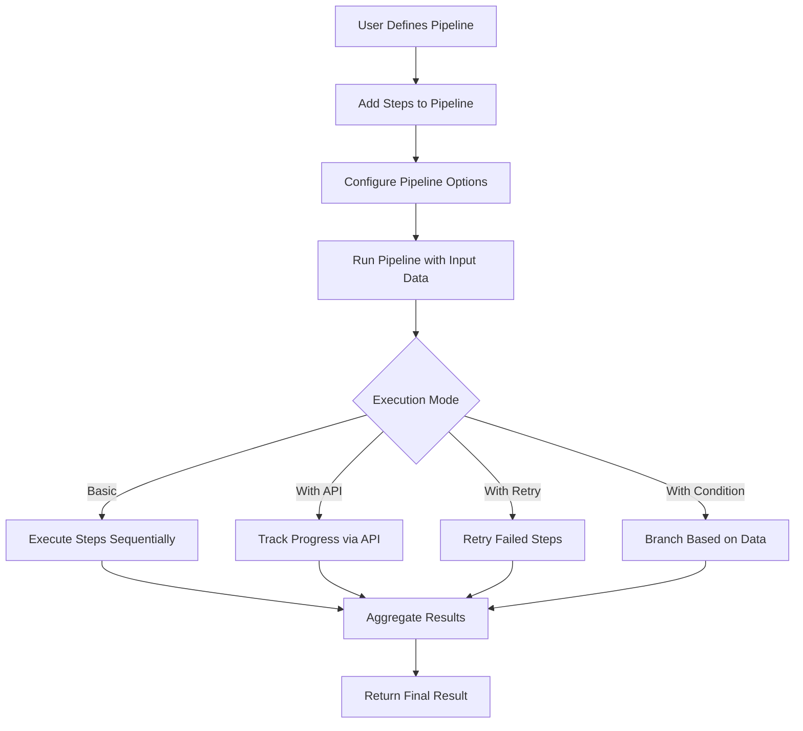
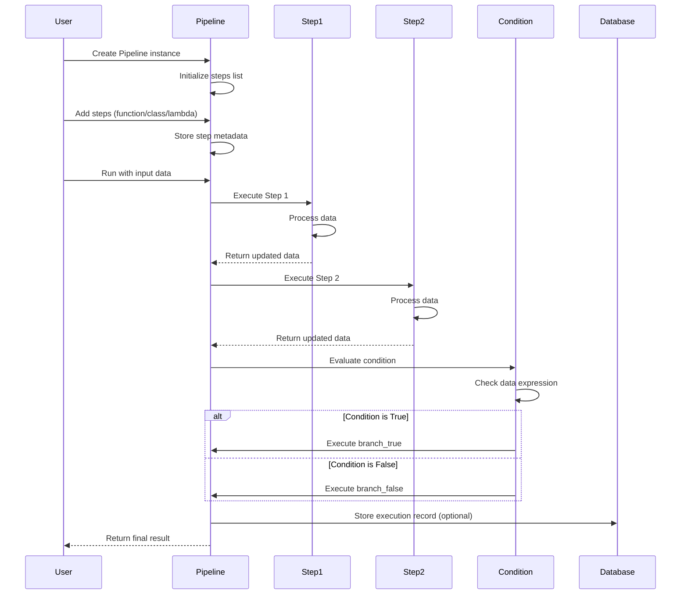
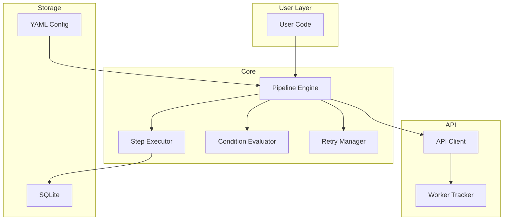
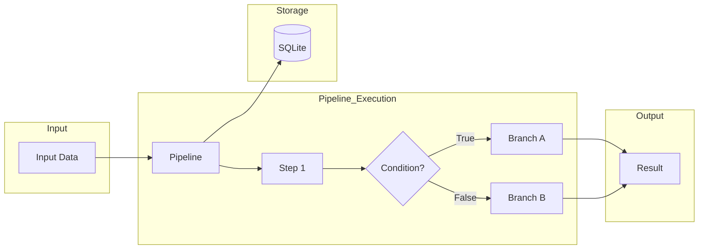
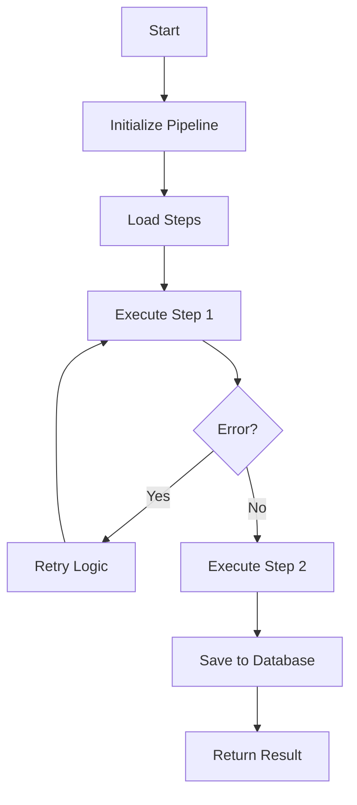

# wpipe Examples

<p align="center">
  
</p>

## Project Overview

This directory contains a comprehensive collection of **working examples** demonstrating the wpipe library's functionality. Each subdirectory represents a specific feature or use case, organized by complexity level from basic concepts to advanced patterns.

**wpipe** is a powerful Python pipeline framework that enables creating executable workflows with support for:
- Chained processing steps
- Conditional branching
- Automatic retry mechanisms
- SQLite database integration
- Nested pipelines
- YAML configuration management
- Microservice architecture patterns

## Features

| # | Feature | Description | Directory |
|---|---------|-------------|-----------|
| 01 | Basic Pipeline | Core pipeline creation and execution | `01_basic_pipeline/` |
| 02 | Tracking | Pipeline with API tracking and worker management | `02_tracking/` |
| 03 | API | API integration with worker tracking | `03_api/` |
| 04 | Error Handling | Strategies for managing failures and recovery | `04_error_handling/` |
| 05 | Conditions | Dynamic branching based on data conditions | `05_conditions/` |
| 06 | SQLite | Persistent storage of pipeline execution data | `06_sqlite/` |
| 07 | Nested | Hierarchical pipeline composition | `07_nested/` |
| 08 | Retry | Automatic retry with configurable backoff | `08_retry/` |
| 09 | Alerts | Alert and notification mechanisms | `09_alerts/` |
| 10 | Checkpointing | Pipeline checkpoint and resume | `10_checkpointing/` |
| 11 | Config | External configuration loading and validation | `11_config/` |
| 12 | Dashboard | Visual dashboard and monitoring | `12_dashboard/` |
| 13 | Metrics | Metrics export and collection | `13_metrics/` |
| 14 | Resource | Resource monitoring | `14_resource/` |
| 15 | Export | Data export (CSV, JSON) | `15_export/` |
| 16 | Log | Log export and management | `16_log/` |
| 17 | Parallel | Parallel execution patterns | `17_parallel/` |
| 18 | Composition | Pipeline composition patterns | `18_composition/` |
| 19 | Decorators | Decorator patterns | `19_decorators/` |
| 20 | Benchmarks | Performance benchmarks | `20_benchmarks/` |
| 21 | For | Loop/iteration patterns | `21_for/` |
| 22 | Timeouts | Timeout handling | `22_timeouts/` |
| 23 | Events | Event handling and annotations | `23_events/` |
| 24 | Microservice | Microservice architecture patterns | `24_microservice/` |
| 26 | Relations | Pipeline relations | `26_relations/` |
| 28 | Type Hinting | Type hinting and validation | `28_type_hinting/` |
| 00 | Honey Pot | Test/demo environment | `00_honey_pot/` |

---

## 1. 🚶 Diagram Walkthrough



---

## 2. 🗺️ System Workflow (Detailed Sequence)



---

## 3. 🏗️ Architecture Components



---

## 4. ⚙️ Container Lifecycle

### Build Process
The wpipe library doesn't require compilation, but the development environment setup includes:

1. **Environment Setup**
   ```bash
   # Create virtual environment
   uv venv --python 3.10
   
   # Activate environment
   source .venv/bin/activate
   ```

2. **Dependency Installation**
   ```bash
   # Install wpipe in development mode
   pip install -e .
   ```

### Runtime Process

1. **Pipeline Initialization**
   - Create Pipeline instance
   - Configure verbose/logging options
   - Set up steps with metadata

2. **Execution Flow**
   - Load input data
   - Execute steps sequentially
   - Handle conditions and branches
   - Apply retry logic on failures
   - Store results in SQLite (if configured)

3. **Completion**
   - Aggregate all step results
   - Return final dictionary
   - Optional: export to CSV

---

## 5. 📂 File-by-File Guide

| # | Directory | Description |
|---|-----------|-------------|
| 01 | `01_basic_pipeline/` | Core pipeline functionality |
| 02 | `02_tracking/` | Pipeline tracking |
| 03 | `03_api/` | API integration |
| 04 | `04_error_handling/` | Error handling strategies |
| 05 | `05_conditions/` | Conditional execution |
| 06 | `06_sqlite/` | SQLite database |
| 07 | `07_nested/` | Nested pipelines |
| 08 | `08_retry/` | Retry mechanisms |
| 09 | `09_alerts/` | Alert mechanisms |
| 10 | `10_checkpointing/` | Checkpoint and resume |
| 11 | `11_config/` | YAML configuration |
| 12 | `12_dashboard/` | Dashboard |
| 13 | `13_metrics/` | Metrics export |
| 14 | `14_resource/` | Resource monitoring |
| 15 | `15_export/` | Data export |
| 16 | `16_log/` | Log export |
| 17 | `17_parallel/` | Parallel execution |
| 18 | `18_composition/` | Composition patterns |
| 19 | `19_decorators/` | Decorator patterns |
| 20 | `20_benchmarks/` | Benchmarks |
| 21 | `21_for/` | Loop patterns |
| 22 | `22_timeouts/` | Timeout handling |
| 23 | `23_events/` | Event handling |
| 24 | `24_microservice/` | Microservice |
| 25 | `25_nested/` | Advanced nested |
| 26 | `26_relations/` | Pipeline relations |
| 27 | `27_retry_logic/` | Advanced retry |
| 28 | `28_type_hinting/` | Type hinting |

---

## File Structure

```
examples/
├── 00_honey_pot/              # Test/demo environment
├── 01_basic_pipeline/          # Core pipeline functionality
├── 02_tracking/               # Pipeline tracking
├── 03_api/                   # API integration
├── 04_error_handling/          # Error handling
├── 05_conditions/            # Conditional execution
├── 06_sqlite/                # SQLite database
├── 07_nested/                 # Nested pipelines
├── 08_retry/                  # Retry mechanisms
├── 09_alerts/                 # Alert mechanisms
├── 10_checkpointing/          # Checkpoint and resume
├── 11_config/                 # YAML configuration
├── 12_dashboard/              # Dashboard
├── 13_metrics/                # Metrics export
├── 14_resource/               # Resource monitoring
├── 15_export/                 # Data export
├── 16_log/                   # Log export
├── 17_parallel/              # Parallel execution
├── 18_composition/            # Composition patterns
├── 19_decorators/             # Decorator patterns
├── 20_benchmarks/             # Benchmarks
├── 21_for/                   # Loop patterns
├── 22_timeouts/               # Timeout handling
├── 23_events/                # Event handling
├── 24_microservice/           # Microservice
├── 25_nested/                # Advanced nested
├── 26_relations/             # Pipeline relations
├── 27_retry_logic/            # Advanced retry
├── 28_type_hinting/           # Type hinting
├── configs/                  # Shared configurations
└── test/                     # Test files
```

---

## Getting Started

### Installation

```bash
# Create and activate environment
uv venv --python 3.10
source .venv/bin/activate

# Install wpipe
pip install -e .
```

### Running Examples

```bash
# 01: Basic pipeline
python examples/01_basic_pipeline/01_simple_function/example.py

# 02: Tracking
python examples/02_tracking/example.py

# 03: API
python examples/03_api/01_basic_api/example.py

# 04: Error handling
python examples/04_error_handling/01_basic_error_example/example.py

# 05: Conditions
python examples/05_conditions/01_basic_condition_example/example.py

# 06: SQLite
python examples/06_sqlite/01_basic_write_example/example.py

# 07: Nested pipelines
python examples/07_nested/01_basic_nested_example/example.py

# 08: Retry
python examples/08_retry/01_basic_retry_example/example.py

# 09: Alerts
python examples/09_alerts/example.py

# 10: Checkpointing
python examples/10_checkpointing/01_basic/example.py

# 11: Config (YAML)
python examples/11_config/01_read_yaml_example/example.py

# 12: Dashboard
python examples/12_dashboard/01_pipeline_with_sqlite/example.py

# 13: Metrics
python examples/13_metrics/example.py

# 14: Resource monitoring
python examples/14_resource/01_basic/example.py

# 15: Export
python examples/15_export/01_json/example.py

# 16: Log export
python examples/16_log/example.py

# 17: Parallel execution
python examples/17_parallel/01_basic/example.py

# 18: Composition
python examples/18_composition/01_nested/example.py

# 19: Decorators
python examples/19_decorators/01_basic/example.py

# 20: Benchmarks
python examples/20_benchmarks/example.py

# 21: For loops
python examples/21_for/01_iterations/example.py

# 22: Timeouts
python examples/22_timeouts/01_sync_timeout/example.py

# 23: Events
python examples/23_events/example.py

# 24: Microservice
python examples/24_microservice/01_basic_service_example/example.py

# 25: Nested (Advanced)
python examples/25_nested/01_basic_nested_example/example.py

# 26: Relations
python examples/26_relations/example.py

# 27: Retry Logic
python examples/27_retry_logic/01_basic_retry_example/example.py

# 28: Type Hinting
python examples/28_type_hinting/01_basic/example.py
```

---

## Configuration

### Environment Variables

| Variable | Description | Default |
|----------|-------------|---------|
| `WPIPE_DB_NAME` | SQLite database path | `register.db` |
| `WPIPE_VERBOSE` | Enable verbose logging | `False` |
| `WPIPE_WORKER_NAME` | Worker identifier | `None` |
| `WPIPE_API_URL` | API endpoint for tracking | `None` |

### YAML Configuration

wpipe supports loading pipeline configuration from YAML files:

```yaml
pipeline:
  name: "my_pipeline"
  version: "v1.0.0"
  
steps:
  - name: "Step 1"
    function: "process_data"
    enabled: true
    
  - name: "Step 2"
    function: "validate_results"
    enabled: true
```

---

## Usage Examples

### Basic Pipeline

```python
from wpipe import Pipeline

def process_data(data):
    data["processed"] = True
    return data

pipeline = Pipeline(verbose=True)
pipeline.set_steps([
    (process_data, "Process Data", "v1.0"),
])

result = pipeline.run({"input": "value"})
print(result)  # {'input': 'value', 'processed': True}
```

### With Conditions

```python
from wpipe import Pipeline
from wpipe.pipe import Condition

pipeline = Pipeline(verbose=True)
pipeline.set_steps([
    (get_data, "Get Data", "v1.0"),
    Condition(
        expression="value > 50",
        branch_true=[(process_high, "High Value", "v1.0")],
        branch_false=[(process_low, "Low Value", "v1.0")],
    ),
])
```

### With Retry

```python
pipeline = Pipeline(verbose=True, max_retries=3, retry_delay=1.0)
pipeline.set_steps([
    (unreliable_step, "Unreliable", "v1.0"),
])
```

### With SQLite

```python
from wpipe.sqlite import SQLite

db = SQLite(db_name="pipeline.db")
record_id = db.write(
    input_data={"input": "value"},
    output={"result": "success"}
)
```

---

## Running Tests

```bash
# Run all tests
pytest

# Run specific test file
pytest test/test_pipeline.py

# Run with coverage
pytest --cov=wpipe --cov-report=html

# Open coverage report
open htmlcov/index.html
```

---

## Code Quality

- **ruff**: All checks passing
- **mypy**: Type checking enabled
- **Tests**: 106+ passing tests
- **Python Support**: 3.9 - 3.13

---

## Visuals

### System Workflow Diagram



### Diagram Walkthrough



---

## See Also

- [Main wpipe Repository](https://github.com/wisrovi/wpipe)
- [Documentation](https://wpipe.readthedocs.io/)
- [API Reference](https://wpipe.readthedocs.io/en/latest/api.html)
- [Change Log](https://github.com/wisrovi/wpipe/blob/main/CHANGELOG.md)
