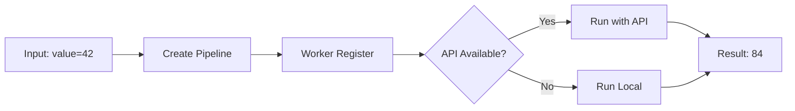
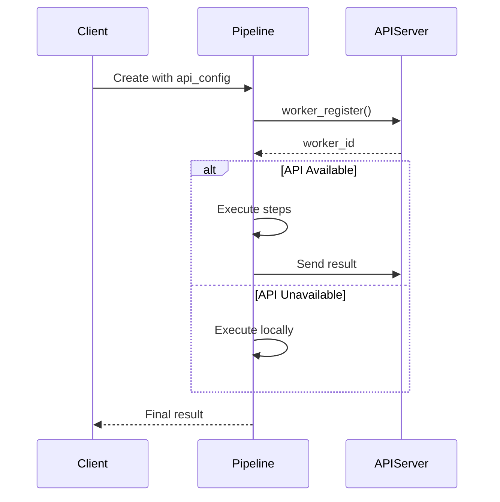
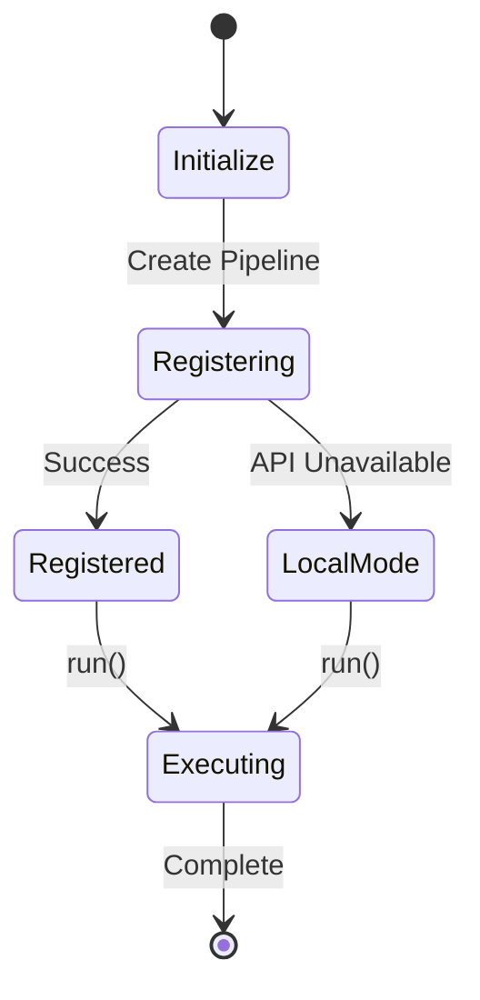

# 01 Basic API

Demonstrates basic API configuration for a pipeline.
Shows how to set up a pipeline with API server connection.

## What it evaluates

- Creating Pipeline with api_config
- Worker registration with API server
- Graceful fallback when API is unavailable
- Processing data through pipeline steps

## Flow





```mermaid
graph TB
    subgraph API_CONFIG
        C1[base_url: http://localhost:8418]
        C2[token: test_token_123]
    end
    
    subgraph PIPELINE_SETUP
        P1[Pipeline worker_name=demo_worker]
        P2[Steps: process function]
    end
    
    subgraph EXECUTION
        E1[worker_register]
        E2[run with {value: 42}]
        E3[result: {result: 84}]
    end
    
    C1 --> P1 --> E1 --> E2 --> E3
```



```mermaid
flowchart TB
    subgraph INPUT
        I1[{value: 42}]
    end
    
    subgraph API_CONFIG
        A1[base_url]
        A2[token]
    end
    
    subgraph STEPS
        S1[process: data["value"] * 2]
    end
    
    subgraph OUTPUT
        O1[{result: 84, status: success}]
    end
    
    I1 --> S1 --> O1
    A1 --> A2
```
