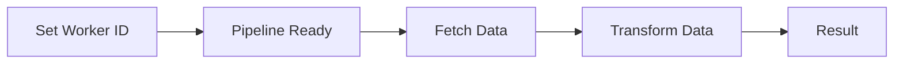
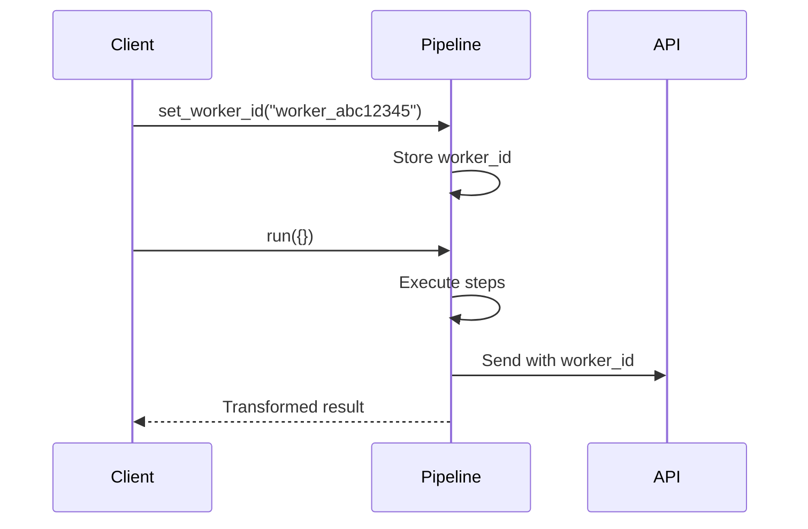
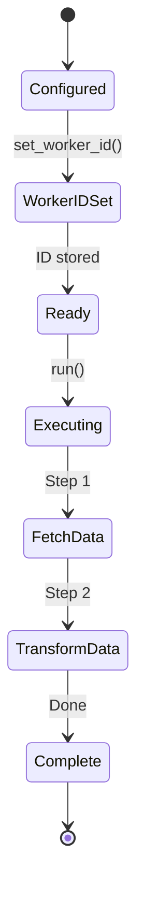

# 02 Worker ID

Demonstrates worker ID management in API pipelines.
Shows how to set and track worker identity for API operations.

## What it evaluates

- Setting worker_id manually
- Tracking worker_id in pipeline
- Enabling API communication with worker_id
- Data transformation through pipeline steps

## Flow





```mermaid
graph TB
    subgraph CONFIG
        C1[api_config: base_url, token]
        C2[worker_name: transform_worker]
    end
    
    subgraph SETUP
        S1[set_worker_id: worker_abc12345]
        S2[worker_id stored]
        S3[send_to_api enabled]
    end
    
    subgraph PIPELINE
        P1[fetch_data: returns [1,2,3,4,5]]
        P2[transform_data: multiply by 2]
    end
    
    subgraph RESULT
        R1[{transformed: [2,4,6,8,10]}]
    end
    
    C1 --> S1 --> P1 --> P2 --> R1
```



```mermaid
flowchart LR
    subgraph STEP_1
        F1[fetch_data]
        F2[data: [1,2,3,4,5]]
    end
    
    subgraph STEP_2
        T1[transform_data]
        T2[transformed: [2,4,6,8,10]]
    end
    
    subgraph WORKER
        W1[worker_id: worker_abc12345]
        W2[send_to_api: True]
    end
    
    F1 --> F2 --> T1 --> T2
    W1 --> W2
```
