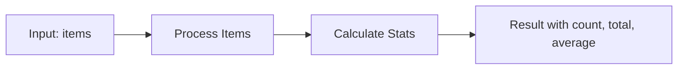
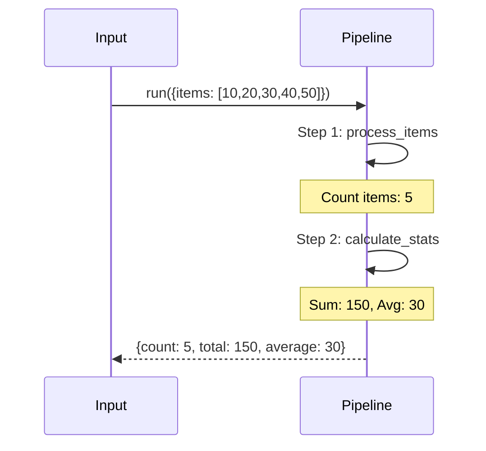
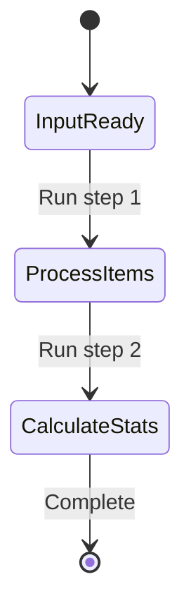

# 03 No API Configuration

Demonstrates running pipeline without API configuration (local-only mode).
Useful for testing or when API server is not available.

## What it evaluates

- Pipeline runs without api_config parameter
- All steps execute locally
- Data aggregation through multiple steps
- Statistics calculation from input data

## Flow





```mermaid
graph TB
    subgraph INPUT
        I1[{items: [10,20,30,40,50]}]
    end
    
    subgraph STEP_1_PROCESS
        S1[process_items function]
        S2[Filter items]
        S3[{processed: 5, items: [...]}]
    end
    
    subgraph STEP_2_STATS
        T1[calculate_stats function]
        T2[Compute sum and average]
        T3[{count: 5, total: 150, average: 30}]
    end
    
    I1 --> S1 --> S2 --> S3 --> T1 --> T2 --> T3
```



```mermaid
flowchart TB
    subgraph DATA_FLOW
        D1[Input items list]
        D2[Process step adds "processed"]
        D3[Stats step computes aggregates]
    end
    
    subgraph AGGREGATION
        A1[count: len(items)]
        A2[total: sum(items)]
        A3[average: sum/len]
    end
    
    D1 --> D2 --> D3
    D3 --> A1
    D3 --> A2
    D3 --> A3
```
