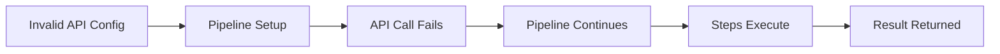
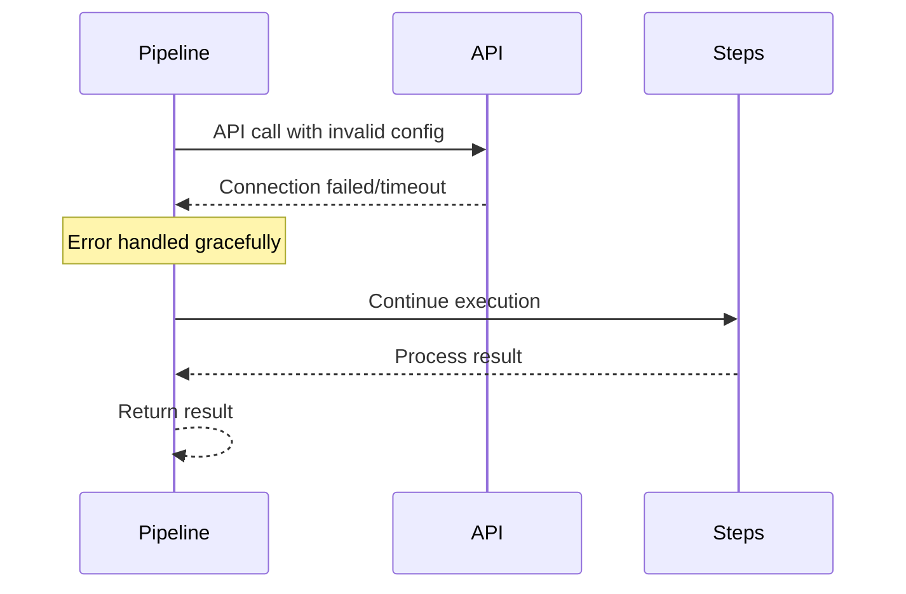
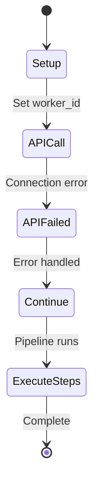
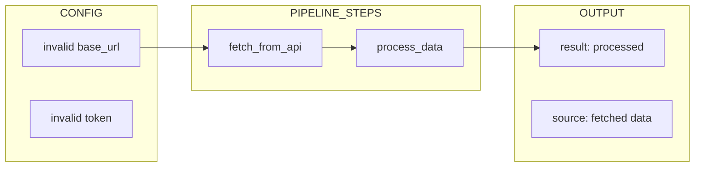

# 04 API Error Handling

Demonstrates how API errors are handled when server is unavailable.
Pipeline continues executing even if API calls fail.

## What it evaluates

- API errors don't stop pipeline execution
- Pipeline handles invalid API server gracefully
- Local execution continues when API fails
- Data flows through steps regardless of API state

## Flow





```mermaid
graph TB
    subgraph API_CONFIG
        A1[base_url: http://invalid-host:9999]
        A2[token: invalid_token]
    end
    
    subgraph ERROR_HANDLING
        E1[API call fails]
        E2[Error caught]
        E3[Continue pipeline]
    end
    
    subgraph STEPS
        S1[fetch_from_api]
        S2[process_data]
    end
    
    subgraph RESULT
        R1[{result: processed, source: data}]
    end
    
    A1 --> E1 --> E2 --> S1 --> S2 --> R1
```




