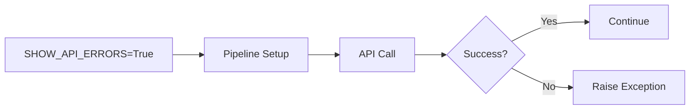
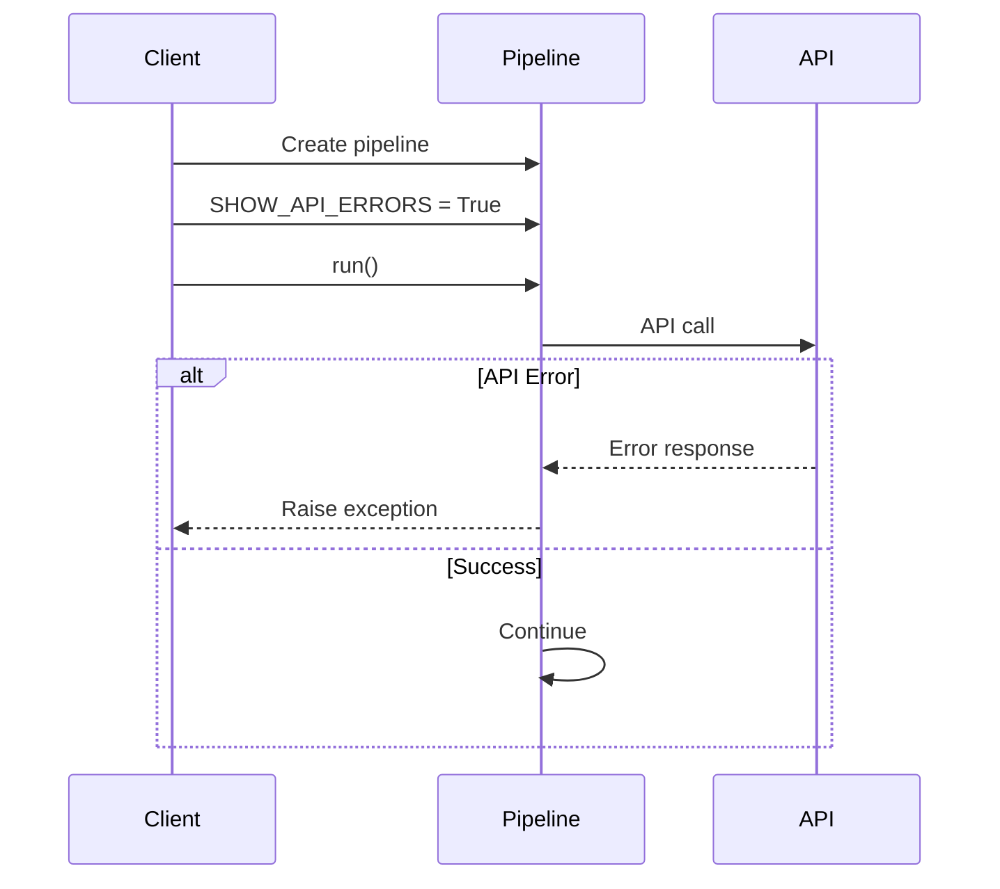
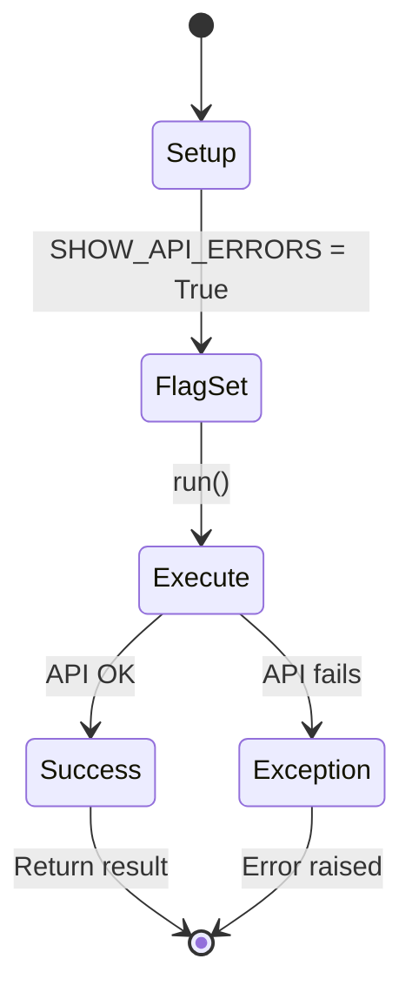
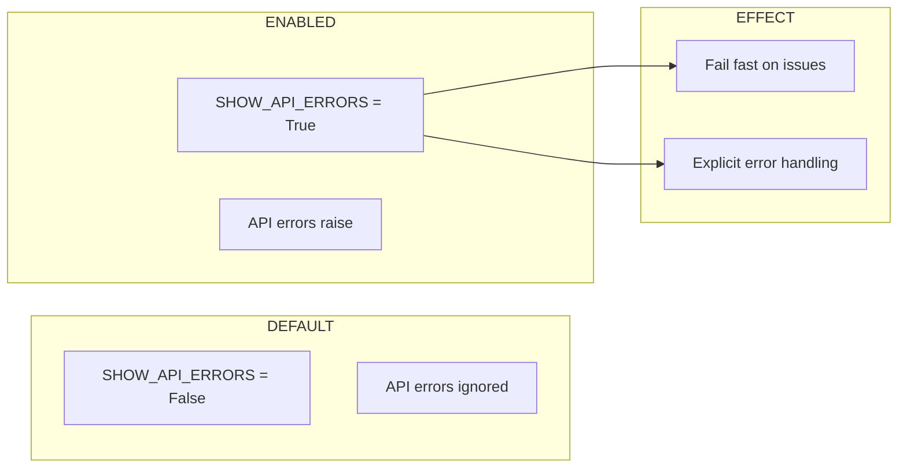

# 05 Show API Errors

Demonstrates using SHOW_API_ERRORS flag to raise exceptions on API errors.
When enabled, API errors will raise exceptions instead of being silently ignored.

## What it evaluates

- SHOW_API_ERRORS flag controls exception behavior
- When True, API errors raise exceptions
- Pipeline can be configured to fail fast on API issues

## Flow





```mermaid
graph TB
    subgraph CONFIG
        C1[api_config: base_url, token]
        C2[worker_id: worker_test12345]
    end
    
    subgraph FLAG
        F1[SHOW_API_ERRORS = True]
        F2[Exceptions raised]
    end
    
    subgraph PIPELINE
        P1[process function]
        P2[data["value"] * 2]
    end
    
    subgraph RESULT
        R1[{result: 20}]
    end
    
    C1 --> F1 --> P1 --> R1
```




