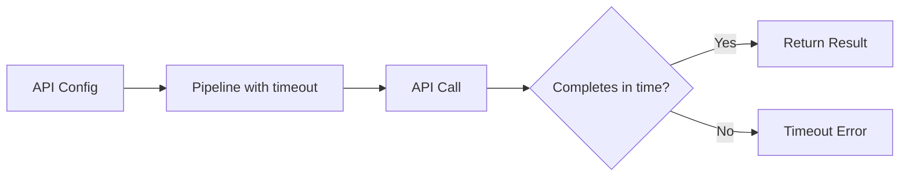
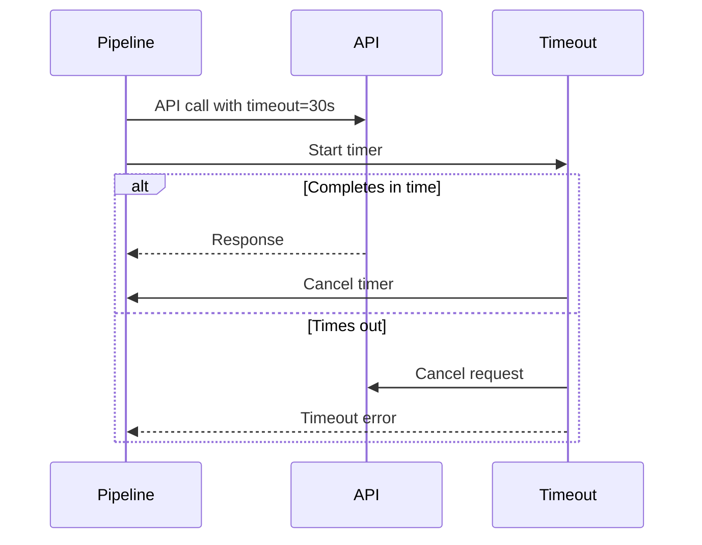
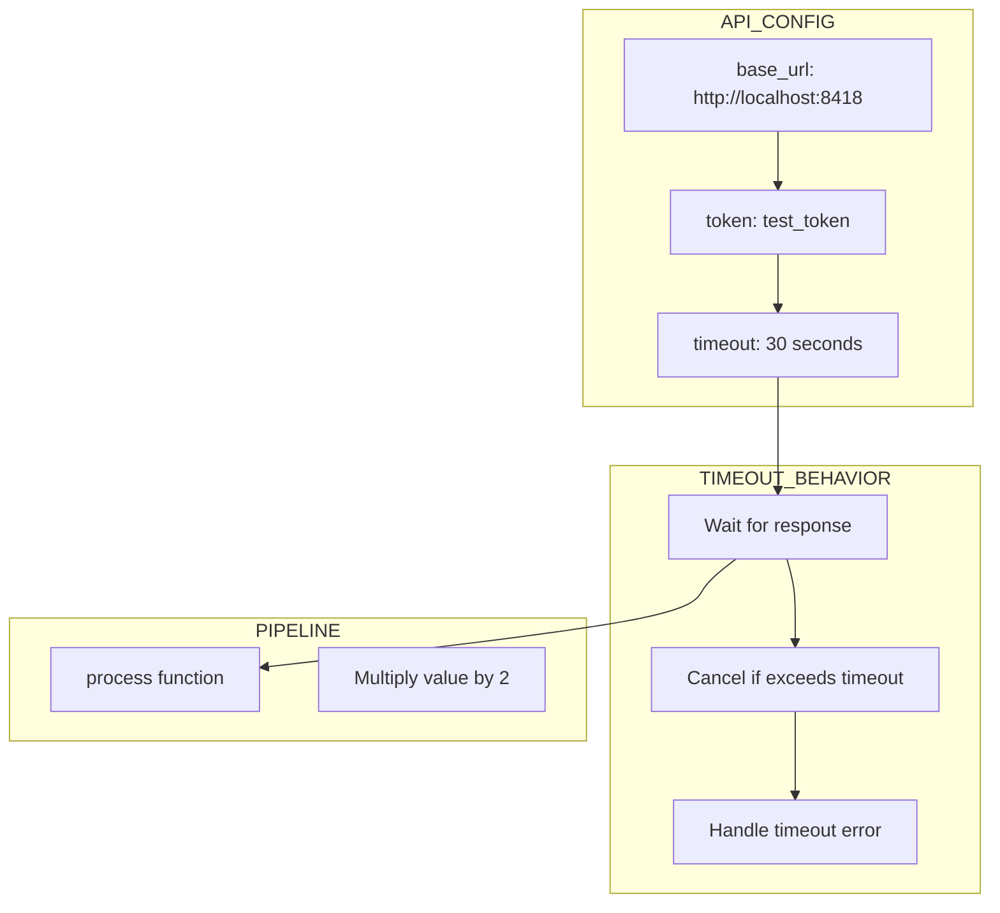
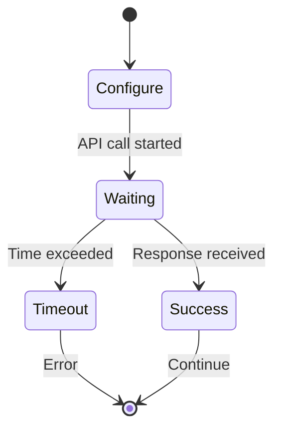
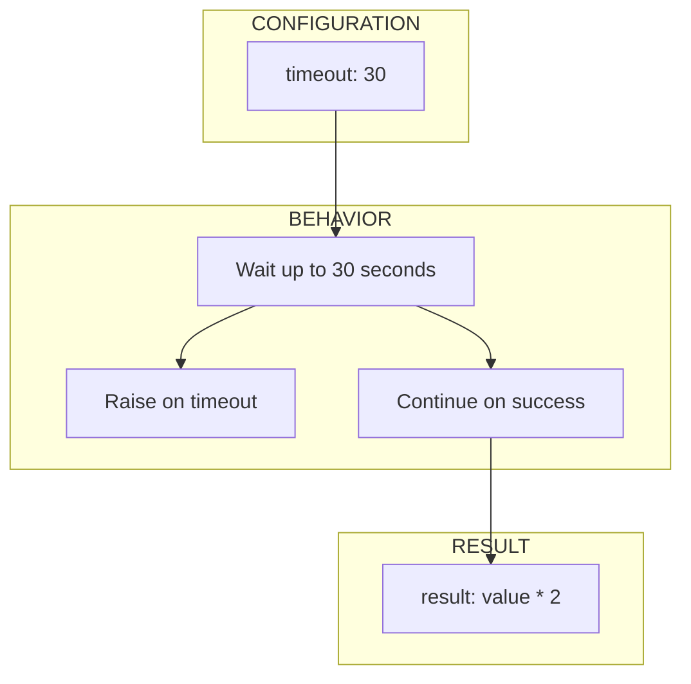

# 06 API With Timeout

Demonstrates configuring timeout for API calls.
Timeout ensures API calls don't hang indefinitely.

## What it evaluates

- Timeout configuration in api_config
- API calls respect timeout settings
- Pipeline handles slow responses gracefully

## Flow

