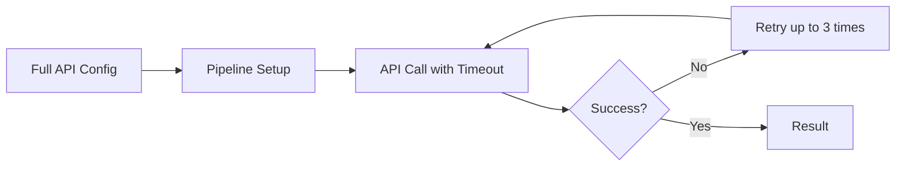
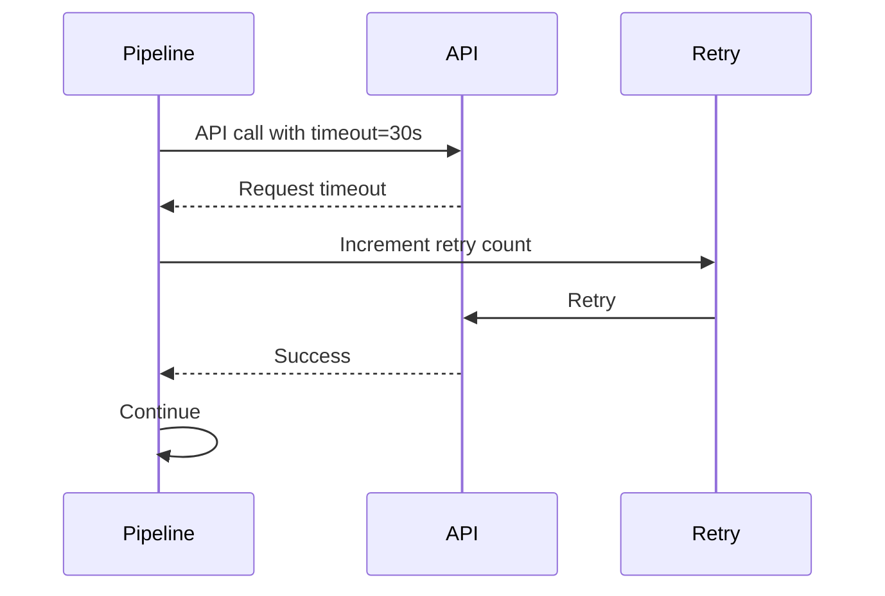
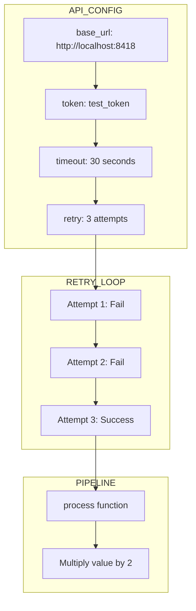
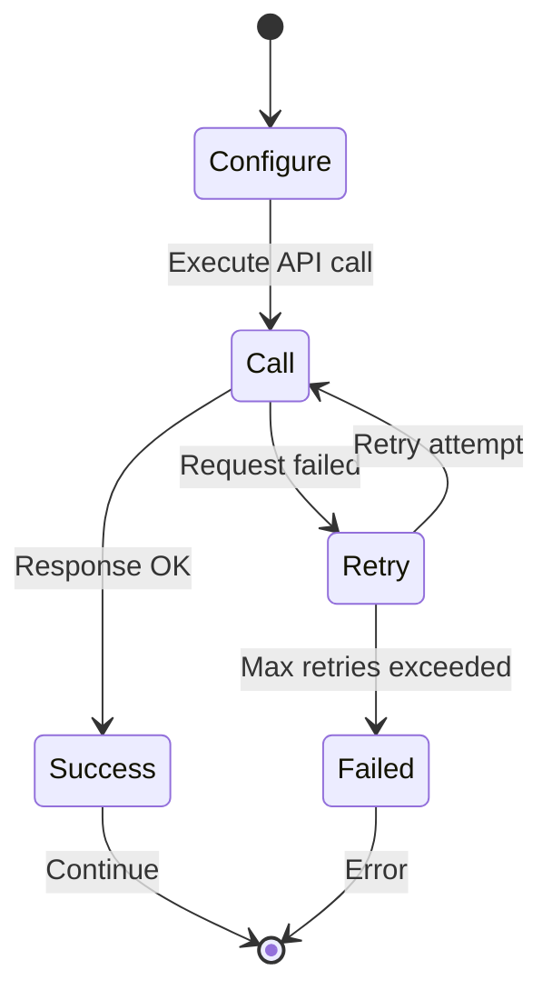

# 06 Full Configuration

Demonstrates full API configuration with all options combined.
Shows how to use timeout and retry settings together.

## What it evaluates

- Combining multiple API config options
- Timeout and retry configuration
- Complete API setup for production
- Single-step processing with full config

## Flow









```mermaid
flowchart TB
    subgraph CONFIGURATION
        C1[base_url]
        C2[token]
        C3[timeout: 30]
        C4[retry: 3]
    end
    
    subgraph EXECUTION
        E1[Call API]
        E2{Success?}
        E3[Retry loop]
    end
    
    subgraph RESULT
        R1[{result: value * 2}]
    end
    
    C1 --> C2 --> C3 --> C4 --> E1 --> E2
    E2 -->|No| E3 --> E1
    E2 -->|Yes| R1
```
