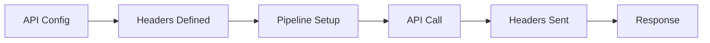
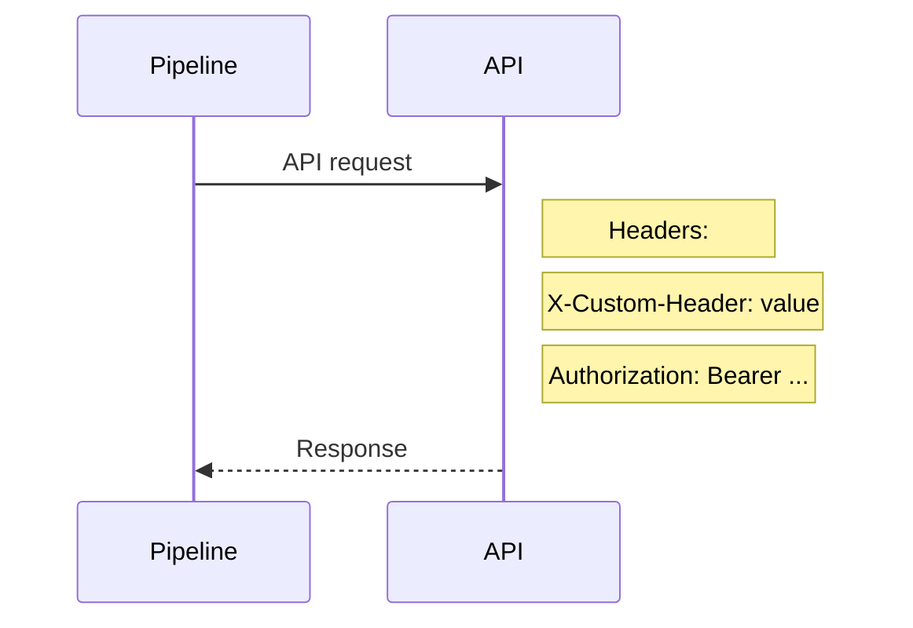
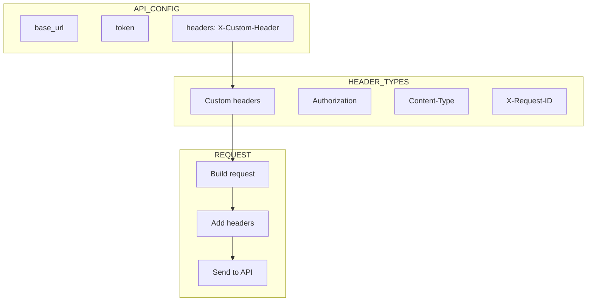
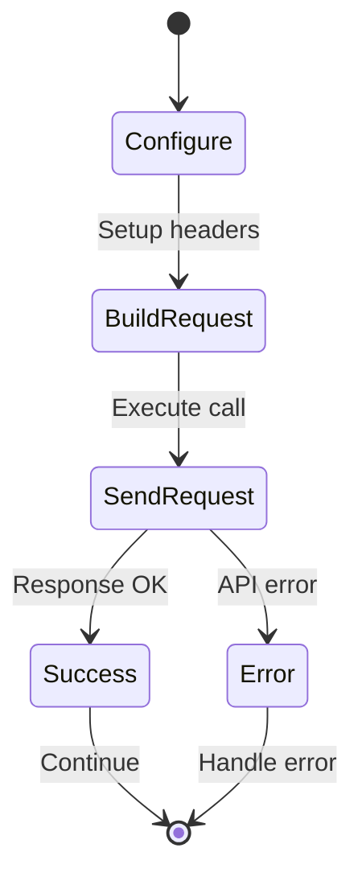
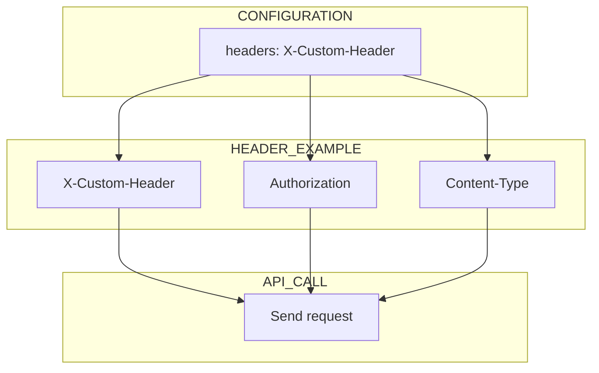

# 08 Custom Headers

Demonstrates adding custom headers to API requests.
Custom headers can be used for authentication, tracking, etc.

## What it evaluates

- Custom headers in api_config
- Headers are sent with API requests
- Pipeline supports header-based customization

## Flow

