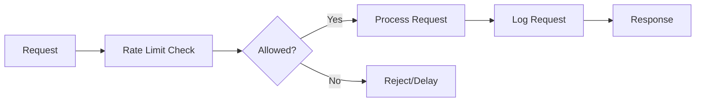
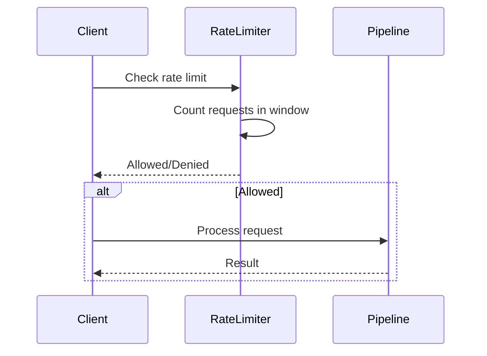
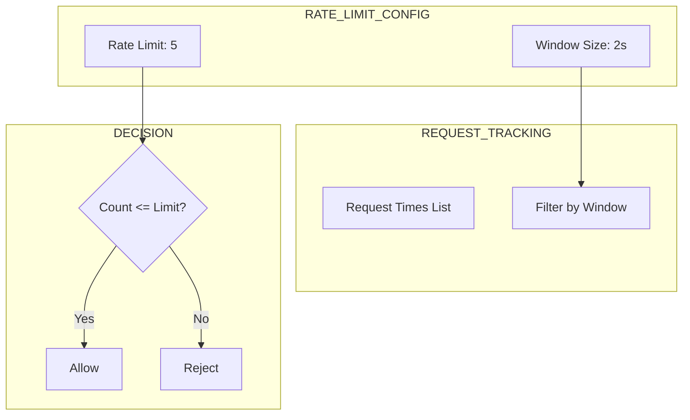
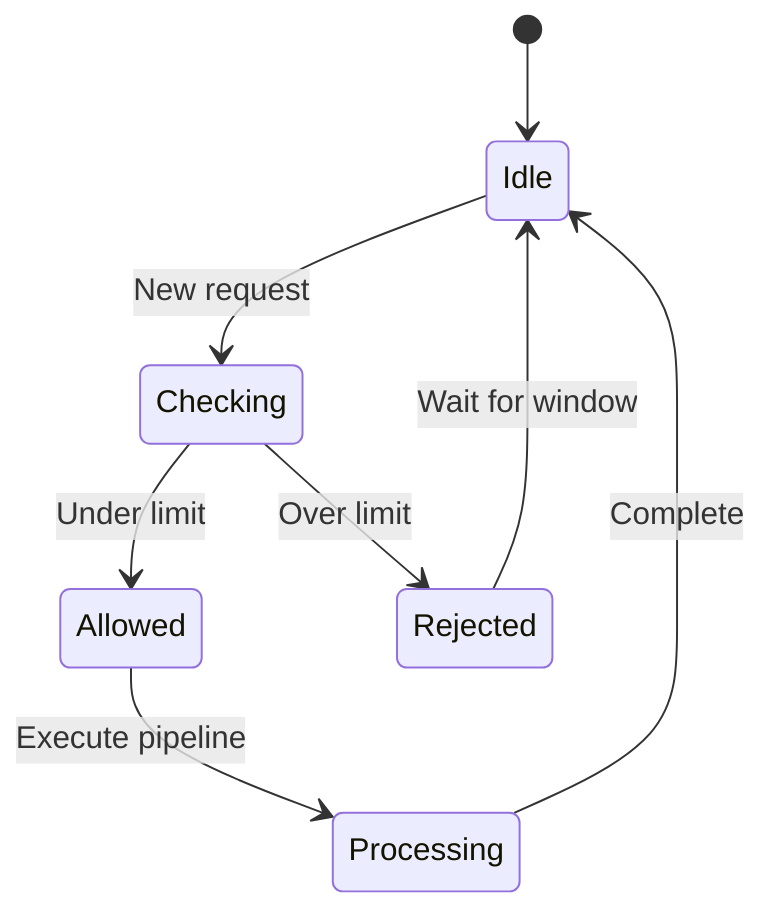
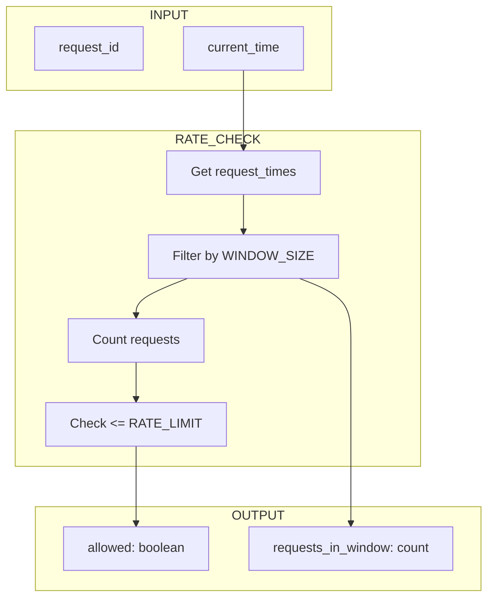

# 11 Rate Limiting

Demonstrates implementing rate limiting in pipeline API calls.
Protects external services from being overwhelmed.

## What it evaluates

- Rate limiting configuration
- Request throttling
- API quota management

## Flow

