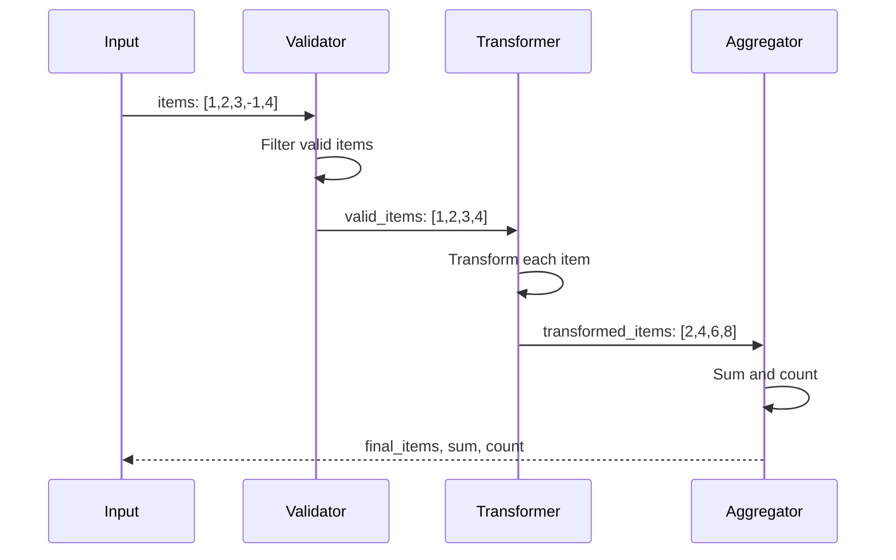
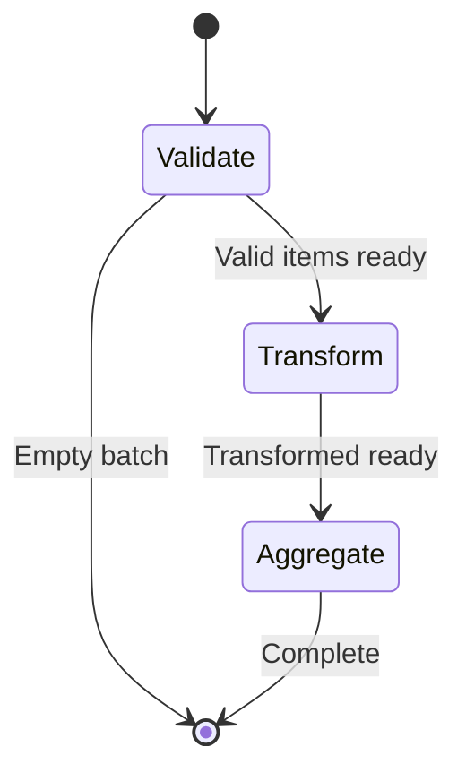
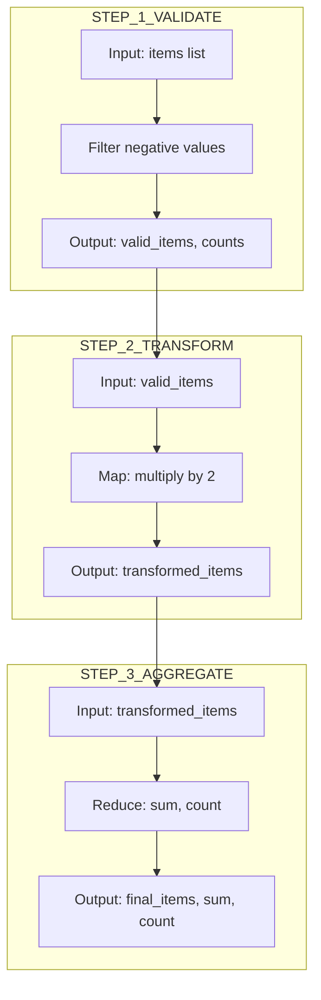

# 12 Batch Operations

Demonstrates processing data in batches through the pipeline.
Useful for handling large datasets efficiently.

## What it evaluates

- Processing multiple items in a single pipeline run
- Batch data aggregation
- Efficient data handling for bulk operations

## Flow




```mermaid
graph TB
    subgraph INPUT
        I1[items: [1,2,3,4,5,6,7,8,-1,-2]]
    end
    
    subgraph VALIDATE_BATCH
        V1[Filter: item > 0]
        V2[valid_items: 8 items]
        V3[total: 10, valid_count: 8]
    end
    
    subgraph TRANSFORM_BATCH
        T1[Transform: item * 2]
        T2[transformed_items: [2,4,6,8,10,12,14,16]]
    end
    
    subgraph AGGREGATE
        A1[Sum: 72]
        A2[Count: 8]
    end
    
    I1 --> V1 --> V2 --> T1 --> T2 --> A1
```




