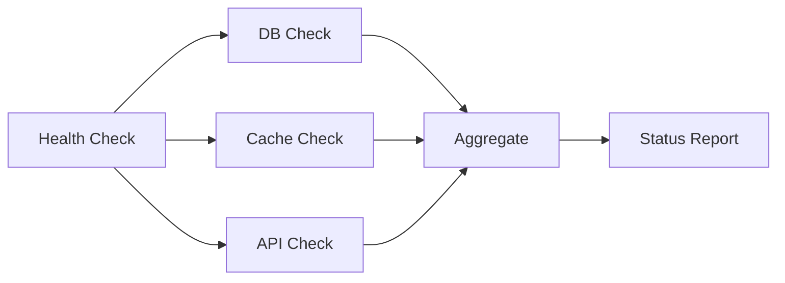
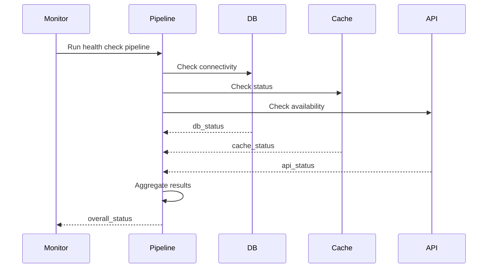
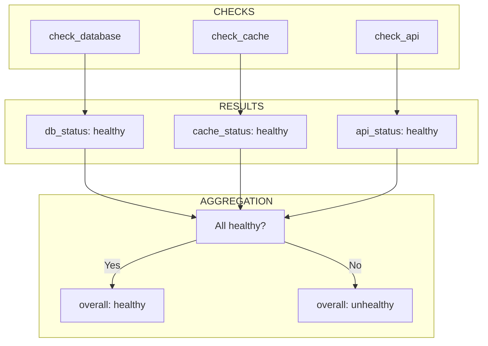
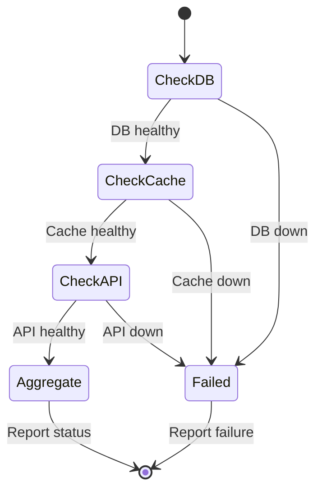
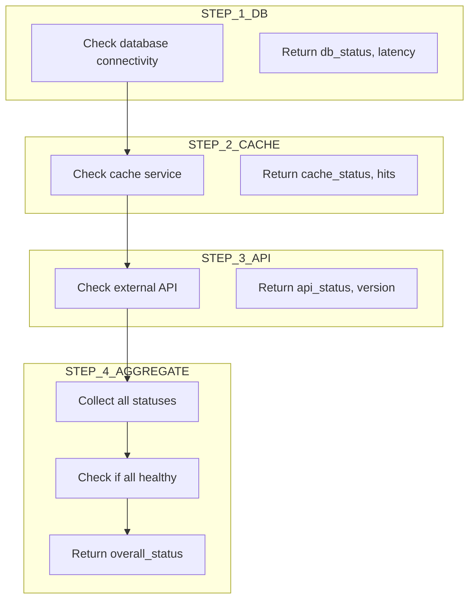

# 14 Health Checks

Demonstrates implementing health check functionality.
Pipeline can be used to verify service dependencies are healthy.

## What it evaluates

- Health check step in pipeline
- Service dependency verification
- Status reporting for monitoring

## Flow

