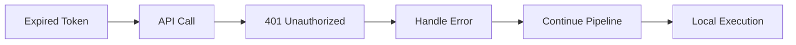
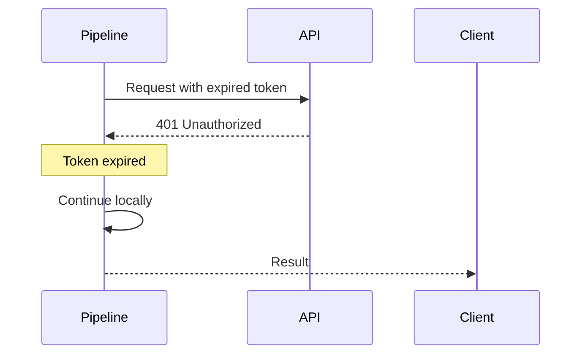
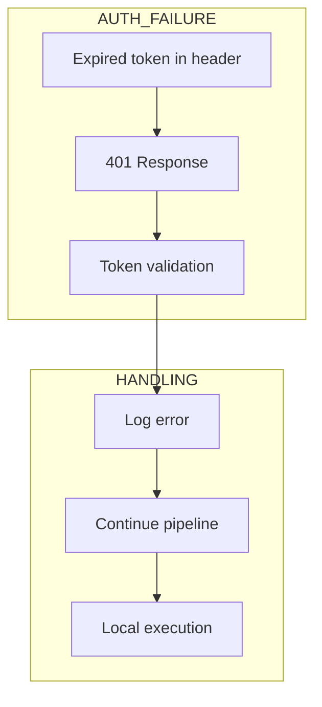
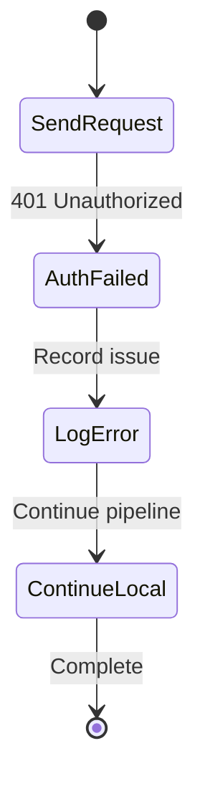
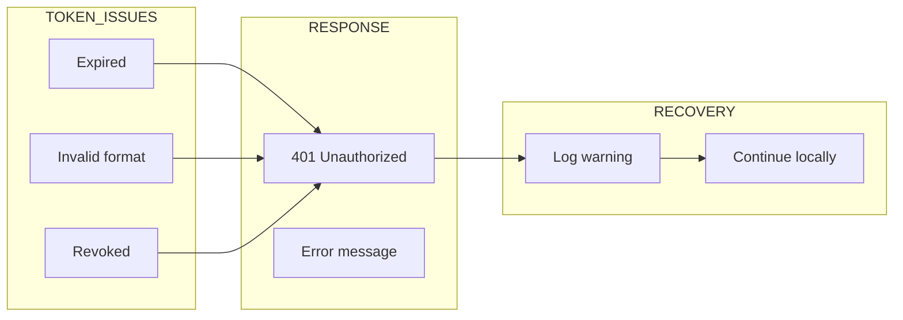

# 16 Expired Token

Demonstrates handling of expired/invalid authentication tokens.
Pipeline should gracefully handle 401 Unauthorized responses.

## What it evaluates

- Token expiration handling
- 401 Unauthorized response handling
- Graceful fallback when auth fails
- Pipeline continues with local execution

## Flow

