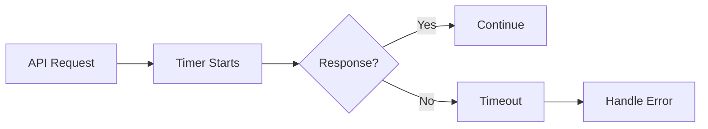
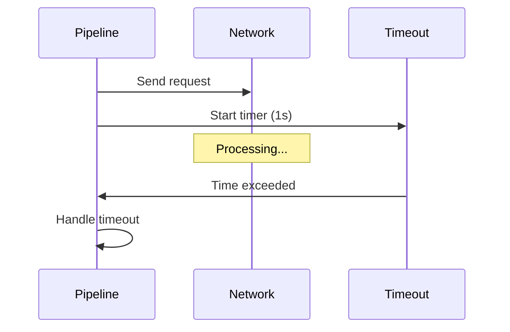
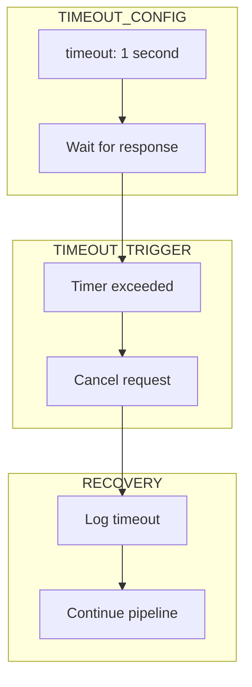
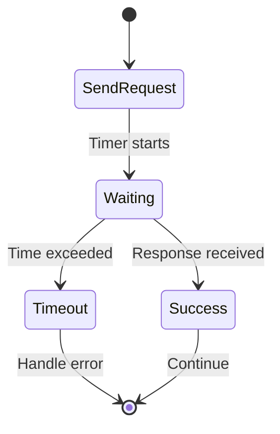
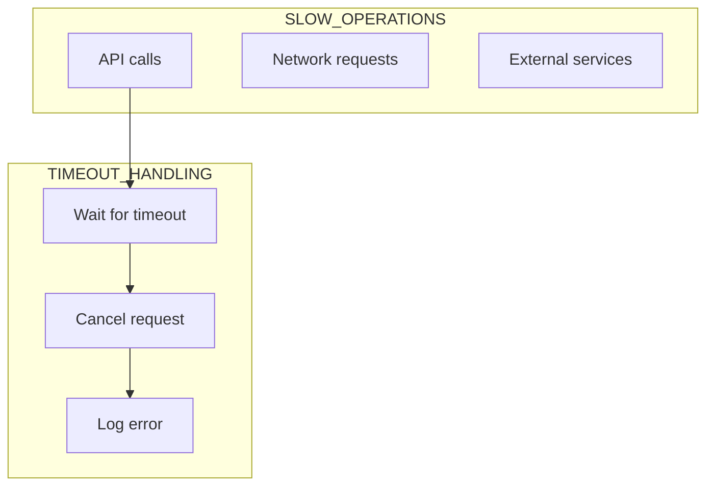

# 17 Network Timeout

Demonstrates handling of network timeouts and slow responses.
Pipeline should handle timeout errors gracefully.

## What it evaluates

- Timeout configuration
- Slow network simulation
- Timeout error handling
- Pipeline continues on timeout

## Flow

