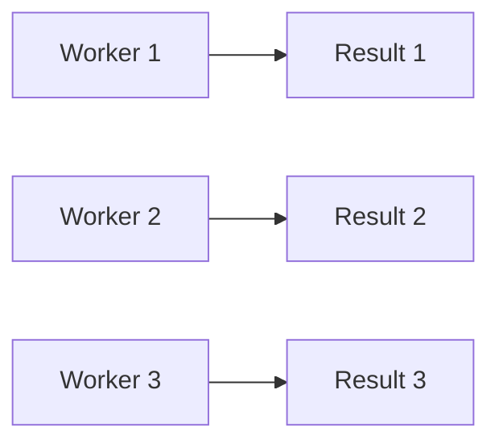
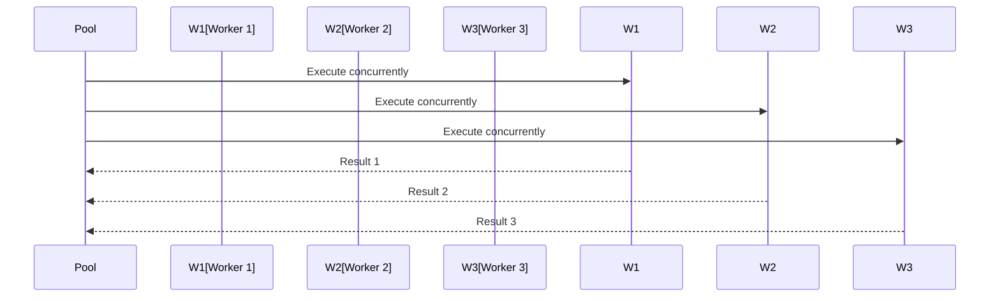
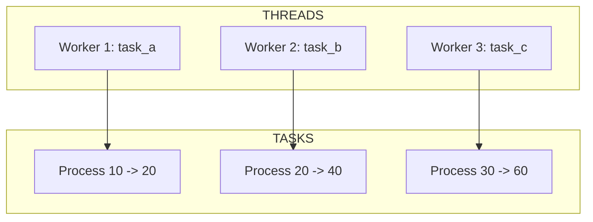
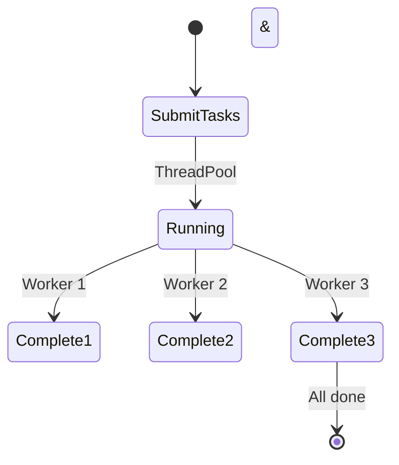
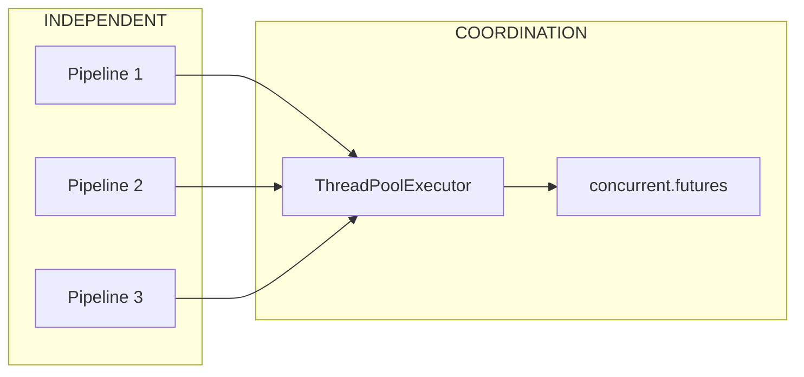

# 19 Concurrent Workers

Demonstrates multiple workers running concurrently with API tracking.
Each worker should have unique ID and operate independently.

## What it evaluates

- Multiple concurrent pipelines
- Unique worker identification
- Independent execution
- Thread-safe operations

## Flow

