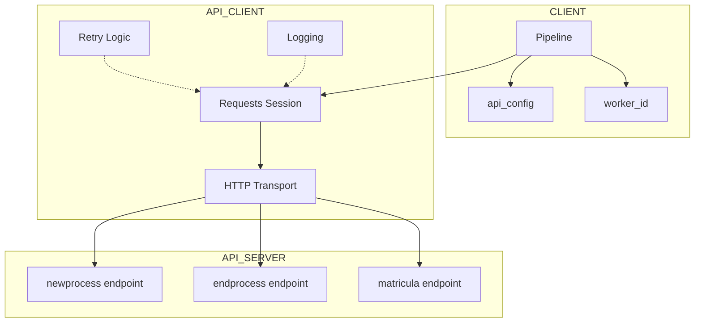
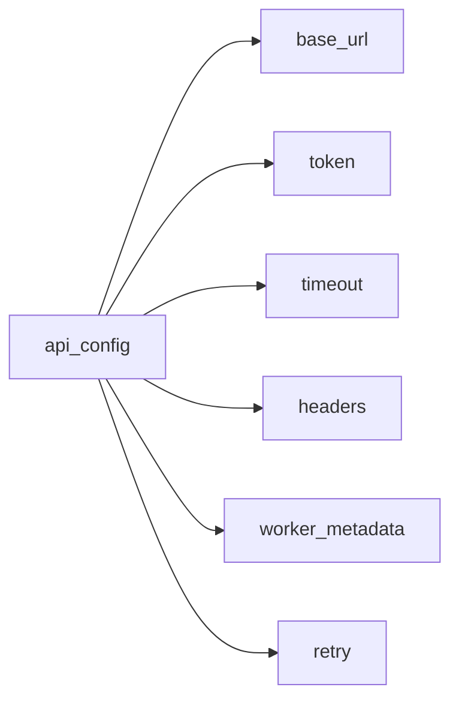
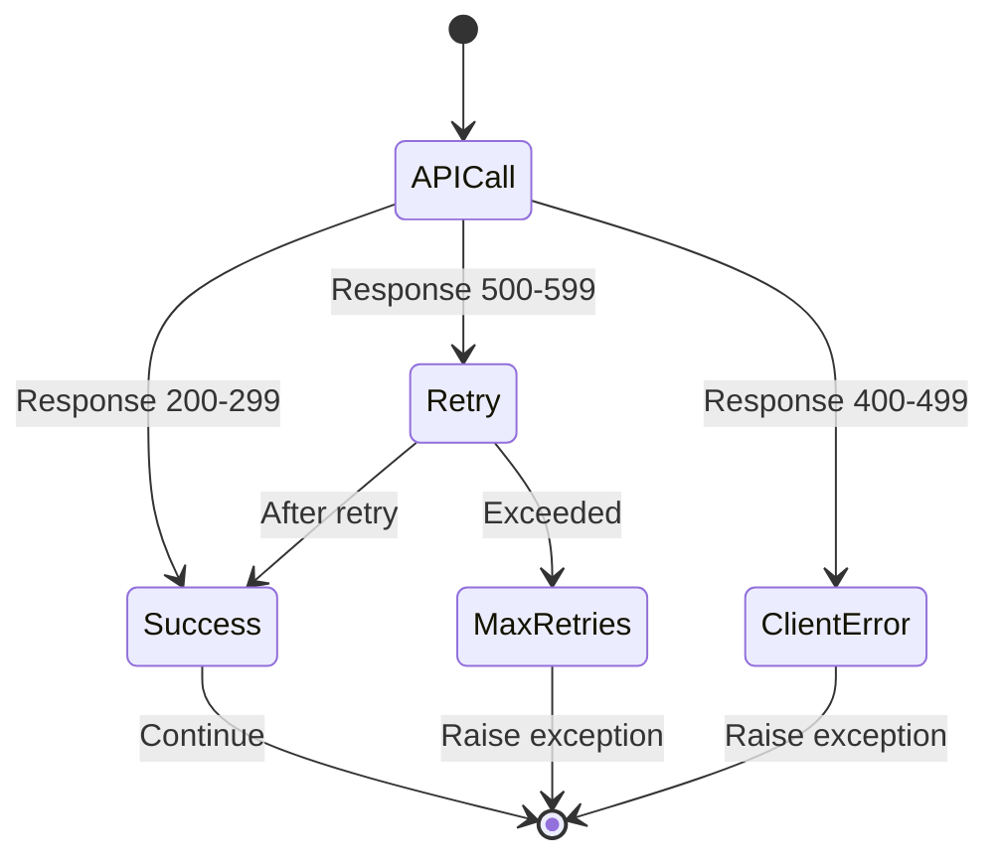
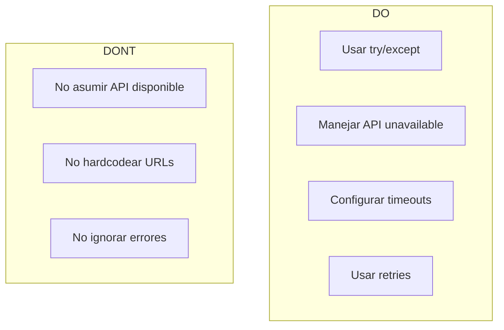

# API Pipeline

Integración de Pipeline con servidores API externos para tracking, registro de workers y comunicación asíncrona.

## Overview

El módulo `api_pipeline` permite que los pipelines de wpipe se comuniquen con servidores API externos, habilitando:

- **Worker Registration**: Registro automático de workers en el servidor
- **Task Tracking**: Seguimiento de ejecuciones de tareas
- **Async Communication**: Comunicación asíncrona con servicios externos
- **Error Handling**: Manejo robusto de errores de red
- **Configuration**: Configuración flexible de timeouts, retries y headers

## Architecture



## Quick Start

```python
from wpipe import Pipeline

api_config = {
    "base_url": "http://localhost:8418",
    "token": "your_token"
}

pipeline = Pipeline(
    worker_name="my_worker",
    api_config=api_config,
    verbose=True
)

pipeline.set_steps([
    (my_function, "Step 1", "v1.0"),
])

worker_id = pipeline.worker_register("my_worker", "v1.0")
if worker_id:
    pipeline.set_worker_id(worker_id.get("id"))

result = pipeline.run({"data": "value"})
```

## Configuration Options



### api_config Parameters

| Parameter | Type | Default | Description |
|-----------|------|---------|-------------|
| `base_url` | str | required | URL base del servidor API |
| `token` | str | required | Token de autenticación |
| `timeout` | int | 30 | Timeout en segundos |
| `headers` | dict | {} | Headers personalizados |
| `worker_metadata` | dict | {} | Metadatos del worker |

### Pipeline Parameters

| Parameter | Type | Default | Description |
|-----------|------|---------|-------------|
| `worker_name` | str | required | Nombre identificador del worker |
| `api_config` | dict | None | Configuración de API |
| `max_retries` | int | 3 | Número máximo de reintentos |
| `verbose` | bool | False | Logging detallado |

## Examples

Los ejemplos están organizados en subcarpetas numeradas:

### Basic (01-05)

| Example | Description |
|---------|-------------|
| [01_basic_api](01_basic_api/) | Configuración básica con API |
| [02_worker_id](02_worker_id/) | Gestión de worker_id |
| [03_no_api](03_no_api/) | Pipeline sin API (modo local) |
| [04_api_errors](04_api_errors/) | Manejo de errores de API |
| [05_show_errors](05_show_errors/) | Flag SHOW_API_ERRORS |

### Configuration (06-09)

| Example | Description |
|---------|-------------|
| [06_api_with_timeout](06_api_with_timeout/) | Configuración de timeout |
| [06_full_config](06_full_config/) | Configuración completa |
| [07_api_retry_config](07_api_retry_config/) | Configuración de reintentos |
| [08_api_custom_headers](08_api_custom_headers/) | Headers personalizados |
| [09_api_logging](09_api_logging/) | Configuración de logging |

### Advanced (10-15)

| Example | Description |
|---------|-------------|
| [10_worker_metadata](10_worker_metadata/) | Metadatos del worker |
| [11_rate_limiting](11_rate_limiting/) | Rate limiting |
| [12_batch_operations](12_batch_operations/) | Operaciones en lote |
| [13_authentication](13_authentication/) | Autenticación |
| [14_health_checks](14_health_checks/) | Health checks |
| [15_service_discovery](15_service_discovery/) | Descubrimiento de servicios |

### Edge Cases (16-20)

| Example | Description |
|---------|-------------|
| [16_expired_token](16_expired_token/) | Token expirado/inválido |
| [17_network_timeout](17_network_timeout/) | Timeout de red |
| [18_invalid_url](18_invalid_url/) | URLs inválidas |
| [19_concurrent_workers](19_concurrent_workers/) | Workers concurrentes |
| [20_reconnection](20_reconnection/) | Reconexión automática |

## Error Handling



### SHOW_API_ERRORS Flag

```python
pipeline.SHOW_API_ERRORS = True  # Raises exceptions on API errors
pipeline.SHOW_API_ERRORS = False  # Silently continues (default)
```

## API Endpoints Used

| Endpoint | Method | Description |
|----------|--------|-------------|
| `/matricula` | POST | Registrar worker |
| `/newprocess` | POST | Iniciar proceso |
| `/endprocess` | POST | Finalizar proceso |

## Testing

```bash
# Run all API tests
pytest test/test_api_client.py

# Run with coverage
pytest --cov=wpipe.api_client --cov-report=html

# Run specific example
python examples/api_pipeline/01_basic_api/example.py
```

## Best Practices



1. **Siempre manejar errores de API** - Usar try/except
2. **Configurar timeouts apropiados** - No dejar indefinitely hanging
3. **Usar retries para operaciones críticas** - Configurar max_retries
4. **Verificar worker_id antes de enviar** - Solo enviar si está configurado
5. **Usar verbose=True en desarrollo** - Para debugging

## See Also

- [Pipeline Documentation](../../wpipe/)
- [API Client Source Code](client.py)
- [Tests](../../test/test_api_client.py)
