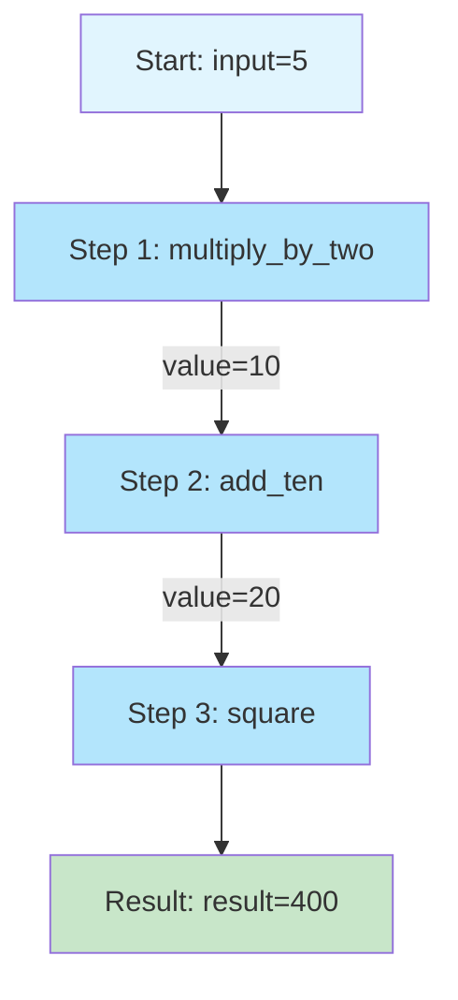
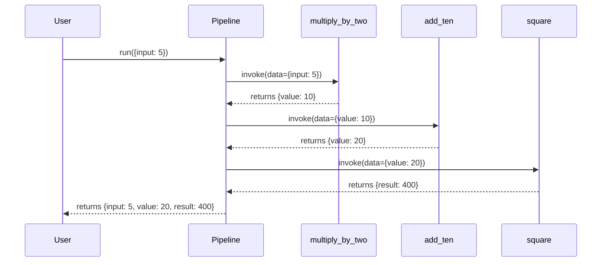
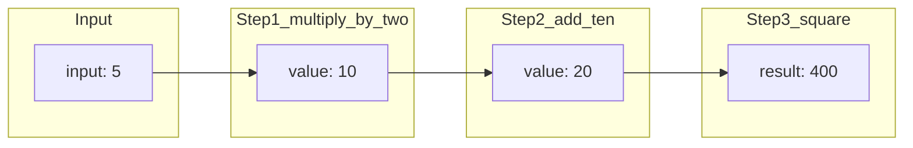

# 01 Simple Function Pipeline

This is the simplest possible pipeline example. It demonstrates the basic pattern of creating a pipeline and running it with sequential steps.

## What It Does

1. Creates a Pipeline instance
2. Defines three functions as pipeline steps
3. Runs the pipeline with input data
4. Each step transforms the data and passes it to the next step

## Code Example

```python
from wpipe import Pipeline

def multiply_by_two(data):
    return {"value": data["input"] * 2}

def add_ten(data):
    return {"value": data["value"] + 10}

def square(data):
    return {"result": data["value"] ** 2}

pipeline = Pipeline(verbose=True)
pipeline.set_steps([
    (multiply_by_two, "Multiply by 2", "v1.0"),
    (add_ten, "Add 10", "v1.0"),
    (square, "Square", "v1.0"),
])

result = pipeline.run({"input": 5})
# Result: {"input": 5, "value": 20, "result": 400}
```

## Flow Diagram



## Pipeline Execution Flow



## Data Transformation



## Key Concepts

| Concept | Description |
|---------|-------------|
| Pipeline | Main orchestrator class |
| Step | A function that receives data, processes it, returns updated data |
| set_steps() | Method to define the sequence of steps |
| run() | Executes the pipeline with input data |

## Expected Output

```
Input: 5 -> Output: {'input': 5, 'value': 20, 'result': 400}
```

## Test

Run this example:
```bash
python examples/basic_pipeline/01_simple_function/example.py
```