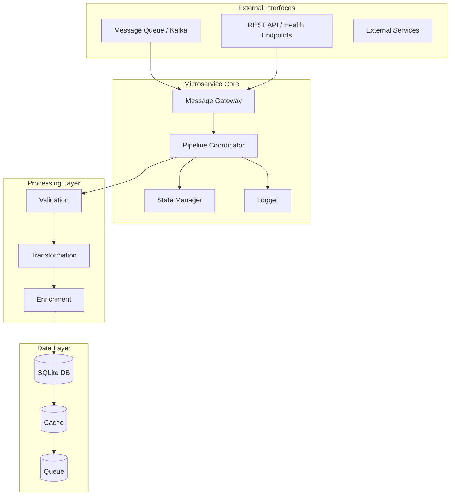
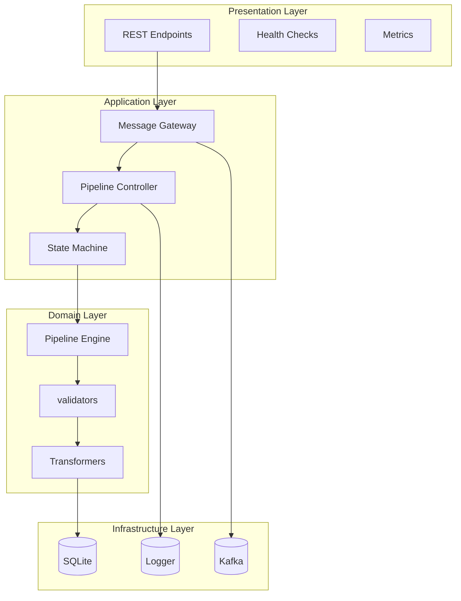
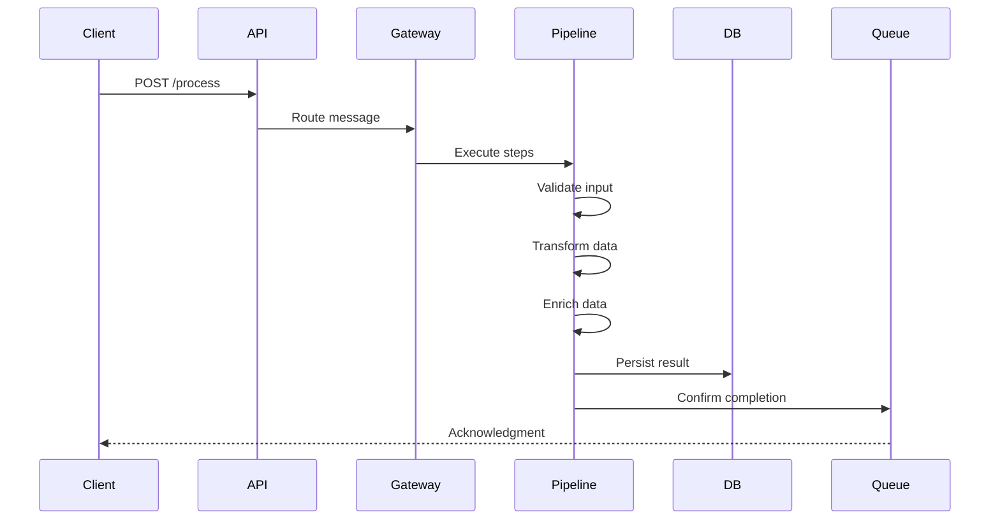
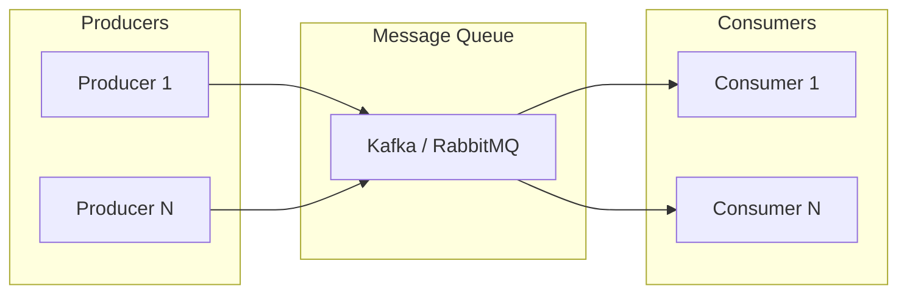
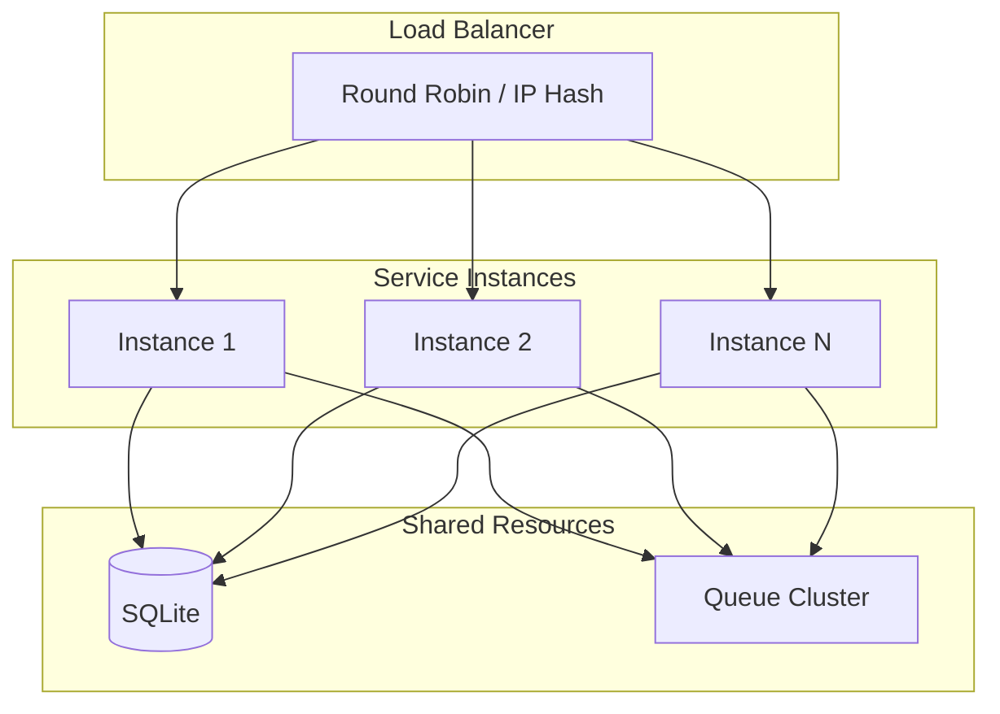
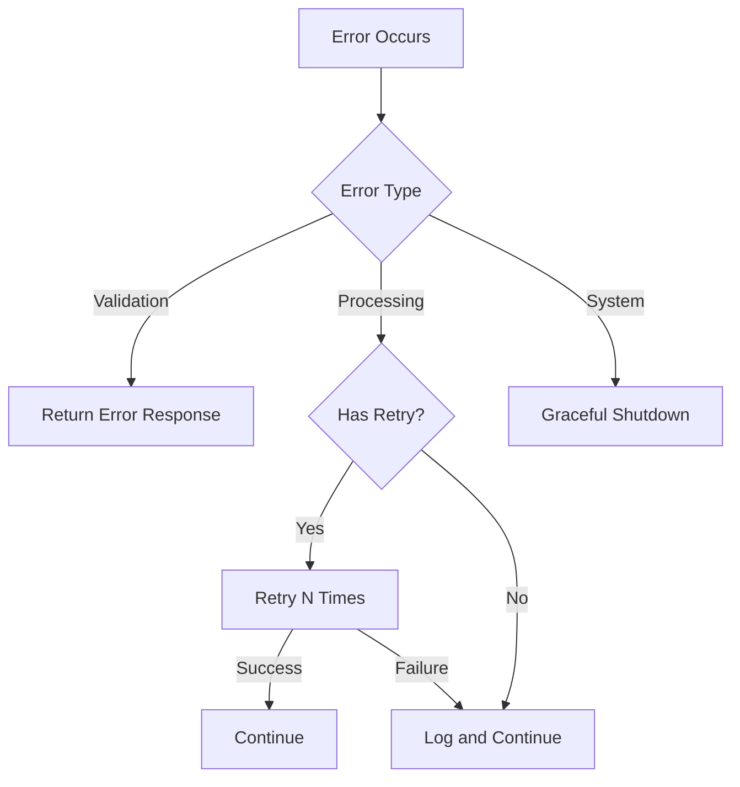
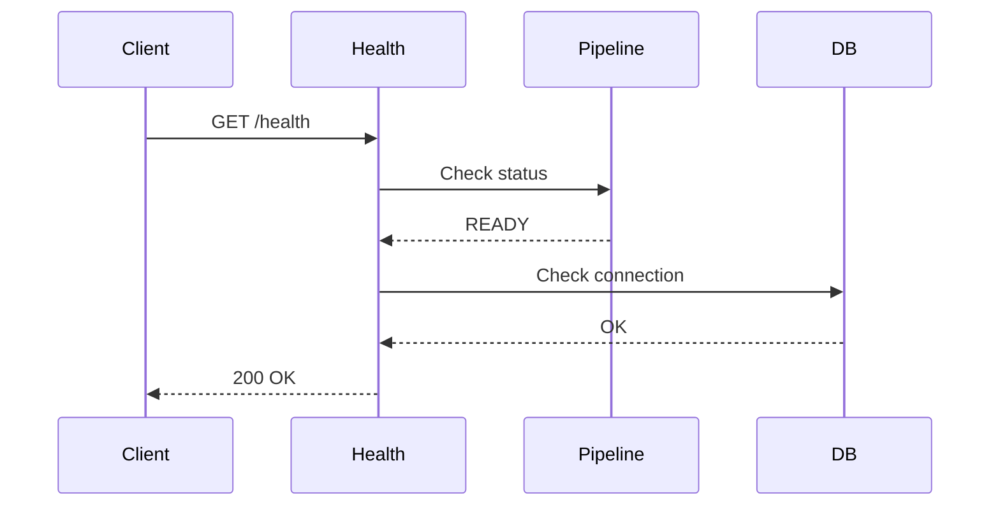

# Architecture & Backend Core

## 1. Executive Summary

This microservice module provides a flexible framework for building message-driven microservices using the WPipe pipeline orchestration library. The architecture enables processing messages from queuing systems (Kafka, RabbitMQ, SQS), executing complex data transformation pipelines, persisting results to SQLite, and exposing health check endpoints.

## 2. System Overview

### 2.1 High-Level Architecture



### 2.2 Core Components

| Component | Responsibility | Key APIs |
|-----------|----------------|----------|
| Message Gateway | Receive and validate incoming messages | `receive()`, `validate_message()` |
| Pipeline Coordinator | Orchestrate execution flow | `execute()`, `add_step()` |
| State Manager | Track service lifecycle | `start()`, `stop()`, `get_status()` |
| Logger | Structured logging with context | `info()`, `error()`, `debug()` |

## 3. Technical Architecture

### 3.1 Layered Architecture



### 3.2 Design Patterns

| Pattern | Implementation | Usage |
|--------|----------------|-------|
| Pipeline | `wpipe.Pipeline` | Orchestrate processing steps |
| Decorator | `@step` | Define reusable processing functions |
| State Machine | Service lifecycle | Manage startup/shutdown |
| Factory | `MicroservicioBasico` | Create service instances |
| Repository | SQLite | Persist processing results |

## 4. Integration Points

### 4.1 External Communication



### 4.2 Message Queue Integration



## 5. Technical Specifications

### 5.1 Dependencies

| Dependency | Version | Purpose |
|------------|---------|----------|
| wpipe | 1.6.4 | Pipeline orchestration |
| sqlite3 | Built-in | Data persistence |
| logging | Built-in | Logging infrastructure |
| signal | Built-in | Graceful shutdown |

### 5.2 Configuration

```yaml
service:
  name: microservice_example
  version: v1.0
  log_level: INFO
  db_path: service.db

pipeline:
  retry_count: 3
  timeout: 30

queue:
  bootstrap_servers: localhost:9092
  topic: processing_queue
  group_id: service_group
```

### 5.3 Database Schema

```sql
CREATE TABLE processing_logs (
    id INTEGER PRIMARY KEY,
    service_name TEXT,
    message_id TEXT,
    status TEXT,
    input_data TEXT,
    output_data TEXT,
    error TEXT,
    timestamp DATETIME DEFAULT CURRENT_TIMESTAMP
);
```

## 6. Scalability Considerations

### 6.1 Horizontal Scaling



### 6.2 Performance Metrics

| Metric | Target | Measurement |
|--------|--------|------------|
| Latency P50 | < 10ms | Pipeline execution |
| Latency P99 | < 100ms | End-to-end |
| Throughput | 1000 msg/s | Message processing |
| Availability | 99.9% | Service uptime |

## 7. Error Handling

### 7.1 Error Classification



### 7.2 Retry Strategy

| Error Type | Retry Count | Backoff |
|-----------|-------------|---------|
| Transient | 3 | Exponential |
| Validation | 0 | None |
| System | 1 | Linear |

## 8. Monitoring & Observability

### 8.1 Metrics Collection

```python
# Key metrics collected
metrics = {
    "requests_total": int,
    "requests_success": int,
    "requests_failed": int,
    "avg_latency_ms": float,
    "p50_latency_ms": float,
    "p99_latency_ms": float,
}
```

### 8.2 Health Check Protocol



## 9. File Structure

```
24_microservice/
├── 01_basic_service_example/
│   └── example.py           # Core microservice structure
├── 02_message_processor_example/
├── 03_service_with_pipeline_example/
├── 05_health_check_example/
│   └── example.py           # Health check implementation
├── 06_service_state_example/
├── 07_service_validation_example/
├── 08_service_metrics_example/
│   └── example.py           # Metrics collection
├── 09_service_config_example/
├── 09_service_dependencies_example/
├── 10_service_graceful_shutdown.py
└── README.md
```

## 10. Version History

| Version | Date | Changes |
|---------|------|---------|
| 1.6.4 | 2026-04-20 | Current version, @step decorator replacement |
| 1.6.3 | 2026-xx-xx | Previous stable release |