# Communication Flow

## 1. Internal Communication

### 1.1 Message Processing Flow

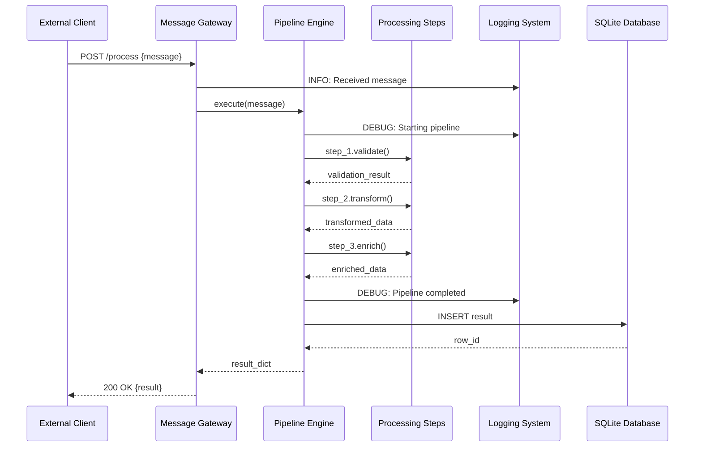

### 1.2 Pipeline Execution Flow

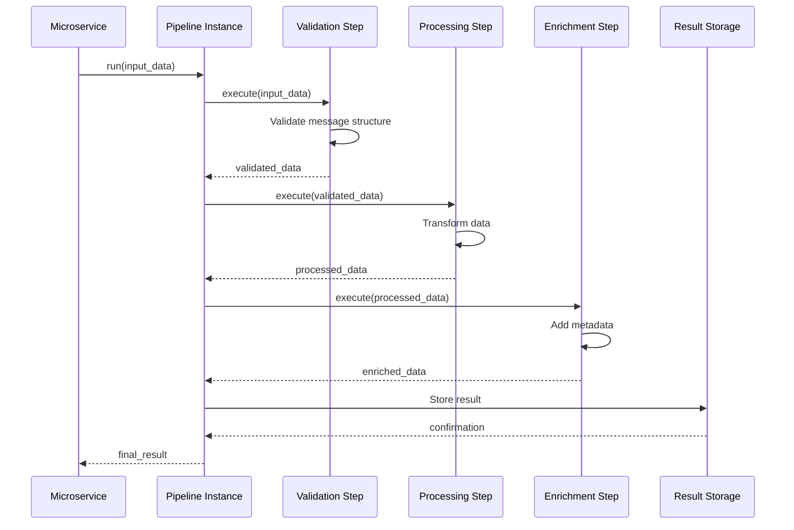

## 2. External Communication

### 2.1 Health Check Endpoint

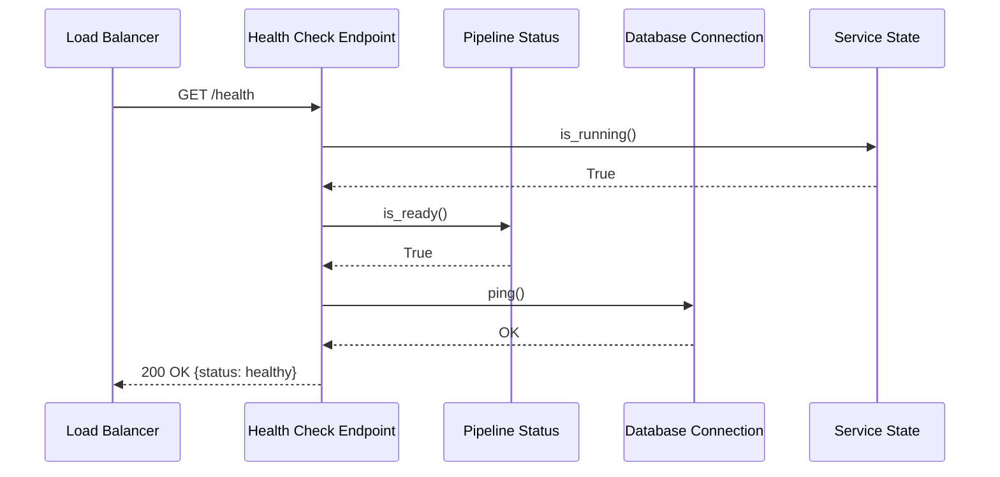

### 2.2 Metrics Collection

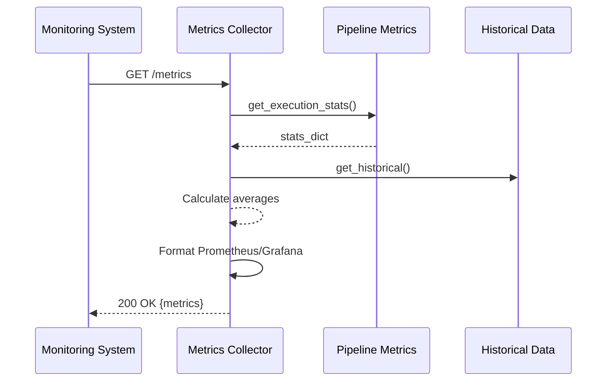

### 2.3 Graceful Shutdown Flow

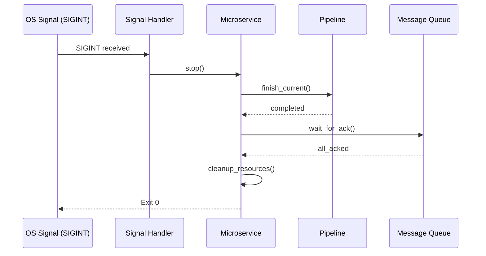

## 3. Kafka Integration Flow

### 3.1 Message Consumption

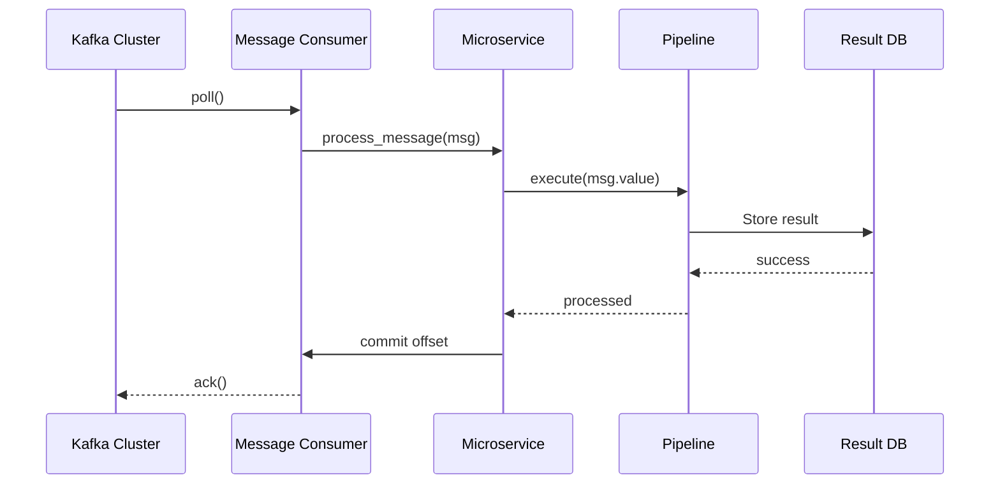

### 3.2 Error Handling with Retry

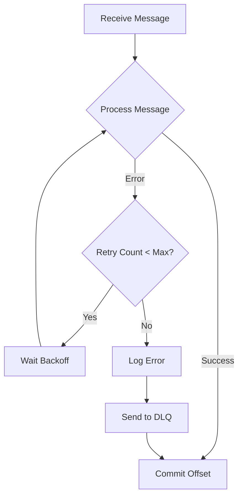

## 4. Service-to-Service Communication

### 4.1 Upstream Service

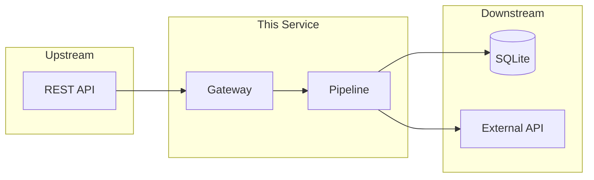

### 4.2 Configuration-based Service Dependencies

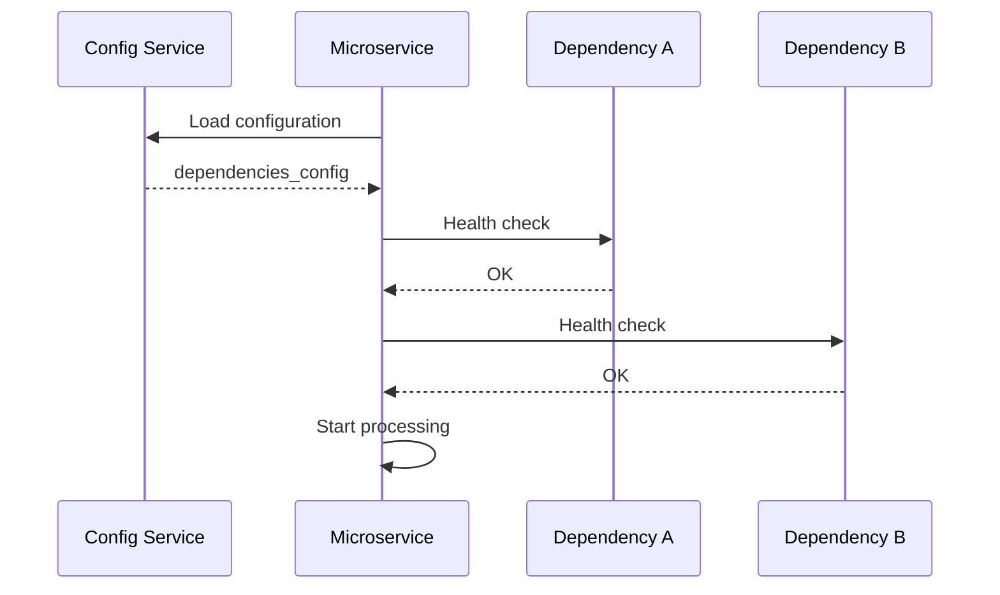

## 5. State Management

### 5.1 Service Lifecycle State Machine

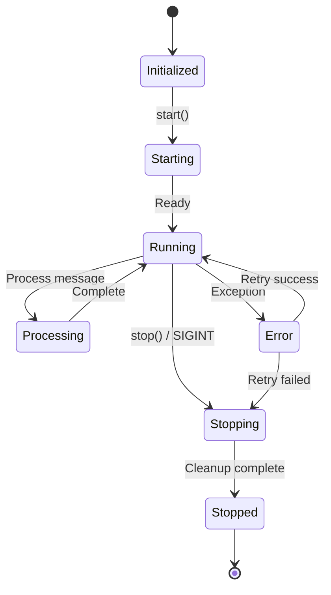

### 5.2 Message Counter State

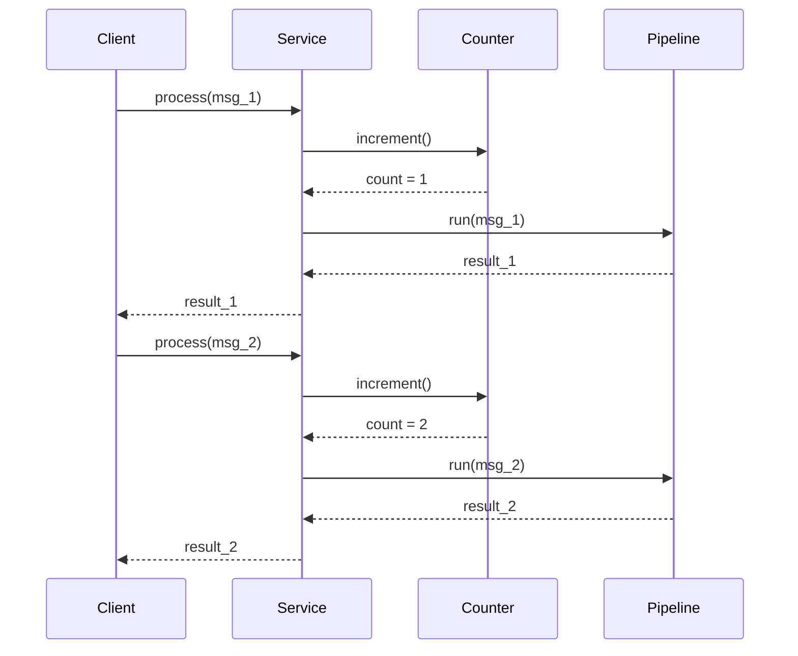

## 6. Data Flow

### 6.1 Input to Output Transformation

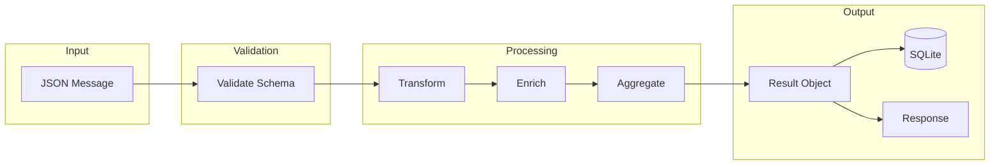

### 6.2 Error Data Flow

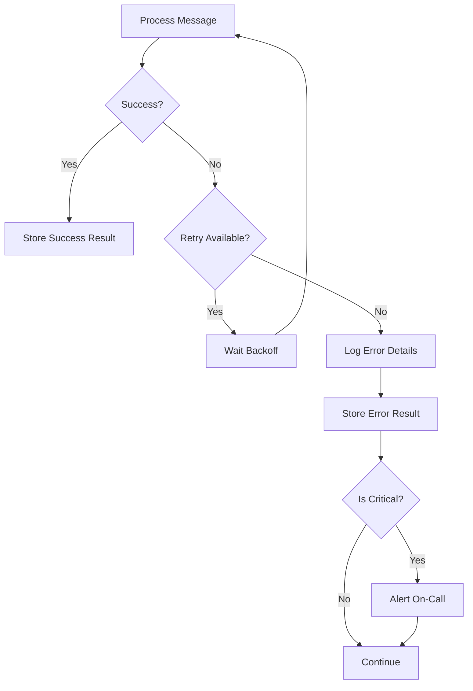

## 7. Communication Protocols

### 7.1 REST API Interface

| Endpoint | Method | Description | Response |
|----------|--------|-------------|----------|
| `/health` | GET | Health check | `{status, pipeline_ready}` |
| `/process` | POST | Process message | `{result}` |
| `/metrics` | GET | Get metrics | `{requests, avg_time}` |
| `/stop` | POST | Graceful shutdown | `{status}` |

### 7.2 Message Queue Protocol

| Topic | Message Format | Ack Mode |
|-------|---------------|----------|
| `input_queue` | JSON | After processing |
| `output_queue` | JSON | Immediate |
| `error_queue` | JSON + Error | After DLQ |

## 8. Logging Context

### 8.1 Logged Events

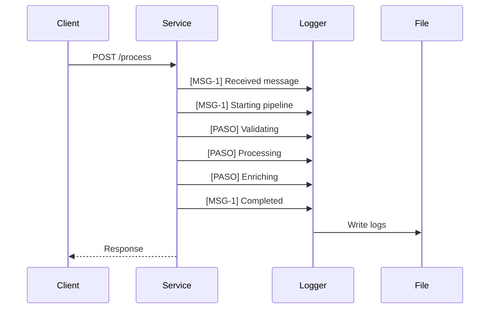